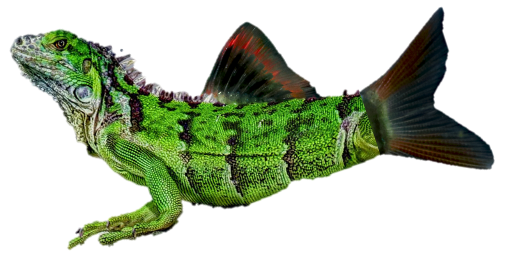

```{r setup, include=FALSE}
knitr::opts_chunk$set(echo = TRUE)
```

<style type="text/css">
.main-container {
  max-width: 900px;
  margin-left: auto;
  margin-right: auto;
}

p, ol, li {
  font-size: 16px;
}


</style>
<br>
<br>

<h1>The problem of the Gilled iguana</h1> 

<hr>


<p><b>Background</b>: Lorena is studying the respiration rate (I believe?) of some species, let's call it a "Gilled green iguana", in a tank of water. To do
so, Lorena adds, dissolved oxygen (DO) to the tank and measures DO (response 
variable) over time (predictor variable). She adds oxygen until the DO
reads 10 mg/L (sorry if I'm butchering your methods Lorena!).</p>

<p><b>The problem</b>: Lorena wants to calculate the slope of dissolved oxygen after she stopped adding DO to the tank. Each period in which the slope is decreasing can be thought of as a trial. The data are continuous and thus need to be grouped for analysis. Because the data are a bit noisy, simply determining positions with negative slopes is not an option.</p>

<p>Steps to solve Lorena's Gilled iguana problem include:</p>


<ol>
<li>Setup</li>
<li>Simulate data</li>
<li>Smooth the noisy data</li>
<li>Assign groups</li>
<li>Subset the data</li>
</ol>
<hr>
<br>

## Setup
<br>
<p>Load the `tidyverse` library.</p>

<p><i>Note: Throughout this document, you can click on the "code" button to display the code used.</i></p>

```{r, message = FALSE, warning = FALSE}
library(tidyverse)
```
<hr>
<br>

## Simulate data
<br>
<p>When Lorena adds oxygen, the DO concentration in the tank increases. When she stops adding oxygen, the DO decreases due to the respiration of the Gilled iguana.</p>

<p>This produces a pattern similar to a sine wave, so we will create a sine wave function to simulate the data.</p>

<p><i>Note: Lorena's data is not really a sine wave (more of a reverse sawtooth), becuase the DO concentration actually rises much more quickly than it falls, but a sin wave should come close enough to approximating the problem.</i></p>

<p>Write a function to generature a tibble representing a sine wave. The basic form of a sine wave is:</p>


$$y(t) = A\times sin(\omega t + \phi) $$

<p>The arguments of the function we will write include:</p>

<ul>
<li><b>timeVector ($t$)</b>: An atomic vector of numeric time values upon which we would like to generate the wave.</li>
<li><b>y-offset</b>: Shifts the mean from 0 to the mean of Lorena's data -- about 8.75</li>
<li><b>amplitude ($A$)</b>: How far the peaks and troughs of the wave deviate from the mean</li>
<li><b>angular_freq ($\omega$)</b>: The number of ossilations in a time interval, in radians (`2*pi*frequency`)</li>
<li><b>phase ($\phi$)</b>: Essentially the position of the wave at t = 0</li>
</ul>

```{r}
make_sineWave <-
  function(timeVector, y_offset, amplitude, angular_freq, phase){
    tibble(
      time = timeVector,
      dissOx = y_offset + amplitude * sin(angular_freq*time + phase)
    )
  }

sineWave <-
  make_sineWave(
  timeVector = 1:120,
  y_offset = 8.75,
  amplitude = 1.25,
  angular_freq = 0.15,
  phase = .5)

str(sineWave)
```
<br>
<p>Plot the data:</p>

```{r}
sineWave %>%
  ggplot(
    aes(x = time, y = dissOx)
  ) +
  geom_line() +
  labs(
    title = 'Dissolved oxygen concentration over time',
    x = 'Time (seconds)',
    y = 'Dissolved oxygen (mg/L)'
  ) +
  theme_bw() +
  theme(
    axis.title = element_text(size = rel(1.2)),
    axis.text = element_text(size = rel(1.2)),
    title = element_text(size = rel(1.5))
  )
```
<br>

<p>We will add noise to the wave. This noise is necessary because, while the DO concentration rises and falls as a general trend, at fine temporal scales the DO may be increasing or decreasing.</p>

<p>Add some noise:</p>

```{r}
make_noisyWave <-
  function(sineWave_frame, noiseValue) {
    sineWave_frame %>%
      mutate(
        dissOx = rnorm(nrow(.), mean = dissOx, sd = noiseValue * .007))
  }

noisyWave <-
  make_noisyWave(sineWave, noiseValue = 20)

noisyWave
```
<br>

<p>Plot simulated data:</p>

```{r}
noisyWave %>%
  ggplot(aes(x = time, y = dissOx)) +
  geom_point() + 
  geom_line() +
  labs(
    title = 'Dissolved oxygen concentration over time',
    x = 'Time (seconds)',
    y = 'Dissolved oxygen (mg/L)'
  ) +
  theme_bw() +
  theme(
    axis.title = element_text(size = rel(1.2)),
    axis.text = element_text(size = rel(1.2)),
    title = element_text(size = rel(1.5))
  )
```
<br>
<br>
<p>Using the code above (copy-and-paste into a session in R Studio), try different noise values -- how does this change the output?</p>
<hr>
<br>

## Smooth data
<br>
<p>We will now apply a smooth to reduce the noise in our simulated dataset. I've chosen local polynomial regression (loess) fitting to do the smoothing. There are many other options for doing so (e.g., running mean).</p>

```{r}
add_smooth <-
  function(noisyData, smoothingSpan){
    loess(
      dissOx ~ time,
      data = noisyData,
      # Span will control how smoothed the data will be:
      span = smoothingSpan) %>%
      # Predict will return predicted values for a given time:
      predict()
  }

noisyWave %>%
  mutate(dissOx_smooth = add_smooth(., smoothingSpan = 0.3))
```
<br>
<p>Let's use ggPlot to take a look at the noisy and smoothed data:</p>

```{r}
# View smoothing to determine which smoothing span is best:

noisyWave %>%
  mutate(dissOx_smooth = add_smooth(., smoothingSpan = 0.3)) %>%
  ggplot(aes(x = time, y = dissOx)) +
  geom_point() + 
  geom_line() +
  # A new line with our smoothed dissOx_smooth data:
  geom_line(aes(y = dissOx_smooth), color = 'blue', size = 1) +
  labs(
    title = 'Dissolved oxygen concentration over time',
    x = 'Time (seconds)',
    y = 'Dissolved oxygen (mg/L)'
  ) +
  theme_bw() +
  theme(
    axis.title = element_text(size = rel(1.2)),
    axis.text = element_text(size = rel(1.2)),
    title = element_text(size = rel(1.5))
  )
```
<br>
<br>
<p>Try different noise and smoothing spans. How does this influence the output?</p>
<hr>
<br>

## Assign groups
<br>

<p>With our noisy data all smoothed out, we are now ready to assign our trials to groups. We will do so by assigning slopes as `positive` or `negative` based on the logical statement `y[t+1] > y[t]`, determining the point at the top of each downslope, and numbering the trials. Explore the code to see how this works:</p>

```{r}
wave_trials <-
  noisyWave %>%
  mutate(dissOx_smooth = add_smooth(., smoothingSpan = 0.3)) %>%
  mutate(
    # Look forward to determine dissOx is increasing or decreasing:
    slope = ifelse(
      lead(dissOx_smooth) > dissOx_smooth,
      'positive',
      'negative'),
    # Define the turning points in the data:
    trial_group = ifelse(
      lag(slope) == 'positive' & slope == 'negative',
      1, 0
    ),
    # Assign group identities:
    trial_group = 
      ifelse(
        slope == 'negative',
        # What does this do?
        cumsum(trial_group),
        NA))

wave_trials
```
<br>

<p>Let's plot the data and see if it did what we wanted it to:</p>

```{r, warning = FALSE}
wave_trials %>%
  ggplot(aes(x = time, y = dissOx)) +
  geom_ribbon(
    # Why do we need to add a new data argument?
    data = wave_trials %>%
      filter(!is.na(trial_group)) %>%
      group_by(trial_group) %>%
      mutate(minTime = min(time), maxTime = max(time)),
    # Look closely at these aesthetics:
    aes(
      ymin = min(dissOx_smooth),
      ymax = dissOx_smooth,
      fill = factor(trial_group)),
    alpha = .9
  ) +
  geom_point(size = 2) + 
  geom_line() +
  geom_line(
    aes(y = dissOx_smooth),
    color = 'blue',
    size = 1) +
  labs(
    title = 'Dissolved oxygen concentration over time',
    x = 'Time (seconds)',
    y = 'Dissolved oxygen (mg/L)'
  ) +
  scale_fill_manual(
    values = c('#B02909', '#DF993A', '#F24A47'),
    name = 'Trial') +
  scale_y_continuous(
    limits = c(7.5, 10),
    expand = c(0,0)) +
  theme_bw() +
  theme(
    axis.title = element_text(size = rel(1.2)),
    axis.text = element_text(size = rel(1.2)),
    title = element_text(size = rel(1.5))
  )
```
<br>

<p>The method we used to generate these trial groups is cool, but there are a lot of solutions to this problem (for example, using a <i>for loop</i> or `purrr::map`) Can you think of any issues that you might face in using this method? How could you avoid these problems?</p>
<hr>
<br>

## Subset the data

<p>We can now subset the data to only those trial groups (when the slope is decreasing). Because we wrote the code to assign a group number for points with a decreasing slope and assign `NA` otherwise, we can use our very familiar `filter` function to extract the observations (rows) of interest. We will use `select` to extract our variables of interest (`trial_group`, `time`, and `dissOx`).</p>

```{r}
gilled_iguana <-
  wave_trials %>%
  filter(!is.na(trial_group)) %>%
  select(trial_group, time, dissOx)

gilled_iguana
```
<br>


<p>Lorena is interested in the slope of decrease after adding the DO. Here's what that might look like:</p>

```{r}
map(
  unique(gilled_iguana$trial_group),
  function(x){
    gilled_iguana %>%
      filter(trial_group == x) %>%
      lm(dissOx ~ time, data = .) %>%
      summary()
  }
)
```
<br>

<p>We can, and should, explore these data graphically. Here's how it might look:</p>

```{r}
gilled_iguana %>%
  mutate(Trial = factor(trial_group)) %>%
  group_by(Trial) %>%
  mutate(time = time - min(time)) %>%
  ungroup %>%
  ggplot(
    aes(time, dissOx)) +
  stat_smooth(method = "lm", aes(col = Trial)) +
  geom_point(
    aes(fill = Trial),
    size = 3, 
    alpha = .5, 
    pch=21) +
  labs(
    title = 'Dissolved oxygen concentration over time',
    x = 'Time since treatment (seconds)',
    y = 'Dissolved oxygen (mg/L)'
  ) +
  theme_bw() +
  theme(
    axis.title = element_text(size = rel(1.2)),
    axis.text = element_text(size = rel(1.2)),
    title = element_text(size = rel(1.5))
  )
```
<br>

<p>Fin! Thank you Lorena for such a cool problem to work with!</p>
<hr>


