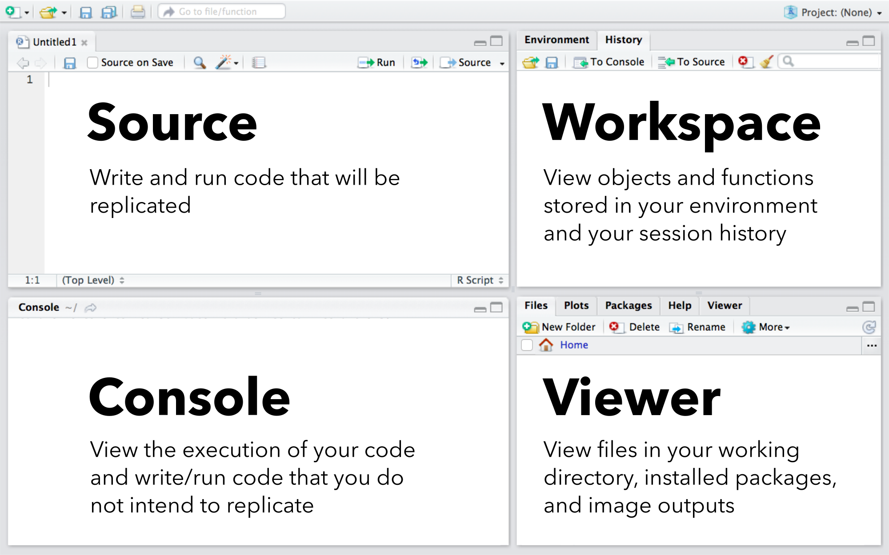

    
  
  
# Introduction to Program R: The structure of R
_Brian S. Evans  
Smithsonian Conservation Biology Institute  
Migratory Bird Center_

This document will lead you through the early steps of data exploration and, in the process, you will explore how R structures and interprets a dataset. It is important that you follow every step, formatting and running your data exactly as the script describes. Since R is a script-based program, R syntax is not very flexible -- you must pay VERY careful attention to detail when writing scripts!

We will be conducting all of our R analyses from R Studio. R Studio is a user interface to Program R that can be used to streamline and organize workflow. The interface consists of four primary panes:

</img>

The **Source Pane** is where we will write most of our R code, which is then executed in the **Console Pane**.

----

### Code execution and assigning R objects

We'll start by creating an R script that executes simple R commands. Open R Studio and create a new R **script** (an R source document) in the Source Pane using the keyboard combination _CTRL+SHIFT+N_ (Windows). Even before you begin, it's good to save the script you will be working on. Save the script onto your computer using the keyboard combination _CTRL+S_. Name the file "MigBirds_RIntro" (_Note: the extension, ".R" will be assigned automatically_).

In the Source Pane, type `1+1+2`. This is a line of **code**. To run the line if code, place your cursor anywhere in the line and use the keyboard combination _CTRL+Enter_.

Let's add a **comment** that describes what we're doing. A comment is a line of code that begins with "#", a symbol that tells R not to evaluate a given line or part of a line. It is crucial to include many comments in your code to communicate the steps of a given analysis to others and your future self. I like to use commenting to provide explanatory section titles above associated code chunks. Let's call this section "Simple Math:" as such:

```{r, eval=FALSE}
# Simple Math:

1+1+2
```

Run the entire section by highlighting it with your mouse and using the keyboard combination _CTRL+Enter_. You'll notice that both lines are run in the console, but only the line that didn't begin with "#" was evaluated.

You can also add a comment after (but not before) a code chunk that you wish to evaluate. This is often very useful in providing a description of a given step. Let's add a comment after the evaluated code and run this section:

```{r, eval=FALSE}
1+1+2 # I added three numbers together
```

Next, we will **assign** a name to our mathematical expression by providing a name followed by an assignment operator and then the expression. Assignment creates an R **object** that can be used in future operations. The objects created are what is known as <b>key-value pairs</b>. The name of the assignment is the key that allows the computer to access the data associated with that key. Assignments can be created with "=" or "<-" operators, however, the use of "<-" is generally considered more readable when communicating your code to others. Let's assign the name "generation1" to our line of code. **_To view the object you created in the console window, you will need add a line that includes the name of the object!_**

```{r, eval=FALSE}
generation1 <- 1+1+2 

generation1
```

Take a look at your Workspace Pane. You will notice that the "Data"" section of the **Global Environment** now includes the R object generation1. To use the object in further operations, simply type the name of the object. For example, let's multiple generation1 by two:

```{r, eval=FALSE}
generation1 * 2
```

If you don't like the name that you created for the object, you can assign a different name (_Note: This creates a duplicate object -- only the name is different_):

```{r, eval=FALSE}
gen1 <- generation1
```

R follows the normal order of operations (i.e., the same order of operations you would find on a scientific calculator or in Microsoft Excel). For example, the mathematical expression:

$$\frac{1+1+2}{3} + \frac{5}{8}$$

Would be written in R as:

```{r, eval=FALSE}
(1+1+2)/3+5/8 
```

----

> **Exercise One:**
>
> Write the code for the following mathematical expression in R and assign a name to the object:
>
$$21 + \frac{34 - 13}{5 \times 8}$$

----

### Functions

The **function** is what Hadley Wickham calls the "fundamental building block of R". Functions are a special type of R object that allow you to conduct often lengthy evaluations with limited work. The R environment contains many functions for data management, graphical display, and statistical analysis. To run a function, you type the name of the function followed by a set of parentheses enclosing what you want your function to evaluate. For example, perhaps you would like to **combine** the integers 1, 1, and 2, as above into a single object. The combine function in R is "c". To combine these values you would type:

```{r, eval=FALSE}
threeValuesOneObject <- 
  c(1,1,2)
```

R has comprehensive help files associated with each function. To access the help file for a given function, simply the "?" and then the name of the function. The help file will be displayed in the **View Pane**. For example, the function "sum" adds the values in a vector. To view this function type the following into the Source or Console Pane:

```{r, eval=FALSE}
?sum
```

Many functions contain **arguments** in addition to the object you are evaluating. These arguments modify the behavior of the function (_Note: Some arguments are necessary while some are optional_). For example, the function "mean" contains an argument "na.rm" that tells R whether you want to remove NA (data Not Available) prior to running the function. Let's make an object with two integers and an NA and calculate the mean of the data with (na.rm = TRUE) and without (na.rm = FALSE) the modifier argument:

```{r, eval=FALSE}
twoValuesWithNA <- 
  c(5,8,NA)

mean(
  twoValuesWithNA,
  na.rm = FALSE)

mean(
  twoValuesWithNA,
  na.rm = TRUE)
```

Functions can also be **nested** inside other functions. This means that you run a function inside of another function. For example, we could have completed the above mean operation using:

```{r, eval=FALSE}
mean(
  c(5,8,NA),
  na.rm = TRUE)
```

_In a future lesson, we will learn how to make custom functions in R that can be used to execute specific tasks. For many complex tasks, functions are available in user-built **libraries** (also called **packages**), that are simply collections of custom functions._

----

> **Exercise Two:**
>
> 1. Create an object that contains the integers 1,1, and 2. 
2. Assign the key "gen1" to the vector and use the "sum" function to add these values together.

----

### Classes of R objects

Above, we used combine to create an object that contained multiple integer values. The object that we created and its component values have a unique class structure that defines what type of object they are. R functions may behave quite differently (or fail completely) across classes of objects, thus knowing the type object you are analyzing is often crucial.

#### Common classes of values

There are numerous classes of **values**, however, those that we normally interact with are: 

* **Numeric**: May be decimals or integers
* **Character**: A string of letters of numbers
* **Factor**: Characters that have been assigned an integer value or, in practice, integers with character labels 

As we've only worked with numeric integer values so far, let's create a character value as an example. To do so, you surround the character in single or double quotation marks. For example, to create an R object of the character string "Hello world", you would type either:

```{r, eval=FALSE}
exampleCharacterValue0 <- "hello world"

exampleCharacterValue1 <- 'hello world'

exampleCharacterValue0

exampleCharacterValue1

```

To convert a character value to a factor, you can use the "factor" function. Factor values take up less system memory than characters and can be implemented in statistical modeling as categorical variables. Run the following and note how the output differs from that of the character:

```{r, eval=FALSE}
factor(exampleCharacterValue0)
```

We can find out the class of a value by using the function "class":

```{r, eval=FALSE}
class(generation1)

class(exampleCharacterValue0)

class(factor(exampleCharacterValue0))
```

#### Common classes of objects containing multiple values

Multiple values may be strung together into a single object, as we did with generation1 above. The class of object we create will depend on the structure of the data and what we intend to do with it.

* **Vector**: A one-dimensional collection of values. All values must be of the same class. If this is not the case, the class of the component values will be modified.

```{r, eval=FALSE}
vector1 <- 
  c(1,1,2,3,5,8)

vector1
```

You can determine how many values comprise a vector using the "length" function:

```{r, eval=FALSE}
length(vector1)
```

* **Matrix**: A two-dimensional collection of values, arranged as rows and columns. Matrices can essentially be thought as a data structure that combines multiple vectors into a single object. Component vectors MUST be of the same class. If this is not the case, the class of the component values will be modified.

Let's turn vector1 into a two-column matrix using the matrix function. Arguments "ncol" and "nrow" specify the number of columns and rows, respectively, of the matrix:

```{r, eval=FALSE}
matrix1 <- 
  matrix(
    vector1,
    nrow = 3,
    ncol = 2)

matrix1
```

* **Data frame**: A two-dimensional collection of values, arranged as rows and columns. Component vectors may be of different classes -- because of this, data frames are very useful for storing data. For example, banding (ringing) data most often include numeric  (e.g., measurement data) and categorical (e.g., species of bird) variables. Let's create and explore a simple data frame composed of two vectors:

```{r, eval=FALSE}
vector1a <- 
  c(1,1,2)

vector2 <- 
  c('a', 'b','c')

dataframe1 <- 
  data.frame(
    vector1a, 
    vector2)

dataframe1
```

To determine the number of rows in a data frame or matrix you can use the "nrow" function:

```{r, eval=FALSE}
nrow(dataframe1)
```

To determine the number of columns in a data frame, you can use the "ncol" or "length" function (because the columns of data frames are themselves vectors):

```{r, eval=FALSE}
ncol(dataframe1)

length(dataframe1)
```

And also view the number of rows and columns (values one and two, respectively) in one step using the "dim" function:

```{r, eval=FALSE}
dim(dataframe1)
```

* **List**: An n-dimensional collection of objects, arranged as list items denoted by "[[i]]". May contain individual values, vectors, data frames, and matrices of different classes and dimensions. Because lists have the flexibility to hold multiple object structures they can be very useful as a place to store data that cannot be easily summarized in a data frame. For example, you could use a list to store separate banding and point count data frames in a single object. Let's create a simple list below:

```{r, eval=FALSE}
list1 <- 
  list(
    'hello world',
    vector1,
    matrix1, 
    dataframe1)

list1
```

Lists do not have rows or columns but, instead, act like vectors of component objects. As such the function "length", as with the vector example above, is used to extract the number of objects that comprise a list.

```{r, eval=FALSE}
length(list1)
```

It may be unclear whether an object is a vector, matrix, data frame, or list. If this is the case, you can use "class" as above to determine the class of the object.


```{r, eval=FALSE}
class(matrix1)

class(dataframe1)

class(list1)
```

As objects such as data frames and lists may contain multiple object classes, you may be interested in knowing the classes of each of the components. To do so, you use the "str" (structure) function:

```{r, eval=FALSE}
str(dataframe1)

str(matrix1)

str(list1)
```

----

> **Exercise Three:**
>
> Create a single R object that includes each of the following three objects:
>
<center> <h4>Text: The bunnies of Pisa </h4> </center> 
\[\begin{array}
{rrr}
6 & 10 & 16 \\
26 & 42 & 68 \\
2 & 3 & 5
\end{array}
\]
\[\begin{array}
{rrr}
PopulationA0 & 6 \\
PopulationB0 & 26 \\
PopulationC0 & 2
\end{array}
\]

----

### Indexing

Values within an R object such as a vector, matrix, data frame, or list can be referred to by their location within the object -- this is known as **Indexing**.

#### Location in a vector

In a vector, the location of a value is identified using brackets ("[ ]"), with the i^th^ location of within a vector, "v", mapped as v[i]. Consider the following vector:

\[\begin{array}
{rrrrrrrrr}
rabbits = 3 & 6 & 9 & 15 & 24 & 39 & 63 \\
\end{array}
\]

Create the vector "rabbits" in R using the combine function.

To extract the second value (6) of the vector rabbits, we would use:

```{r, eval=FALSE}
rabbits[2]
```

We can also extract multiple values at a time. To extract the 1^st^ through 3^rd^ values (3, 6, and 9) within rabbits, we separate the starting and ending location values with a ":" symbol:

```{r, eval=FALSE}
rabbits[1:3]
```

Or use the combine function to select non-adjacent (or adjacent!) values:

```{r, eval=FALSE}
rabbits[c(1,3)]
```

Additionally, we can nest functions within our vector location map. For example, perhaps we're interested in the last value of a vector but the vector is so long that it is unfeasible to count. To address this, we can nest the function "length" within our mapping operation. In the below, notice how the "length" function returns the number of values that make up the vector, which is also the location of the last value:

```{r, eval=FALSE}
length(rabbits)

rabbits[7]

rabbits[length(rabbits)]
```

----

> **Exercise Four:**
>
> 1. Extract the fifth value (24) of the rabbits vector.
2. Use the ":" symbol to extract the third through fifth values in the rabbits vector.
3. Use the combine function to extract the third and fifth values in the rabbits vector.
4. Use the combine and length functions to extract the third and last values in the rabbits vector.

----

#### Using the location of values within matrices and data frames

The location map of values within matrices and data frames are similar to that of vectors but have two components, one representing the row and the other the column. These components are written as [row, column]. To illustrate this, lets take another look at matrix1:

```{r, eval=FALSE}
matrix1
```

You'll notice that the column location is provided after the the comma at the top of each column. Likewise, the row location is provided before the comma.

You can use this row and column address to extract the value at that location. For example, use the following to determine the value at row three, column one of the matrix:

```{r, eval=FALSE}
matrix1[3,1]
```

Notice what happens when you do not provide any address information for matrix1:

```{r, eval=FALSE}
matrix1[,]
```

By leaving out the address information on either side of the comma, you are telling R to return all of the rows and all of the columns of matrix1. You can extract a vector representing a single column or row by providing the address of the row or column you are interested in and leaving the other side of the comma blank:

```{r, eval=FALSE}

# Example One:

matrix1[1,] # Extracts row one of matrix1

# Example Two. 

matrix1[,1] # Extracts column one of matrix1

```

The above tells R to return all of the values in row one across columns in Example One and all of the values in column two across rows in Example Two. 

Similar to our use of the function "length" in our vector assignment, we can nest the functions "nrow" and "ncol" inside matrix or data frame addresses to extract the vector associated with the last row or column, respectively:

```{r, eval=FALSE}

# Example One:

matrix1[nrow(matrix1),] # Extracts the last row of matrix1

# Example Two. 

matrix1[,ncol(matrix1)] # Extracts the last column of matrix1

```


As with vectors, you can use the ":" to extract adjacent columns and rows from data frames and matrices:

```{r, eval=FALSE}
dataframe1[2:3,]
```

Or use the combine function to select non-adjacent (or adjacent!) rows or columns:

```{r, eval=FALSE}
matrix1[c(1,3),]
```

----

>**Exercise Five:** 
>
> 1. Extract the value at the cell address associated with row two, column two in dataframe1.
2. Extract the vector of values associated with row one of dataframe1.
3. Extract the vector of values associated with column two of dataframe1.
4. Use the nrow and ncol functions to extract the value contained in the last row and column of dataframe1.
5. Use the ":" symbol to extract the first and second rows of matrix1.
6. Use the combine function to extract the second and third rows of dataframe1.

----

#### Using location to extract values within lists

Using the location of list objects, called **elements**, is similar to that of vectors. Note that, though list1 is composed of objects that contain multiple dimensions, using the "length" function only returns the number of elements:

```{r, eval=FALSE}
length(list1)
```

To extract a list element from list1, for example the i^th^ element, you use double brackets ("[[i]]"). To extract the matrix from list1 (the third element), you would use:

```{r, eval=FALSE}
list1[[3]]
```

As above, to extract the last element of list1, you could nest the "length" function within the address:

```{r, eval=FALSE}
list1[[length(list1)]]
```

Note that extracting the element returns the object itself. For example, although list1 is an object of class "list", list1[[3]] is an object of class "matrix":

```{r, eval=FALSE}
class(list1)

class(list1[[3]])
```

Because of this, you can extract objects from the list similarly to how you would from the object if it weren't located within the list. Let's look at column two of matrix1, extracting from the matrix itself and from the matrix within the list:


```{r, eval=FALSE}
matrix1[,2]

list1[[3]][,2]
```

#### Changing values based on location

Finally, you can use the location of a cell, column, or row, or list element to assign a new the value of that object For example, we could change the value associated with row two, column one in dataframe1 to 13:

```{r, eval=FALSE}
dataframe1[2,1] <- 13
```

... change the value of just the first two elements of column one:


```{r, eval=FALSE}
dataframe1[1:2,1] <- 
  c(8,13)
```

... or change the value of all of the elements in column one:

```{r, eval=FALSE}
dataframe1[,1] <- 
  c(8,13,21)
```

#### Naming columns and rows and extracting by name

Just as you can assign a name to an object, you can also provide names for the columns of a matrix or data frame and for each list element. This allows you to refer to an object within a matrix, data frame, or list by name rather than just by location. To add names to a dataframe or list, you use the "name" function, followed by a vector of names (in quotations):

```{r, eval=FALSE}

names(dataframe1) <- 
  c('popSize', 'population')

names(list1) <- 
  c('sillyComputerSaying','vector','matrix','dataframe')
```

To add names to a matrix, you use the "colnames" function

```{r, eval=FALSE}

colnames(matrix1) <- 
  c('N0', 'N1')

```

You can add names the rows of a matrix or data frame using the "row.names" function:

```{r, eval=FALSE}
row.names(dataframe1) <-
  c('Population.A','Population.B','Population.C')
```

Because names are a vector, you can access a single name or assign a different name using its address within a vector. For example, you could change the name of the second column in dataframe1:

```{r, eval=FALSE}
names(dataframe1)

names(dataframe1)[2]

names(dataframe1)[2] <- 'N0'

names(dataframe1)
```

Naming columns, rows, and list elements is useful because you can extract the object from its parent list, data frame, or matrix using the name of the object as its address rather than its numeric location: 

```{r, eval=FALSE}
list1[['sillyComputerSaying']]

dataframe1[,'N0']

dataframe1['PopulationA',]

matrix1[,'N0']
```

As a shortcut, you can extract or view columns of a dataframe (but not a matrix) or list elements using the "$":

```{r, eval=FALSE}
dataframe1$N0

list1$sillyComputerSaying
```

----

> **Exercise Six:**
>
> Run the following script to read exampleBirdData.csv into R:
>
>```{r, eval=FALSE}
> # Read in the data:
>
> birdCounts <- 
      read.csv('https://raw.githubusercontent.com/bsevansunc/smsc_data_science/master/data/exampleBirdData.csv')
>```
>
> Use the birdCounts dataset to do the following:
>
> 1. Determine the class of the birdCounts dataset.
2. Determine the class of the species field within birdCounts.
3. Extract the count field of birdCounts as a vector.
4. Create a data frame of birdCounts consisting of the first 20 records and assign the name "birdCounts2".
5. Change the name of the counts field in birdCounts2 to "abundance".
6. Subset birdCount2 to the fields "site",species", "abundance", and "diet". 
7. Change the count for Gray Catbirds (grca) at site 3 from 1 to 2 using the address of the value.

----

### Exploring and summarizing data frames

There are a number of useful functions for further exploring the structure of the data.

The function "head" shows the first six rows of birdCounts. If we use the "n" argument, we can specify the number of rows we would like to show in the console:

```{r, eval=FALSE}
head(birdCounts)

head(
  birdCounts,
  n = 10)
```

You could also extract the first 10 records using the address of the rows. The above is equivalent to:

```{r, eval=FALSE}
birdCounts[1:10,]
```

The function "tail" shows the last six rows of data and the "n" argument is used to specify the number of rows:

```{r, eval=FALSE}
tail(birdCounts)

tail(birdCounts,
     n = 10)
```

We may be interested in observing the number of unique factor levels within the object. To do so, we can use the "levels" function (factors only) or "unique" function (any vector data class) to view the number of factor levels for a given vector within the object:

```{r, eval=FALSE}
levels(birdCounts$diet)

unique(birdCounts$diet)
```

We can nest the above function in the function "length" to determine how many dietary classes are represented within the dataset:

```{r, eval = F}
length(
  unique(birdCounts$diet))
```

Providing basic summary statistics is often a crucial part of data exploration. Let's view some key summary statistics for the vector birdCounts$count:

* Minimum: `min(birdCounts$count)`
* Maximum: `max(birdCounts$count)`
* Mean: `mean(birdCounts$count)`
* Median: `median(birdCounts$count)`
* Quantile: `quantile(birdCounts$count)`
* Standard deviation: `sd(birdCounts$count)`

Finally, we can view several summary statistics for the dataset across fields using the "summary" function:

```{r, eval=FALSE}
summary(birdCounts)
```

----

> **Exercise Seven:** For the birdCount dataset, address the following:
>
>1. Extract the last 10 records using the row addresses (do not use the "tail" function).
2. What are the factor levels for the column "foraging"?
3. How many unique species does the dataset contain?
4. What is the mean value of counts?


----


