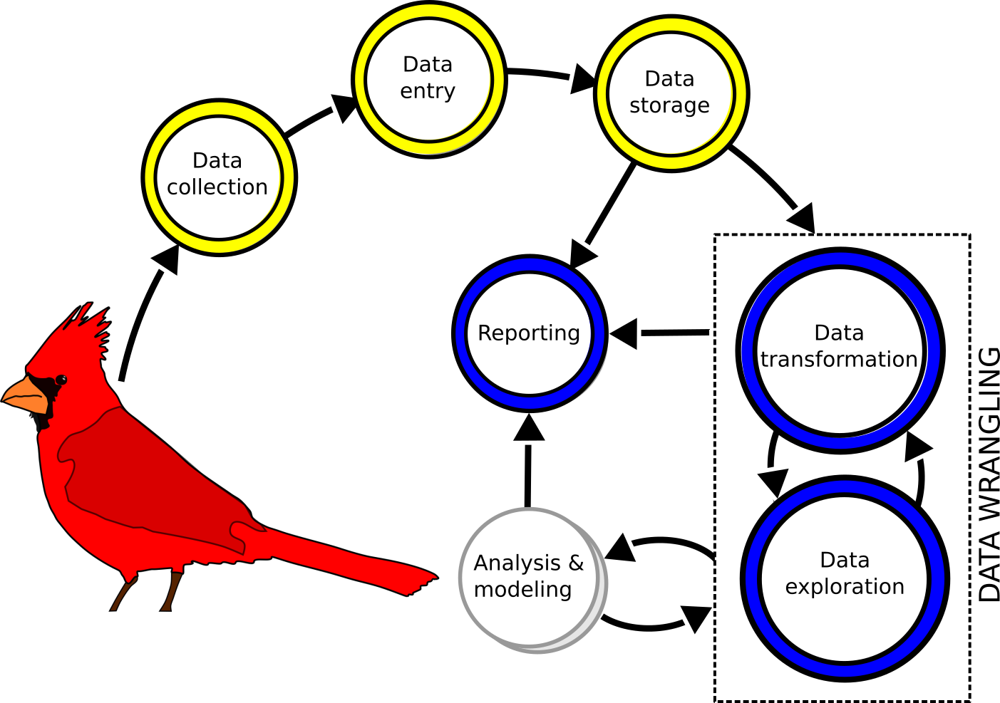

---
output:
  revealjs::revealjs_presentation:
    theme: simple
    highlight: pygments
    center: false
    transition: none
    progress: true
    font-family: Verdana
---

```{r include = FALSE}
# Libraries:
library(tidyverse)

# Functions:

theme_add <- function(){
  theme(
    axis.title = element_text(size = rel(1.5))
  )
}

# Preset values

exampleFactor <- factor(c('three','two','one', 'one'))

exampleFactorLevels <- factor(
  exampleFactor,
  levels = c('one', 'two', 'three')
)

exampleFactorLabels <- factor(
  exampleFactorLevels,
  labels = c('One', 'Two', 'Three')
)

numericVector <- c(1, 1, 2, 3)


```

<head>
<style>
  code{
    background-color:#f2f2f2;
  }
  
  span.co{
    color:#000080;
    font-weight: bold;
  }
  
  img{
	      display: block;
	      padding-left: 15px;
        padding-right: 15px;
        padding-top: 10px;
        padding-bottom: 10px;
  }

  p{
    text-align: left;
    font-size: 24px;
  }

  ul, ol{
    line-height: 28px;
    text-align: left;
    font-size: 24px;
    margin-left: 0px;
  }
  
  h2{
    font-size: 36px;
  }
  
  .row{
    margin: auto;
  }
  
  table {
    border-collapse: collapse;
}

table, td, th {
    border: 1px solid black;
    padding: 5px;
    text-align: right;
    vertical-align: middle;
}
  
  /* Create two equal columns that floats next to each other */
.column {
    float: left;
    width: 50%;
    padding: 10px;
}

/* Clear floats after the columns */
.row:after {
    content: "";
    display: table;
    clear: both;
}
</style>
</head>

<h2>Introduction to data science in R</h2>
<hr>
<p style = "text-align: center; font-size: 24px;">Brian S. Evans, Ph.D.<p/>
Migratory Bird Center<br />
Smithsonian Conservation Biology Institute</p>
<br>

 
## Data science workflow
<hr>

	      
## Data science workflow
<hr>

	      
## Data science workflow
<hr>

	      
## Re-thinking data
<hr>
<p style="text-align: center;">How we've interacted with data dictates how we structure data mentally.</p>


	      
## Workshop goals
<hr>
<ul style="line-height: 150%;">
<li>Today: Workshop overview and logic</li>
<li>In pursuit of normal data (Codd’s rules & tidyr)</li>
<li>Data visualization (ggplot)</li>
<li>Functions and how to avoid them (dplyr)</li>
<li>For loops and how to avoid them (purrr)</li>
<li>Redefining normal: Nested datasets (purrr)</li>
<li>Applications: Introduction to geospatial analysis with R (sf)</li>
<li>Introduction to data reporting (RMarkdown & Shiny)</li>
</ul>


## Today's goals
<hr>
<ul style="line-height: 150%;">
<li>RStudio</li>
<li>Best practices in coding</li>
<li>Logic
<ul>
<li><b>Objects</b>: Container for holding values</li>
<li><b>Indexing</b>: Querying objects by position</li>
<li><b>Logic</b>: Querying objects using logical operators
</ul></li>
</ul>

## RStudio
<hr>


## Best practices - A few starting points
<hr>

<ul style="line-height: 150%;">
<li>Always work in a project! Avoiding `setwd()` or long references to points on your computer</li>
```{r eval = FALSE}
/Users/brianevans/gits/smbc-nzp.github.io/www/kml.jpg
```
<li>Using `source` to stop rebuilding the wheel (<a style = "color: red;">danger</a>)</li>
<li>Avoiding package proliferation</li>
<li>Use keyboard shortcuts!
<ul>
<li>Shortcut help: option(alt)-shift-k</li>
<li>Running code! cmd(ctrl)-return(enter)</li>
</ul>
</li>
</ul>

## Best practices - Communicating code
<hr>
<ul style="line-height: 150%;">
<li>Sectioning: cmd-shift-r</li>
<li>Commenting code</li>
<li>Formatting code chunks</li>
<li>Reading and writing data</li>
<li>Version control (Github)</li>
</ul>


## Querying data
<hr>
<ul>
<li>Using logic with objects</li>
<li>The logical operators to compare <b>values</b> and <b>sets</b></li>
<li>Indexing and logic:
<ul>
<li>Querying <b>vectors</b>, <b>matrices</b>, and <b>data frames</b></li>
<li>Working with <b>strings</b></li>
<li>Summarizing and queries</li>
</ul></li>
<li>Practice with real data</li>
</ul>

## Review: Indexing vectors
<hr>
<p>Each value in a vector has a position, denoted by "[<i>x</i>]"</p>

<table style = "font-size: 1em; vertical-align: middle;">
<tr>
  <th style = "text-align: center; font-weight: normal;">[1]</th>
  <th style = "text-align: center; font-weight: normal;">[2]</th>
  <th style = "text-align: center; font-weight: normal;">[3]</th>
  <th style = "text-align: center; font-weight: normal;">[4]</th>
</tr>
<tr>
  <td style = "text-align: center;">1</td>
  <td style = "text-align: center;">1</td>
  <td style = "text-align: center;">2</td>
  <td style = "text-align: center;">3</td>
</tr>
</table>

```{r eval = FALSE}
# Use indexing to subset a vector:

numericVector

numericVector[3]

numericVector[3:4]

numericVector[c(1,3)]
```

## Review: Indexing matrices
<hr>
<p>A <b>matrix</b> is a two dimensional object -- basically a vector that has been positioned as multiple columns. All values must be of the same class.</p>

```{r eval = TRUE}
# Generate matrix:

m <- 
  matrix(
    c(1, 1, 2, 3),
    ncol = 2)

m
```

## Matrix objects: Indexing
<hr>
<p>Values in a matrix have a row (x) and column (y) position, denoted by "[<i>x</i>, <i>y</i>]"</p>
<table style = "font-size: 1.1em; vertical-align: middle;">
<tr>
  <th style = "text-align: center; font-weight: normal;"></th>
  <th style = "text-align: center; font-weight: normal;">[ ,1]</th>
  <th style = "text-align: center; font-weight: normal;">[ ,2]</th>
</tr>
<tr>
  <td style = "text-align: center;">[1, ]</td>
  <td style = "text-align: center;">1</td>
  <td style = "text-align: center;">2</td>
</tr>
<tr>
  <td style = "text-align: center;">[2, ]</td>
  <td style = "text-align: center;">1</td>
  <td style = "text-align: center;">3</td>
</tr>
</table>

```{r eval = FALSE}
# Index by row (x) and column (y) position [x,y]:

m[1,1]

m[2,2]

m[1:2,2]

```

## Review: logical values
<hr>
<br>
<div style = "text-align: left;">
<p> R reserves the words TRUE and FALSE as logical constants. These constants are mapped to integer values:</p>
<ul>
<li><b>FALSE</b>: 0</li>
<li><b>TRUE</b>: 1</li>
</ul>
</div>

## Review: logical values
<hr>
<br>
```{r is equal to, eval = FALSE}
# The "is equal to" logical operator:

3 == 3

3 == 4

3 == 2 + 1

3 == 3 + 1

(3 == 3) + (3 == 2 + 1)
```

## Using logic with objects
<hr>
<p>Logical tests can be run on sets of values.</p>
<br>
```{r logic with objects vector, eval = FALSE}
# Generate and evaluate whether values in vector v are equal to 3:

v <-
  c(1, 1, 2, 3, 5, 8)

v

v == 3
```

## Using logic with objects
<hr>
<p>Logical tests can be run on sets of values.</p>
<br>
```{r logic with objects matrix, eval = FALSE}
# Generate and evaluate whether values in matrix m are equal to 3:

m <-
  matrix(
    v,
    ncol = 2)

m

m == 3
```

## Using logic with objects
<hr>
<p>Logical tests can be run on sets of values.</p>
<br>
```{r logic with objects data frame, eval = FALSE}
# Generate and evaluate whether values in data frame df are equal to 3:

df <- 
  as.data.frame(m)

df

df == 3
```

## Logical operators
<hr>
<br>
<table>
<tr>
  <th><b>Operator</b></th>
  <th><b>Description</b></th>
  <th><b>Value class</b></th>
</tr>
<tr>
  <td>x == y</td>
  <td>x is equal to y</td>
  <td>any</td>
</tr>
<tr>
  <td>x != y</td>
  <td>x is NOT equal to y</td>
  <td>any</td>
</tr>
<tr>
  <td>!x</td>
  <td>NOT x</td>
  <td>any</td>
</tr>
<tr>
  <td>x < y</td>
  <td>x is less than y</td>
  <td>numbers</td>
</tr>
<tr>
  <td>x <= y</td>
  <td>x is less than or equal to y</td>
  <td>numbers</td>
</tr>
<tr>
  <td>x > y</td>
  <td>x is greater than y</td>
  <td>numbers</td>
</tr>
<tr>
  <td>x >= y</td>
  <td>x is greater than or equal to y</td>
  <td>numbers</td>
</tr>
</table>

## Logic: Comparing values
<hr>

```{r explore logical operators with v, eval = FALSE}

# Explore logical operators with vector v:

v

v != 3

!(v == 3)

v < 3

v <= 3

v > 3

v >= 3

```
<p>Repeat the above with your matrix, `m`, and data frame, `df`.</p>

## Logic: Comparing sets
<hr>
<p>The operator `%in%` tests the logic statement "is in".</p>
<br>

```{r using in, eval = FALSE}
# Test whether values in v match values 1 or 3:

v %in% c(1,3)

```

## Logic: Comparing sets
<hr>
<p>The NOT statement, `!x`, in combination with `%in%`, is a powerful tool to examine sets.</p>
<br>

```{r using in and not, eval = FALSE}
# Test whether values in v DO NOT match values 1 or 3:

!(v %in% c(1,3))

```


## Logic: Comparing sets

<hr>
<p>You can also compare sets with <i>and/or</i> statements, represented in R by `&` and `|`.</p>
<br>

```{r using and or, eval = FALSE}
# Test whether values in v match values 1 OR 3:

v == 1 | v ==3

# Test whether values in v match values 1 AND 3:

v == 1 & v == 3

```

## Logic: Comparing sets
<hr>
<p>The AND operator is very useful when querying across multiple conditions.</p>
<br>

```{r better use of and, eval = FALSE}
# Test whether values in v are less than 5 and not equal to 2:

v < 5 & v != 2

```

<p>Now you ... test whether values in v are less than 5 and not equal to 2 OR equal to eight</p>


## Indexing & logic: Query vectors
<hr>
<p>The position of value `x` in vector `v` is notated as `v[x]`
<br>
```{r vector index review, eval = FALSE}
# Use indexing to subset a vector:

v[3]

v[3:4]

v[c(1,3)]

```

## Indexing & logic: Query vectors
<hr>
<p>The position of value `x` in vector `v` is notated as `v[x]`
<br>

## Indexing & logic: Vectors
<hr>
<p>You may also query values by <b>condition</b>, using logic, in the same manner as above.</p> 
<p>For example, vector `v` where value v<sub>x</sub> is greater than two:</p>
<br>
```{r logic query vector, eval = FALSE}
# Use logic to subset a vector:

v

v > 2

v[v > 2]

```

## Indexing & logic: Vectors
<hr>
<p>You may also query values by <b>condition</b>, using logic, in the same manner as above.</p> 
<p>For example, vector `v` where value v<sub>x</sub> is greater than two:</p>
<br>
```{r logic query with which, eval = FALSE}
# At which indices does our logical statement evaluate to TRUE?

v

v > 2

which(v > 2)

v[4:6]

v[v > 2]
```

## Indexing & logic: Vectors
<hr>
<p>Take a moment to query vector `v` based on the following conditions:</p>
<br>
<ul>
<li>Values greater than or equal to 3</li>
<li>Values that do not equal 2</li>
<li>Values that equal 2</li>
<li>Values greater than or equal to 3 but do not equal 5</li>
<li>Values that are 3 or 5</li>
</ul>

## Indexing & logic: Matrices
<hr>
<p>The position of value `x,y` (row, column) in a matrix, `m`, can be notated as `m[x,y]`.</p>
<br>
```{r matrix index, eval = FALSE}
# Index matrix m by row (x) and column (y) position [x,y]:

m[,]

m[1,1]

m[2,2]

m[2, ]

m[ ,2]

m[1:2,2]

```

## Indexing & logic: Matrices
<hr>
<p>Matrix queries are fundamentally the same as vector queries:</p>
<br>

```{r m just logic, eval = FALSE}
# Logical test of whether the first column of m is greater than 1:

m[,1] > 1

# At which indices does our logical statement evaluate to TRUE?

which(m[,1] > 1)

# Query m by index and logical statement:

m[3, ]

m[m[,1] > 1, ]

```

## Indexing & logic: Matrices
<hr>
<p>Matrix queries using "matrix notation" can be very hard to read:</p>
<br>
```{r m query complicated, eval = FALSE}
# Querying matrix by column 1 less than 2 and column 2 less than 5

which(m[,1] < 2 &  m[,2] < 5)

m[m[,1] < 2 &  m[,2] < 5 , ]

```

## Indexing & logic: Data frames
<hr>
<p>The position of value `x,y` (row, column) in a data frame, `df`, can be notated as `df[x,y]`.</p>
<br>
```{r data frame index, eval = FALSE}
# Index dataframe df by row (x) and column (y) position [x,y]:

df[,]

df[1,1]

df[2,2]

df[2, ]

df[ ,2]

df[1:2,2]

```

## Indexing & logic: Data frames
<hr>
<p>Recall ...</p>
<br>
```{r data frame reset names 2, eval = FALSE}
# Data frame indexing by position ...

df[,1]

df[,2]

# ... is equivalent to:

df$hello

df$world
```

## Indexing & logic: Data frames
<hr>
<p>Thus ...</p>
<br>
```{r data frame query by position and name, eval = FALSE}

# Querying data frames using "matrix notation" ...

df[,1] > 1

which(df[,1] > 1)

df[df[,1] > 1,]

# ... is equivalent to using column names:

df$hello > 1

which(df$hello > 1)

df[df$hello > 1,]

```

## Indexing & logic: Data frames
<hr>
<br>
<p>Now you: Query  `df` such that values of column one are less than 2 and values of column two are less than 5. Use "matrix notation" and the column names of `df` to do so.</p>
<br>

## Indexing & logic: Strings
<hr>
<br>
<p>The tidyverse has a packages `stringr` that is useful for querying strings.</p>
<br>

```{r load fruits, eval = FALSE} 
library(tidyverse)
library(stringr)

fruit

# Query the first five fruits by index:

fruit[1:5]

```

## Indexing & logic: Strings
<hr>
<p>Which fruits are apples?</p>
```{r fruit by full name, eval = FALSE} 
# Which position in the fruit vector is apple?

fruit == 'apple'

which(fruit == 'apple')

# Subsetting to fruits named "apple" by position ...

fruit[1]

fruit[which(fruit == 'apple')]

# ... is equivalent to subsetting by condition:

fruit[fruit == 'apple']
```

## Indexing & logic: Strings
<hr>
<p>Extract characters from strings using `str_sub`.</p>
```{r hello world str_sub, eval = FALSE}
# Subset "hello world" to just "hello":

str_sub('hello world', start = 1, end = 5)

# Subset to just "world":

str_sub('hello world', start = 7, end = 12)

# You actually don't have to specify the end point here:

str_sub('hello world', start = 7)

# You can also count from the end:

str_sub('hello world', start = -5)

```

## Indexing & logic: Strings
<hr>
<p>`str_sub` can be used for smart queries of strings. For example, which fruits start with the letter "a"?</p>

```{r fruit by str_sub, eval = FALSE} 

# str_sub can be used to examine the first letter of each value:

str_sub(fruit, start = 1, end = 1)

str_sub(fruit, start = 1, end = 1) == 'a'

which(str_sub(fruit, start = 1, end = 1) == 'a')

# Subsetting to fruits with 7 characters by index or condition:

fruit[1:3]

fruit[which(str_sub(fruit, start = 1, end = 1) == 'a')]

fruit[str_sub(fruit, start = 1, end = 1) == 'a']
```

## Indexing & logic: Strings
<hr>
<p>We can also query by the number of characters (i.e., symbols, numbers, or letters) in the string. For example, perhaps we're not interested in "apple" but rather any fruit that has five letters:</p>

```{r fruit by str_count, eval = FALSE} 

# str_count can be used to determine the number of letters
# or symbols in a string:

fruit

str_count(fruit)

# Which fruits have exactly 5 letters?

str_count(fruit) == 5

which(str_count(fruit) == 5)
```

## Indexing & logic: Strings
<hr>
<p>We can also query by the number of characters (i.e., symbols, numbers, or letters) in the string. For example, perhaps we're not interested in "apple" but rather any fruit that has five letters:</p>

```{r fruit by str_count 2, eval = FALSE} 
# Subsetting to fruits with 5 characters by index ...

fruit[c(1,34,36,44,49,53,58)]

# ... is equivalent to ...

fruit[which(str_count(fruit) == 5)]

# ... and is also equivalent to subsetting by condition:

fruit[str_count(fruit) == 5]
```

## Indexing & logic: Strings
<hr>
<p>`str_detect` is a logical test of whether a provided pattern is present in a target value. For example, we might explore the example phrase "hello world" as such:</p>

```{r hello world str_detect, eval = FALSE} 
# Detecting a pattern within a string:

str_detect('hello world', pattern = 'hello')

str_detect('hello world', pattern = 'ello')

str_detect('hello world', pattern = 'lo wo')

str_detect('hello world', pattern = 'world')

str_detect('hello world', pattern = "foo")

str_detect('hello world', pattern = 'helloworld')

```

## Indexing & logic: Strings
<hr>
<p>How many fruits contain the word apple?</p>
```{r fruit by str_detect, eval = FALSE} 
# Which fruits contain the pattern "apple"?

str_detect(fruit, 'apple')

which(str_detect(fruit, 'apple'))

# Subsetting to fruits with the pattern "apple" by index ...

fruit[c(1,62)]

fruit[which(str_detect(fruit, 'apple'))]

# ... and is also equivalent to subsetting by condition:

fruit[str_detect(fruit, 'apple')]
```

## Summarizing and queries
<hr>
<p>Querying with indexing and logic can be a great way to summarize your data.</p>

```{r dummy data minMax, eval = FALSE}

# Make a dummy data frame:

dummyData <-  data.frame(
  gen = c('a', 'b', 'a', 'a', 'b'),
  n = c(3,5,8,13, 21)
  )

dummyData

# Basic summary statistics of the dummy data frame:

summary(dummyData)

min(dummyData$n)

max(dummyData$n)

```

## Summarizing and queries
<hr>
<p>We often want to see summary values associated with treatment levels. Let's explore querying `dummyData` by maximum and minimum values:</p>

```{r dummy data minMax subset, eval = FALSE}

# Subset to maximum and minimum values, returning separate results:

dummyData[dummyData$n == min(dummyData$n),]

dummyData[dummyData$n == max(dummyData$n),]

# Subset to maximum and minimum n values, returning both
# results in one frame:

dummyData[dummyData$n == min(dummyData$n)|
            dummyData$n == max(dummyData$n),]

```

## Summarizing and queries
<hr>
<p>Provide the minimum value of n for treatment level "a". We might address this as:</p>

```{r dummy data minMax subset extract, eval = FALSE}

# Subset to group "a":

dummyData[dummyData$gen == 'a',]

# As a data frame, we can pull out the second column using indexing ...

dummyData[dummyData$gen == 'a',2]

# ... or by name (my preference):

dummyData[dummyData$gen == 'a',]$n


# We can then calculate the minimum value in group "a" as:

min(dummyData[dummyData$gen == 'a',]$n)

```

## Practice with real data
<hr>
<p>We will practice on an example data frame built in to the tidyverse package. The data provided are the size of the human population, by country, from 1995 to 2013 (source: World Health Organization's Tuberculosis Report, see http://www.who.int/tb/country/data/download/en/). Let's first load and explore the data:</p>
<br>

```{r tb data load, eval = FALSE}

# Load WHO's TB dataset:

population
```

## Practice with real data
<hr>
<p>Let's explore the population of the United States. We'll start by subsetting the data to records where the "country" value is the "United States".</p>
<br>
```{r us population data fail, eval = FALSE}

# Subset population data to the United States:

population[population$country == 'United States', ]

```

## Practice with real data
<hr>
```{r us population United query, eval = FALSE}

# What are the country names?

unique(population$country)

# Which of these countries contain the pattern "United"?

str_detect(unique(population$country), 'United')

unique(population$country)[str_detect(unique(population$country),
                                      'United')]

# They call the United States "United States of America", so 
# the query could be written as:

population[population$country == 'United States of America',]

```

## Practice with real data
<hr>
<p>Perhaps you are interested in what the population of the United States was in 2004. Query the data to the year 2004 and return the population size, as below:</p>
```{r us population 2004, eval = FALSE}

# To determine the size of a population in 2004:

population[population$year == 2004,]

# Therefore, the data frame reduced to the population 
# of the United States in 2004:

population[population$country == 'United States of America' &
             population$year == 2004,]

# To return just the population information:

population[population$country == 'United States of America' & 
             population$year == 2004,]$population

```
	    
## Practice with real data
<hr>
<p>In what years was the population of the United States greater than 300 million?</p>  
```{r us population greater than 300M, eval = FALSE}

# Subset the population data frame to records with a 
# population of greater than 300 million:

population[population$population > 300000000,]

# Repeat the above, but subset the records to the United States:

population[population$country == 'United States of America' &
             population$population > 300000000,]

# To return just the years:

population[population$country == 'United States of America' &
             population$population > 300000000, ]$year

```

## Practice with real data
<p><b>Now you</b>! Use the population dataset to explore the following questions:</p>
<br>

<ol>
<li>What was the population of Palau in 2005?</li>
<li>Which countries had a population of less than 10,000 in 2013?</li>
<li>Which country had the smallest population in 2005?</li>
<li>What was the population of the United Kingdom in 2008?</li>
</ol>