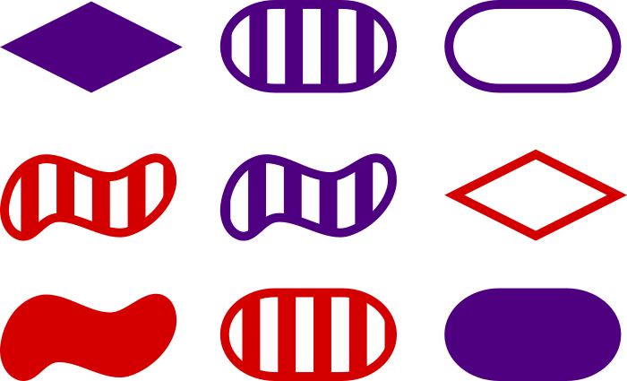
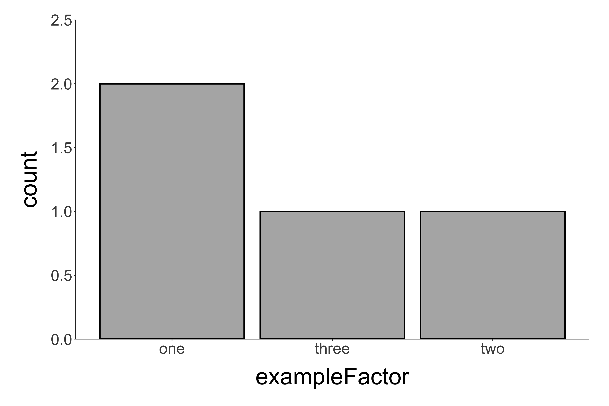
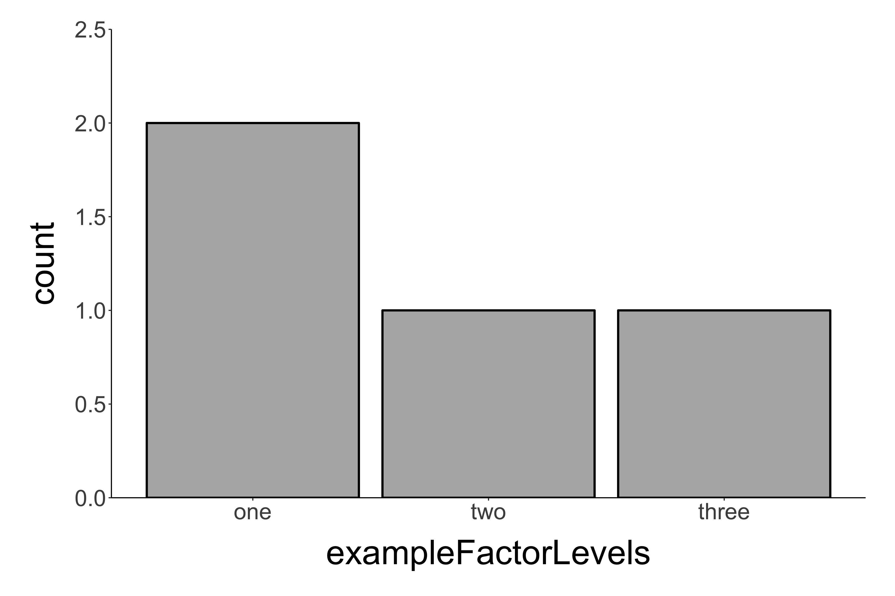

---
output:
  revealjs::revealjs_presentation:
    theme: simple
    highlight: pygments
    center: false
    transition: none
    progress: true
    font-family: Verdana
---

<style>
  code{
    background-color:#f2f2f2;
  }
  
  ul{
    line-height: 3em;
  }
  
  span.co{
    color:#000080;
    font-weight: bold;
  }
  
  img{
	      border-style: solid;
	      border-width: 40px;
	      border-color: white;
	      width: 65%;
	      display: block;
	      margin-left: auto;
        margin-right: auto;
	      padding: 10px;
  }

  p{
    text-align: left;
  }

  ul{
    text-align: left;
    margin-left: 0px;
  }
  
  th, td {
    padding: 15px;
    text-align: right;
    vertical-align: middle;
  }

</style>

```{r include = FALSE}
# Libraries:
library(tidyverse)

# Functions:

theme_add <- function(){
  theme(
    axis.title = element_text(size = rel(1.5))
  )
}

# Preset values

exampleFactor <- factor(c('three','two','one', 'one'))

exampleFactorLevels <- factor(
  exampleFactor,
  levels = c('one', 'two', 'three')
)

exampleFactorLabels <- factor(
  exampleFactorLevels,
  labels = c('One', 'Two', 'Three')
)

```

## Data science workflow
<hr>

	      
## Data science workflow
<hr>

	      
## Data science workflow
<hr>


## Re-thinking data
<hr>
<p style="text-align: center;">How we've interacted with data dictates how we structure data mentally.</p>


	      
<!This is an important place to start because, in many fields, including science, we are hardwired by inertia to consider this -- the typical excel worksheet -- as data. This dictates how we interact with data and limits our flexibility.
In this workshop we'll work to increase our flexibility to rebuilding how we consider data from the ground up>

## Re-thinking data
<hr>


## Today's goals
<hr>
<ul style="line-height: 150%;">
<li><b>Value</b>: Any datum (single unit of data)</li>
<li><b>Object</b>: Container for holding values</li>
<li><b>Indexing</b>: Querying objects by position</li>
<li><b>Logic</b>: Querying objects using logical operators</li>
</ul>

## Values
<hr>
<p>A value is defined by its:</p>
<div style = "text-align: left;">

<ul>
<li>State</li>
<li>
Attributes (metadata), e.g.:
<ul>
<li>Name</li>
<li>Class</li>
</ul>
</li>
<li>Context</li>
</ul>
</div>

## Values

<hr>
<p style="text-align: center;">Values are distinguished by similarities and differences in their multi-dimensional <b>states</b>, <b>attributes</b>, and <b>contexts</b>.</p>



<!include: Developing a flexible R skillset, and combating the inertia of our Excel-trained brains, requires us to not think of collections of values as fixed entities, but rather as sets that may be arranged ...>

## Values

<hr>
<p style="text-align: center;">Values are distinguished by similarities and differences in their multi-dimensional <b>states</b>, <b>attributes</b>, and <b>contexts</b>.</p>


<!include: Developing a flexible R skillset, and combating the inertia of our Excel-trained brains, requires us to not think of collections of values as fixed entities, but rather as sets that may be arranged ...>

## Values

<hr>
<p style="text-align: center;">Values are distinguished by similarities and differences in their multi-dimensional <b>states</b>, <b>attributes</b>, and <b>contexts</b>.</p>


<!include: ... and re-arranged>

## Classes of values

<hr>
<p>In R, the most commonly used types of values are:</p>
<ul>
<li><b>Number values</b>: numeric and integers</li>
<li><b>Character</b>: string (i.e., symbols)</li>
<li><b>Factor</b>: a smart combination of words/letters and integers</li>
<li><b>Logical</b>: integer values of 0 and 1 assigned to words
</ul>

## Classes of values: Numeric

<hr>
<p>Number values can be either:</p>
<ul>
<li><b>Numeric</b>: double precision floating point numbers (on the user end this can be thought of as a decimal number)</li>
<li style = "color:#c0c0c0;" ><b>Integer</b>: whole numbers</li>
</ul>

```{r eval = FALSE}
# Create a vector of numeric values:

numericV <- c(3, 2, 1, 1)

numericV

```

## Classes of values: Numbers

<hr>
<p>Number values can be either:</p>
<ul>
<li><b>Numeric</b>: double precision floating point numbers (on the user end this can be thought of as a decimal number)</li>
<li style = "color:#c0c0c0;" ><b>Integer</b>: whole numbers</li>
</ul>

```{r eval = FALSE}

# What type of object is this?

class(numericV)

str(numericV)

summary(numericV)

```

## Classes of values: Numbers

<hr>
<p>Number values can be either:</p>
<ul>
<li style = "color:#c0c0c0;" ><b>Numeric</b>: double precision floating point numbers (on the user end this can be thought of as a decimal number)</li>
<li><b>Integer</b>: whole numbers</li>
</ul>

```{r eval = FALSE}
# Create a vector of numeric integer values:

numericInteger <- 1:5

numericInteger

# What type of object is this?

class(numericInteger)

str(numericInteger)

summary(numericInteger)
```

## Classes of values: Character

<hr>
<p style="text-align: center;"> A <b>character</b> or "string" value is a symbol or set of symbols from a given library</p>

```{r eval = FALSE}
# Create a vector of character values:

exampleCharacter <- c('three', 'two', 'one', 'one')

exampleCharacter

# What type of object is this?

class(exampleCharacter)

str(exampleCharacter)

summary(exampleCharacter)
```

## Classes of values: Factor

<hr>
<p> A <b>factor</b> value includes the following information:</p>
<ul>
<li><b>Integer value</b>: Numeric integer value associated with factor level</li>
<li><b>Levels</b>: Character values associated with integer value</li>
<li><b>Labels</b>: Characters to assign to each factor level</li>
</ul>


```{r eval = FALSE}
# Create a vector of factor values:

exampleFactor <- factor(c('three', 'two', 'one', 'one'))

exampleFactor

# What type of object is this?

class(exampleFactor)

str(exampleFactor)

summary(exampleFactor)
```

## Classes of values: Factor

<hr>


## Classes of values: Factor

<hr>
<p> A <b>factor</b> value includes the following information:</p>
<ul>
<li><b>Integer value</b>: Numeric integer value associated with factor level</li>
<li><b>Levels</b>: Character values associated with integer value</li>
<li><b>Labels</b>: Characters to assign to each factor level</li>
</ul>

```{r eval = FALSE}
# Set factor levels and labels:

factor(c('three', 'two', 'one', 'one'))

factor(
  c('three', 'two', 'one', 'one'),
  levels = c('one', 'two', 'three')
  )
```

## Classes of values: Factor

<hr>


## Classes of values: Factor

<hr>
<p> A <b>factor</b> value includes the following information:</p>
<ul>
<li><b>Integer value</b>: Numeric integer value associated with factor level</li>
<li><b>Levels</b>: Character values associated with integer value</li>
<li><b>Labels</b>: Characters to assign to each factor level</li>
</ul>

```{r eval = FALSE}
# Set factor levels and labels:

factor(c('three', 'two', 'one', 'one'))

factor(
  c('three', 'two', 'one', 'one'),
  levels = c('one', 'two', 'three'),
  labels = c('One', 'Two', 'Three')
  )
```

## Classes of values: Factor

<hr>


## Classes of values: Logical

<hr>
<div style = "text-align: left;">
<p> R reserves the words TRUE and FALSE as logical constants. These constants are mapped to integer values:</p>
<ul>
<li><b>FALSE</b>: 0</li>
<li><b>TRUE</b>: 1</li>
</ul>
</div>

```{r eval = FALSE}
# Observe the behavior of logical values:

FALSE

TRUE

as.numeric(FALSE)

as.numeric(TRUE)

FALSE + TRUE

FALSE + TRUE + TRUE
```

## Classes of values: Logical

<hr>
<div style = "text-align: left;">
<p>Logical values can be obtained by evaluating objects with <b>logical operators</b>. For example, the logical operator `==` tests whether a value is equal to another value.</p>
</div>
```{r eval = FALSE}
# The "is equal to" logical operator:

3 == 3

3 == 4

3 == 2 + 1

3 == 3 + 1

(3 == 3) + (3 == 2 + 1)
```

## Objects: Containers for values

<hr>
<p>In R, containers called <b>objects</b> structure collections of values. Different types of objects store values in different ways:</p>

<br>
<table style = "font-size: 1.1em; border-style: solid; vertical-align: middle;">
<tr style = "border-style: solid;">
  <th style = "text-align: center;">Object dimensions</th>
  <th style = "text-align: center;">Homogeneous class</th>
  <th style = "text-align: center;">Heterogeneous class</th>
</tr>
<tr>
  <td style = "text-align: center;">1-D</td>
  <td style = "text-align: center;">Atomic vector</td>
  <td style = "text-align: center;">List</td>
</tr>
<tr>
  <td style = "text-align: center;">2-D</td>
  <td style = "text-align: center;">Matrix</td>
  <td style = "text-align: center;">Data frame</td>
</tr>
</table>

## Objects: Containers for values
<hr>
<p>For each object type, we'll address:</p>
<div style = "text-align: left;">
<ul>
<li>Structure</li>
<li>Indexing</li>
<li>Attributes</li>
</ul>
</div>

## Vector objects: Structure
<hr>
<p>An <b>atomic vector</b> is a one-dimensional collection of values. All values must be of the same class.</p>
<p>Each value in a vector has a position, denoted by "[<i>x</i>]"</p>
<br>
<table style = "font-size: 1.1em; vertical-align: middle;">
<tr>
  <th style = "text-align: center; font-weight: normal;">[1]</th>
  <th style = "text-align: center; font-weight: normal;">[2]</th>
  <th style = "text-align: center; font-weight: normal;">[3]</th>
  <th style = "text-align: center; font-weight: normal;">[4]</th>
</tr>
<tr>
  <td style = "text-align: center;">1</td>
  <td style = "text-align: center;">1</td>
  <td style = "text-align: center;">2</td>
  <td style = "text-align: center;">3</td>
</tr>
</table>

## Vector objects: Structure
<hr>
<p>An <b>atomic vector</b> is a one-dimensional collection of values. All values must be of the same class.</p>

```{r}
# A vector of numeric values:

numericVector <- c(1, 1, 2, 3)

numericVector

summary(numericVector)
```

## Vector objects: Structure
<hr>
<p>An <b>atomic vector</b> is a one-dimensional collection of values. All values must be of the same class.</p>

```{r}
# All values in a vector must be of the same class:

numericVector

messyVector <- c(1, 'one', 2, 3)

messyVector
```

## Vector objects: Indexing
<hr>
<p>Each value in a vector has a position, denoted by "[<i>x</i>]"</p>

<table style = "font-size: 1em; vertical-align: middle;">
<tr>
  <th style = "text-align: center; font-weight: normal;">[1]</th>
  <th style = "text-align: center; font-weight: normal;">[2]</th>
  <th style = "text-align: center; font-weight: normal;">[3]</th>
  <th style = "text-align: center; font-weight: normal;">[4]</th>
</tr>
<tr>
  <td style = "text-align: center;">1</td>
  <td style = "text-align: center;">1</td>
  <td style = "text-align: center;">2</td>
  <td style = "text-align: center;">3</td>
</tr>
</table>

```{r eval = FALSE}
# Use indexing to subset a vector:

numericVector

numericVector[3]

numericVector[3:4]

numericVector[c(1,3)]
```

## Vector objects: Attributes
<hr>
<div style = "text-align: left;">
<p>Typical attributes we are interested in of vectors include:</p>
<ul>
<li><b>Class</b>: What type of values?
<li><b>Length</b>: How many values?
</ul>
</div>

```{r eval = FALSE}
# Attributes of the vector:

class(numericVector)

length(numericVector)

str(numericVector)
```

## Vector objects: Attributes
<hr>
<p>Attributes can be added to vectors.</p>
<br>
```{r eval = FALSE}
# Adding attributes to a vector:

numericVector

names(numericVector)

names(numericVector) <- c('orange', 'pear', 'apple', 'apple')
```

## Vector objects: Attributes
<hr>
<p>Vectors can be indexed by their names attribute.
<table style = "font-size: 1.1em; vertical-align: middle;">
<tr>
  <th style = "text-align: center; font-weight: normal;">['orange']</th>
  <th style = "text-align: center; font-weight: normal;">['pear']</th>
  <th style = "text-align: center; font-weight: normal;">['apple']</th>
  <th style = "text-align: center; font-weight: normal;">['apple']</th>
</tr>
<tr>
  <td style = "text-align: center;">1</td>
  <td style = "text-align: center;">1</td>
  <td style = "text-align: center;">2</td>
  <td style = "text-align: center;">3</td>
</tr>
</table>

```{r eval = FALSE}
numericVector[2]

numericVector['pear']

numericVector[2] == numericVector['pear']

numericVector[c('orange', 'pear')]
```

## Matrix objects: Structure
<hr>
<p>A <b>matrix</b> is a two dimensional object -- basically a vector that has been split into multiple columns. All values must be of the same class.</p>

<p>Values in a matrix have a row (x) and column (y) position, denoted by "[<i>x</i>, <i>y</i>]"</p>
<br>
<table style = "font-size: 1.1em; vertical-align: middle;">
<tr>
  <th style = "text-align: center; font-weight: normal;"></th>
  <th style = "text-align: center; font-weight: normal;">[ ,1]</th>
  <th style = "text-align: center; font-weight: normal;">[ ,2]</th>
</tr>
<tr>
  <td style = "text-align: center;">[1, ]</td>
  <td style = "text-align: center;">1</td>
  <td style = "text-align: center;">2</td>
</tr>
<tr>
  <td style = "text-align: center;">[2, ]</td>
  <td style = "text-align: center;">1</td>
  <td style = "text-align: center;">3</td>
</tr>
</table>

## Matrix objects: Structure
<hr>
<p>A <b>matrix</b> is a two dimensional object -- basically a vector that has been positioned as multiple columns. All values must be of the same class.</p>

```{r eval = TRUE}
# Generate matrix:

m <- matrix(c(1, 1, 2, 3), ncol = 2)

m
```

## Matrix objects: Structure
<hr>
<p>A vector can be structured horizontally (row-wise) or vertically (column-wise) within a matrix:</p>

```{r }
# Compare matrices built row-wise and column-wise:

matrix(c(1, 1, 2, 3), ncol = 2, byrow = TRUE)

matrix(c(1, 1, 2, 3), ncol = 2, byrow = FALSE)
```

## Matrix objects: Structure
<hr>
<p>Because matrices must be homogeneous, all values are forced to be the same type.</p>

```{r }

# Matrix built with multiple types:

messyMatrix <- matrix(c(1, 'one', 2, 3), ncol = 2)

messyMatrix
```

## Matrix objects: Indexing
<hr>
<p>Values in a matrix have a row (x) and column (y) position, denoted by "[<i>x</i>, <i>y</i>]"</p>
<table style = "font-size: 1.1em; vertical-align: middle;">
<tr>
  <th style = "text-align: center; font-weight: normal;"></th>
  <th style = "text-align: center; font-weight: normal;">[ ,1]</th>
  <th style = "text-align: center; font-weight: normal;">[ ,2]</th>
</tr>
<tr>
  <td style = "text-align: center;">[1, ]</td>
  <td style = "text-align: center;">1</td>
  <td style = "text-align: center;">2</td>
</tr>
<tr>
  <td style = "text-align: center;">[2, ]</td>
  <td style = "text-align: center;">1</td>
  <td style = "text-align: center;">3</td>
</tr>
</table>

```{r eval = FALSE}
# Index by row (x) and column (y) position [x,y]:

m[1,1]

m[2,2]

m[1:2,2]

```

## Matrix objects: Attributes
<hr>
<p>There are a number of attributes that can be observed for a given matrix:</p>

```{r eval = FALSE}
# View matrix attributes:

class(m)

length(m)

dim(m)

str(m)

summary(m)
```

## Matrix objects: Attributes
<hr>
<p>You may add a name attribute to rows and columns.</p>

```{r eval = FALSE}
# Naming rows and columns:

colnames(m) <- c('a', 'b')

rownames(m) <- c('c', 'd')

attributes(m)

m
```

## List objects: Structure
<hr>
<p>A <b>list</b> is a one dimensional object constructed by combining ANY objects of ANY dimension.</p>
<p>List position is denoted by [[<i>x</i>]].</p>

## List objects: Structure
<hr>
<p>A <b>list</b> is a one dimensional object constructed by combining ANY objects of ANY dimension.</p>
<p>List position is denoted by [[<i>x</i>]].</p>

```{r}
# List of a numeric vector and matrix:

list(numericVector, m)
```

## Objects: Data frames
<hr>
<p>A <b>data frame</b> is a two dimensional object constructed by combining vectors.</p>

<p>Each value in a data frame has a row and column position, denoted by "[<i>x</i>, <i>y</i>]"</p>
<br>
<table style = "font-size: 1.1em; vertical-align: middle;">
<tr>
  <th style = "text-align: center; font-weight: normal;"></th>
  <th style = "text-align: center; font-weight: normal;">[ ,1]</th>
  <th style = "text-align: center; font-weight: normal;">[ ,2]</th>
</tr>
<tr>
  <td style = "text-align: center;">[1, ]</td>
  <td style = "text-align: center;">1</td>
  <td style = "text-align: center;">1</td>
</tr>
<tr>
  <td style = "text-align: center;">[2, ]</td>
  <td style = "text-align: center;">2</td>
  <td style = "text-align: center;">3</td>
</tr>
</table>

## Objects: Data frames
<hr>
<p>A <b>data frame</b> is a two dimensional object constructed by combining vectors.</p>

```{r}
# Generate a data frame:

df <- data.frame(a = c(1, 1), b =  c(2, 3))

df
```

## Objects: Data frames
<hr>
<p>The vectors that are contained in a data frame may be of different classes.</p>

```{r eval = FALSE}
# View data frame attributes:

str(df)

class(df)

length(df)

dim(df)

summary(df)
```

## Objects: Data frames
<hr>
<p>The column names attribute of a data frame is a vector and can be re-assigned.</p>
```{r eval = FALSE}
# Change the names of the data frame:

names(df)

names(df) <- c('gen1', 'gen2')

df
```

## Objects: Data frames
<hr>
<p>A <b>tibble</b> is a special type of data frame provided by the package tidyverse.</p>

```{r}
# Read tidyverse package(s):

library(tidyverse)

# Generate a tibble data frame:

data_frame(a = c(1, 'one'), b =  c(2, 3))

```