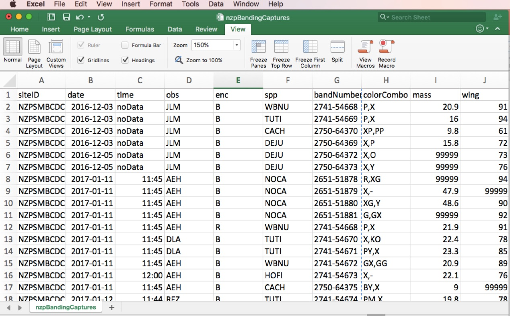
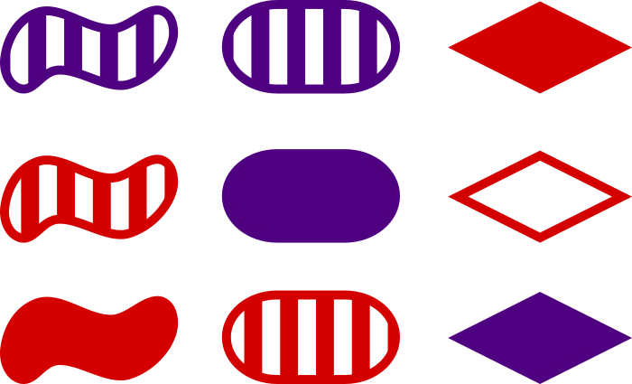

---
output:
  revealjs::revealjs_presentation:
    theme: simple
    highlight: pygments
    center: false
    transition: none
    progress: true
    font-family: Verdana
---

<style>
  code{
    background-color:#f2f2f2;
  }
  
  span.co{
    color:#000080;
    font-weight: bold;
  }
  
  img{
	      border-style: solid;
	      border-width: 40px;
	      border-color: white;
	      width: 65%;
	      display: block;
	      margin-left: auto;
        margin-right: auto;
	      padding: 10px;
  }

  p{
    text-align: left;
  }

  ul{
    text-align: left;
    margin-left: 0px;
}

</style>

```{r include = FALSE}
library(tidyverse)
```

## Re-thinking data
<hr>
<p style="text-align: center;">How we've interacted with data dictates how we structure data mentally.</p>


	      
<!This is an important place to start because, in many fields, including science, we are hardwired by inertia to consider this -- the typical excel worksheet -- as data. This dictates how we interact with data and limits our flexibility.
In this workshop we'll work to increase our flexibility to rebuilding how we consider data from the ground up>

## Values
<hr>
<p style="text-align: center;">In this workshop, we'll use the term <b>value</b> to represent any datum (single unit of data).</p>

## Values
<hr>
<p style="text-align: center;">In this workshop, we'll use the term <b>value</b> to represent any datum (single unit of data).</p>


## Values
<hr>
<p style="text-align: center;">In this workshop, we'll use the term <b>value</b> to represent any datum (single unit of data).</p>


## Values

<hr>
<p style="text-align: center;">In this workshop, we'll use the term <b>value</b> to represent any datum (single unit of data).</p>


	      
<!include: each value has a number of characteristics that define it, for example, in this case, the value has a characteristic shape, color, and fill pattern>

## Values

<hr>
<p style="text-align: center;">In this workshop, we'll use the term <b>value</b> to represent any datum (single unit of data).</p>


	      
## Values

<hr>
<p style="text-align: center;">In this workshop, we'll use the term <b>value</b> to represent any datum (single unit of data).</p>


## Types of values

<hr>
<p>The most commonly used types of values are:</p>
<ul>
<li><b>Numeric</b>: numbers</li>
<li><b>Character</b>: string (i.e., symbols)</li>
<li><b>Factor</b>: a smart combination of words/letters and numbers</li>
</ul>

## Types of values: Numeric

<hr>
<p>A <b>numeric value</b> is a number of type:</p>
<ul>
<li><b>Double</b>: double precision floating point numbers (on the user end this can be thought of as a decimal number)</li>
<li style = "color:#c0c0c0;" ><b>Integer</b>: whole numbers</li>
</ul>

```{r eval = FALSE}
# Create a vector of numeric values:

numericV <- c(5, 3, 2)

# What type of object is this?

class(numericV)

typeof(numericV)

str(numericV)

summary(numericV)

```

## Types of values: Numeric

<hr>
<p>A <b>numeric value</b> is a number of type:</p>
<ul>
<li style = "color:#c0c0c0;" ><b>Double</b>: double precision floating point numbers (on the user end this can be thought of as a decimal number)</li>
<li><b>Integer</b>: whole numbers</li>
</ul>

```{r eval = FALSE}
# Create a vector of numeric values:

numericInteger <- as.integer(numericV)

# What type of object is this?

class(numericInteger)

typeof(numericInteger)

str(numericInteger)

summary(numericInteger)
```

## Types of values: Character

<hr>
<p style="text-align: center;"> A <b>character</b> or "string" value is a symbol or set of symbols from a given library</p>


```{r eval = FALSE}
# Create a vector of numeric values:

exampleCharacter <- c('five', 'three', 'two')

# What type of object is this?

class(exampleCharacter)

typeof(exampleCharacter)

str(exampleCharacter)

summary(exampleCharacter)
```

## Types of values: Factor

<hr>
<p> A <b>factor</b> value includes the following information:</p>
<ul>
<li>Integer value: Numeric integer value associated with factor level</li>
<li>Levels: Character values associated with integer value</li>
<li>Labels: Characters to assign to each factor level</li>
</ul>


```{r eval = FALSE}
# Create a vector of numeric values:

exampleFactor <- factor(c('may', 'march', 'february', 'january','january'))

# What type of object is this?

class(exampleFactor)

str(exampleFactor)

summary(exampleFactor)
```

## Types of values: Factor

<hr>

<div border="0" style = "border-style: solid;
	      border-width: 40px;
	      border-color: white;
	      width: 85%;
	      display: block;
	      margin-left: auto;
        margin-right: auto;
	      padding: 10px;" border = 0>
```{r eval = TRUE, echo = FALSE}
# Plot factor values:
data.frame(exampleFactor = factor(c('may', 'march', 'february', 'january','january'))) %>%
  ggplot(aes(x = exampleFactor)) + 
  geom_bar() +
  scale_y_continuous(limits = c(0, 2.5), expand = c(0,0)) +
  theme_bw()
```
</div>