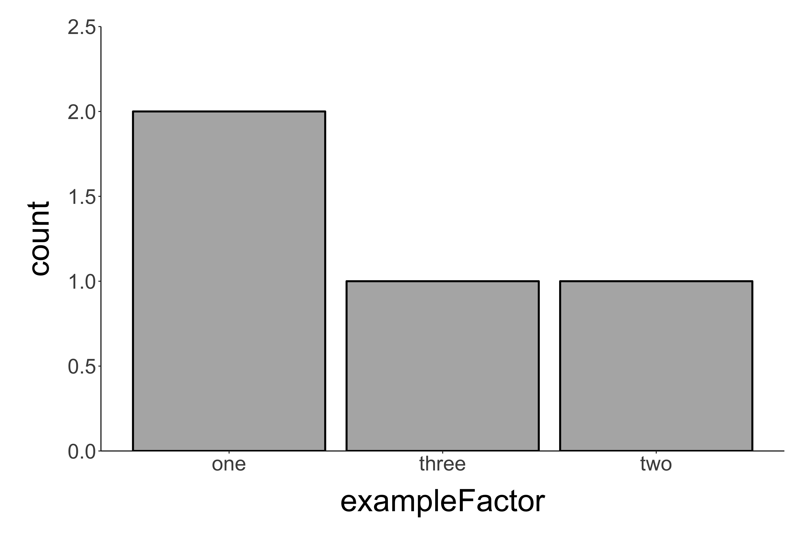
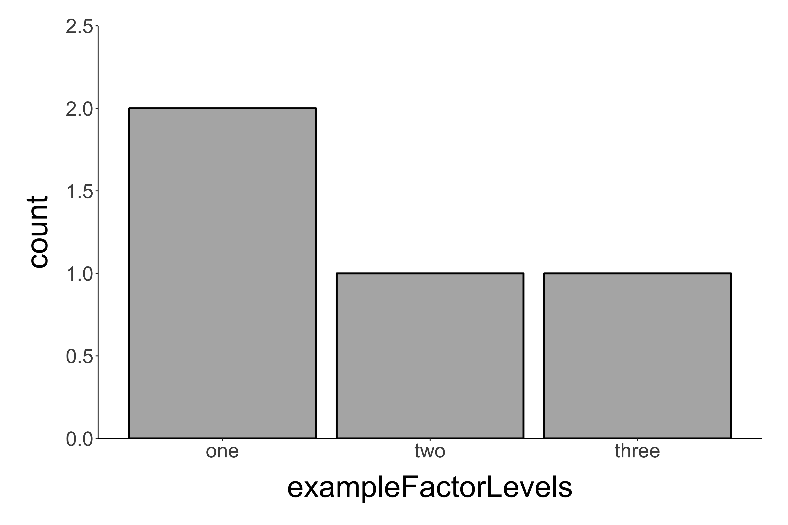

---
output:
  html_document:
    theme: yeti
---

<style>
  code{
    background-color:#f2f2f2;
  }
  
  span.co{
    color:#000080;
    font-weight: bold;
  }
  
  img{
	      display: block;
	      padding-left: 15px;
        padding-right: 15px;
        padding-top: 10px;
        padding-bottom: 10px;
  }

  p{
    text-align: left;
    font-size: 18px;
  }

  ul{
    line-height: 27px;
    text-align: left;
    font-size: 18px;
    margin-left: 0px;
  }
  
  .row{
    margin: auto;
  }
  
  table {
    border-collapse: collapse;
}

table, td, th {
    border: 1px solid black;
    padding: 5px;
    text-align: right;
    vertical-align: middle;
}
  
  /* Create two equal columns that floats next to each other */
.column {
    float: left;
    width: 50%;
    padding: 10px;
}

/* Clear floats after the columns */
.row:after {
    content: "";
    display: table;
    clear: both;
}

</style>

```{r include = FALSE}
# Libraries:
library(tidyverse)

# Functions:

theme_add <- function(){
  theme(
    axis.title = element_text(size = rel(1.5))
  )
}

# Preset values

exampleFactor <- factor(c('three','two','one', 'one'))

exampleFactorLevels <- factor(
  exampleFactor,
  levels = c('one', 'two', 'three')
)

exampleFactorLabels <- factor(
  exampleFactorLevels,
  labels = c('One', 'Two', 'Three')
)

numericVector <- c(1, 1, 2, 3)


```

<h1 style="text-align: center;">Introduction to data science in R:<br> Data management and the art of wrangling</h1>
<br>
<!img style="float: left; margin: 0px 0px 15px 15px;" src="nzpLogo.jpg" width="150" />
<p style = "text-align: center; font-size: 14px;">Brian S. Evans, Ph.D.<br />
Migratory Bird Center<br />
Smithsonian Conservation Biology Institute</p>
<hr>

<div class = "row">
<p>Welcome to the data science in R workshop! We will spend the next few weeks exploring new ways to think about data in program R. R is a user-friendly programming language/software environment that is a great tool for data management and analysis.</p>

<p>People without much previous coding experience often find the process of learning R a grueling uphill climb. I believe one of the biggest impediments to this learning process involves using R as a tool to replace current steps in your data science workflow. When new tools are incorporated, especially in regards to learning to code, it is best to assess your workflow and modify as necessary. The latter requires us to better understand R as a language and develop new ways of processing data.</p>
</div>

<div class = "row">
<hr>


<h2>Re-thinking data</h2>

<p>In this workshop, we will be exploring a data science workflow using R. The data science workflow can be thought of as a series of interconnected steps, starting with the phenomenon being observed. The holy grail of data science is to develop what I call a "cradle-to-grave" workflow model (phenomenon to reporting). In this model, data science steps, including storage, wrangling, and modeling, are fully reproducible and reportable. <i>Note: the displayed model represents a data science workflow associated with collecting empirical data -- in the data science workflow associated with data mining, all steps should be fully reproducible and reportable.</i></p>
  
<p>A solid data management plan is crucial for creating a flexible path from raw data to results that is fully reproducible.</p>
  
<p>Components of data management we will address in this workshop are data wrangling (transformation and exploration) and reporting. We will not be addressing any collection, entry, storage, or analysis/modeling steps.</p>

<p>How we have interacted with data dictates how we structure data mentally. The image to the left of this screen shows a typical Excel workbook. Many of us in science, myself included, have learned to use programs like Microsoft Excel (or iOS' numbers, libreOffice's Calc, Google Sheets, etc.) for viewing and managing data. Through learning and using spreadsheet programs, we tend to format and organize data in ways that are incompatible with environments outside of that system. In other words, there are ways that we interact with data in Excel, especially in regards to how we organize spreadsheets, which do not lend itself well to working with the data in R. Under these conditions, using R becomes a frustrating exercise of constantly wrestling datasets and this process ends up taking most of our computer time.</p>

<p>In addition to increasing our stress level when working with R, the spreadsheet paradigm fails to provide us with fully reproducible data or adequate reporting. Ideally, our target audience should be able to reproduce each step of a data process, starting with the raw data itself.</p>
</div>

<hr>

<p>Today we're going to start to build our new data science model from the ground up. To understand how data science works in R, it is necessary to get a solid background in the values that make up data and the structures that hold them. Specifically, we will address:</p>

<ul style="line-height: 150%;">
<li><b>Value</b>: Any datum (single unit of data)</li>
<li><b>Object</b>: Container for holding values</li>
</ul>
<hr>

<h2>Values</h2>

<p>A value is defined by its:</p>
<ul>
<li><b>State</b>: What we typically think of as the value itself. For example, we might consider the state of the symbol on the right as being purple, a squiggle, and having a patterned fill.</li>
<li><b>Attributes</b> (metadata), e.g.:
<ul>
<li>Name: What is the value called?</li>
<li>Class: What type of value is it?</li>
</ul>
</li>
<li><b>Context</b>: How does the value relate to other values in a set (see below)?</li>
</ul>

<br>
<p>Values are distinguished by similarities and differences in their multi-dimensional <b>states</b>, <b>attributes</b>, and <b>contexts</b>.</p>

<br>
<p>Developing a flexible R skillset, and combating the inertia of our Excel-trained brains, requires us to not think of collections of values as fixed entities, but rather as sets that may be arranged and re-arranged as necessary.</p>

<div class = "row">
  <div class = "column" style = "width = 50%; float: left;">
  
  </div>
  <div class = "column" style = "width = 50%; float: right;">
  
</div>

<br>
<div class = "row">
<hr>
<h2>Classes of values</h2>
<p>In R, the most commonly used types of values are:</p>
<ul>
<li><b>Number values</b>: numeric and integers</li>
<li><b>Character</b>: string (i.e., symbols)</li>
<li><b>Factor</b>: a smart combination of words/letters and integers</li>
<li><b>Logical</b>: integer values of 0 and 1 assigned to words</li>
</ul>
<br>
<hr>
<p><i><b>Note</b>: At this point, please open R Studio. Open a new script a save it as "rWorkshop2018_lesson1.R".<p>

<p>The gray boxes below include code but no output. Please run the code and study the output within the context of the text in the document. To deepen or test your understanding of a given subject matter, please play around with the inputs to see if you fully understand the results.</i></p>
</div>

<hr>
<h2>Classes of values: Numeric</h2>
<br>
<p>Number values can be either:</p>
<ul>
<li><b>Numeric, double</b>: double precision floating point numbers (on the user end this can be thought of as a decimal number). R automatically assigns sets of numbers as double unless told otherwise.</li>
<li><b>Numeric, integer</b>: whole numbers</li>
</ul>
<br>
```{r eval = FALSE}
# Create a vector of numeric values:

numericV <- c(3, 2, 1, 1)

numericV

# What type of object is this?

class(numericV)

typeof(numericV)

# The structure function (str) can provide a lot of info on the object:

str(numericV)

summary(numericV)

# Create a vector of numeric integer values:

numericInteger <- 1:5

numericInteger


# What type of object is this?

class(numericInteger)

typeof(numericInteger)

str(numericInteger)

summary(numericInteger)

# Read numericV as an integer:

numericVI <- as.integer(numericV)

class(numericVI)

typeof(numericVI)

```


<hr>

<h2>Classes of values: Character</h2>
<br>

<p> A <b>character</b> or "string" value is a symbol or set of symbols from a given alphabet (note: also includes numbers and punctuation).</p>
<br>
```{r eval = FALSE}
# Create a vector of character values:

exampleCharacter <- c('march', 'february', 'january', 'january')

exampleCharacter

# What type of object is this?

class(exampleCharacter)

str(exampleCharacter)

summary(exampleCharacter)
```

<hr>
<h2>Classes of values: Factor</h2>
<br>
<p> A <b>factor</b> is a value that includes the following information:</p>
<ul>
<li><b>Integer value</b>: Numeric integer value associated with factor level. For example, you may construct a factor of female and male treatment groups. In this instance, each treatment group would be assigned to a different integer value. </li>
<li><b>Levels</b>: Character values that are associated with the integer value. Continuing with the example above, the levels would be female and male.</li>
<li><b>Labels</b>: Characters to assign to each factor level. This relates to the character values that you see when you print or plot your data. For example, you may want to visualize female as "F" and males as "M".</li>
</ul>
<br>

```{r eval = FALSE}
# Create a vector of factor values:

exampleFactor <- factor(c('one', 'one', 'two', 'three'))

exampleFactor

# Factor values as integers:

as.integer(exampleFactor)

# What type of object is this?

class(exampleFactor)

str(exampleFactor)

summary(exampleFactor)
```
<br>
<p>Note that `exampleFactor`, as written, would produce the following output when plotted (<i>Note: plotting will be covered in a later lesson, your code will not generate a plot output</i>). The plot below shows factor values on the x axis and the number of records associated with those values on the y axis. What's wrong with this plot?</p>



<p>Notice that the factor should likely be ordered "one, two, three", but R automatically assigns factor levels alphabetically. To address this, levels can be manually set:</p>
<br>

```{r eval = FALSE}
# Set factor levels and labels:

factor(
  c('one', 'one', 'two', 'three'),
  levels = c('one', 'two', 'three')
  )
```


	      
<p>Likewise, labels can be manually set if those that are automatically assigned are not ideal.</p>
<br>

```{r eval = FALSE}
# Set factor levels and labels:

factor(
  c('one', 'one', 'two', 'three'),
  levels = c('one', 'two', 'three'),
  labels = c('One', 'Two', 'Three')
  )
```


<br>
<p><i>Factors are very useful (especially for statisticians!), but can also be a bit of a pain to deal with. If you are working with a factor that has an untenable number of levels, consider simplifying the factor or using character values instead. At one time, evaluating characters required much more memory to process, but this is no longer the case.</i></p>
<hr>
<h2>Classes of values: Logical</h2>
<br>
<div style = "text-align: left;">
<p> R reserves the words TRUE and FALSE as logical constants. These constants are mapped to integer values:</p>
<ul>
<li><b>FALSE</b>: 0</li>
<li><b>TRUE</b>: 1</li>
</ul>
</div>
<br>


```{r eval = FALSE}
# Observe the behavior of logical values:

FALSE

TRUE

as.numeric(FALSE)

as.numeric(TRUE)

FALSE + TRUE

FALSE + TRUE + TRUE
```

<br>

<p>Logical values can be obtained by evaluating objects with <b>logical operators</b>. For example, the logical operator `==` tests whether a value is equal to another value.</p>
<br>


```{r eval = FALSE}
# The "is equal to" logical operator:

3 == 3

3 == 4

3 == 2 + 1

3 == 3 + 1

(3 == 3) + (3 == 2 + 1)
```
<hr>
<h2>Objects: Containers for values</h2>
<br>

<p>In R, containers called <b>objects</b> structure collections of values. Different types of objects store values in different ways:</p>

<br>
<table style = "font-size: 1.1em; border-style: solid; vertical-align: middle;">
<tr style = "border-style: solid;">
  <th style = "text-align: center;">Object dimensions</th>
  <th style = "text-align: center;">Homogeneous class</th>
  <th style = "text-align: center;">Heterogeneous class</th>
</tr>
<tr>
  <td style = "text-align: center;">1-D</td>
  <td style = "text-align: center;">Atomic vector</td>
  <td style = "text-align: center;">List</td>
</tr>
<tr>
  <td style = "text-align: center;">2-D</td>
  <td style = "text-align: center;">Matrix</td>
  <td style = "text-align: center;">Data frame</td>
</tr>
</table>
<br>
<p>For each object type, we'll address:</p>
<div style = "text-align: left;">
<ul>
<li>Structure: One vs. two dimensions; heterogeneous vs. homogeneous value classes</li>
<li>Indexing: Location within an object</li>
<li>Attributes of the object class</li>
</ul>
</div>

<hr>

<h2>Vector objects: Structure</h2>
<br>
<p>An <b>atomic vector</b> is a one-dimensional collection of values. All values must be of the same class.</p>

<br>

```{r eval = FALSE}
# A vector of numeric values:

numericVector <- c(1, 1, 2, 3)

numericVector

summary(numericVector)
```

<br>
<p>All values in an atomic vector must be of the same class.</p>
<br>

```{r eval = FALSE}
# All values in a vector must be of the same class:

messyVector <- c(1, 'one', 2, 3)

messyVector

class(messyVector)
```

<h2>Vector objects: Indexing<h2>
<br>

<p>Each value in a vector has a position, denoted by "[<i>x</i>]"</p>

<table style = "font-size: 16px; vertical-align: middle;">
<tr>
  <th style = "text-align: center; font-weight: normal;">[1]</th>
  <th style = "text-align: center; font-weight: normal;">[2]</th>
  <th style = "text-align: center; font-weight: normal;">[3]</th>
  <th style = "text-align: center; font-weight: normal;">[4]</th>
</tr>
<tr>
  <td style = "text-align: center;">1</td>
  <td style = "text-align: center;">1</td>
  <td style = "text-align: center;">2</td>
  <td style = "text-align: center;">3</td>
</tr>
</table>
<br>

```{r eval = FALSE}
# Use indexing to subset a vector:

numericVector

numericVector[3]

numericVector[3:4]

numericVector[c(1,3)]
```
<br>
<h2>Vector objects: Attributes</h2>
<br>

<div style = "text-align: left;">
<p>Typical attributes we are interested in of vectors include:</p>
<ul>
<li><b>Class</b>: What type of values?
<li><b>Length</b>: How many values?
</ul>
</div>
<br>

```{r eval = FALSE}
# Attributes of the vector:

class(numericVector)

length(numericVector)

str(numericVector)
```

<br>
<p>Attributes, such as names, can be added to vectors:</p>
<br>
```{r eval = FALSE}
# Adding attributes to a vector:

numericVector

names(numericVector)

names(numericVector) <- c('orange', 'pear', 'apple', 'apple')
```

<br>
<p>Vectors can be indexed by their names attribute.
<table style = "font-size: 1.1em; vertical-align: middle;">
<tr>
  <th style = "text-align: center; font-weight: normal;">['orange']</th>
  <th style = "text-align: center; font-weight: normal;">['pear']</th>
  <th style = "text-align: center; font-weight: normal;">['apple']</th>
  <th style = "text-align: center; font-weight: normal;">['apple']</th>
</tr>
<tr>
  <td style = "text-align: center;">1</td>
  <td style = "text-align: center;">1</td>
  <td style = "text-align: center;">2</td>
  <td style = "text-align: center;">3</td>
</tr>
</table>
<br>

```{r eval = FALSE}
numericVector[2]

numericVector['pear']

numericVector[2] == numericVector['pear']

numericVector[c('orange', 'pear')]
```
<hr>
<h2>Matrix objects: Structure</h2>
<br>
<p>A <b>matrix</b> is a two dimensional object -- basically a vector that has been split into multiple columns. All values must be of the same class.</p>
<br>

```{r eval = FALSE}
# Generate matrix:

m <- matrix(c(1, 1, 2, 3), ncol = 2)

m

class(m)

typeof(m)
```
<br>
<p>A vector can be structured horizontally (row-wise) or vertically (column-wise) within a matrix:</p>
<br>
```{r eval = FALSE}
# Compare matrices built row-wise and column-wise:

matrix(c(1, 1, 2, 3), ncol = 2, byrow = TRUE)

matrix(c(1, 1, 2, 3), ncol = 2, byrow = FALSE)
```

<br>
<p>Because matrices must be homogeneous, all values are forced to be the same type.</p>
<br>

```{r eval = FALSE}

# Matrix built with multiple types:

messyMatrix <- matrix(c(1, 'one', 2, 3), ncol = 2)

messyMatrix

class(messyMatrix)

typeof(messyMatrix)

```
<br>
<h2>Matrix objects: Indexing</h2>
<br>
<p>Values in a matrix have a row (x) and column (y) position, denoted by "[<i>x</i>, <i>y</i>]"</p>
<table style = "font-size: 1.1em; vertical-align: middle;">
<tr>
  <th style = "text-align: center; font-weight: normal;"></th>
  <th style = "text-align: center; font-weight: normal;">[ ,1]</th>
  <th style = "text-align: center; font-weight: normal;">[ ,2]</th>
</tr>
<tr>
  <td style = "text-align: center;">[1, ]</td>
  <td style = "text-align: center;">1</td>
  <td style = "text-align: center;">2</td>
</tr>
<tr>
  <td style = "text-align: center;">[2, ]</td>
  <td style = "text-align: center;">1</td>
  <td style = "text-align: center;">3</td>
</tr>
</table>
<br>
```{r eval = FALSE}
# Index by row (x) and column (y) position [x,y]:

m[1,1]

m[2,2]

m[1:2,2]

```
<br>

<h2>Matrix objects: Attributes</h2>
<br>
<p>There are a number of attributes that can be observed for a given matrix:</p>
<br>
```{r eval = FALSE}
# View matrix attributes:

class(m)

length(m)

dim(m)

str(m)

summary(m)
```
<br>
<p>You may add a name attribute to rows and columns.</p>
<br>
```{r eval = FALSE}
# Naming rows and columns:

colnames(m) <- c('a', 'b')

rownames(m) <- c('c', 'd')

attributes(m)

m
```
<hr>
<h2>List objects: Structure</h2>
<br>
<p>A <b>list</b> is a one dimensional object constructed by combining ANY objects with ANY dimensionality.</p>
<br>

```{r eval = FALSE}
# List of a numeric vector and matrices:

exampleList <- list(numericVector, m, messyMatrix)

exampleList
```
<br>
<br>

<h2>List objects: Indexing</h2>
<br>
<p>List position is denoted by [[<i>x</i>]].</p>
<br>

<div class = "row">
<p>[[1]]</p>
<table style = "font-size: 1em; vertical-align: middle; float: left; padding: 10px">
<tr>
<th style = "text-align: center; font-weight: normal;">[1]</th>
<th style = "text-align: center; font-weight: normal;">[2]</th>
<th style = "text-align: center; font-weight: normal;">[3]</th>
<th style = "text-align: center; font-weight: normal;">[4]</th>
</tr>
<tr>
<td style = "text-align: center;">1</td>
<td style = "text-align: center;">1</td>
<td style = "text-align: center;">2</td>
<td style = "text-align: center;">3</td>
</tr>
</table>
<br>
</div>

<div class = "row">
<p>[[2]]</p>
<table style = "font-size: 1.1em; vertical-align: middle;">
<tr>
<th style = "text-align: center; font-weight: normal;"></th>
<th style = "text-align: center; font-weight: normal;">[ ,1]</th>
<th style = "text-align: center; font-weight: normal;">[ ,2]</th>
</tr>
<tr>
<td style = "text-align: center;">[1, ]</td>
<td style = "text-align: center;">1</td>
<td style = "text-align: center;">2</td>
</tr>
<tr>
<td style = "text-align: center;">[2, ]</td>
<td style = "text-align: center;">1</td>
<td style = "text-align: center;">3</td>
</tr>
</table>
<br>
</div>

<div class = "row">
<p>[[3]]</p>
<table style = "font-size: 1.1em; vertical-align: middle;">
<tr>
<th style = "text-align: center; font-weight: normal;"></th>
<th style = "text-align: center; font-weight: normal;">[ ,1]</th>
<th style = "text-align: center; font-weight: normal;">[ ,2]</th>
</tr>
<tr>
<td style = "text-align: center;">[1, ]</td>
<td style = "text-align: center;">"1"</td>
<td style = "text-align: center;">"2"</td>
</tr>
<tr>
<td style = "text-align: center;">[2, ]</td>
<td style = "text-align: center;">"one"</td>
<td style = "text-align: center;">"3"</td>
</tr>
</table>
</div>
<br>


```{r eval = FALSE}
# List indexing:

exampleList

exampleList[[2]]

exampleList[[2]] == m

m[2,2]

exampleList[[2]][2,2]
```

<br>
<h2>List objects: Attributes</h2>
<br>
<div style = "text-align: left;">
<p>Typical attributes we are interested in of lists include:</p>
<ul>
<li><b>Class</b>: What type of values?
<li><b>Length</b>: How many values?
</ul>
</div>
<br>

```{r eval = FALSE}
# Attributes of a list:

class(exampleList)

length(exampleList)

str(exampleList)

# Attributes of list items:

class(exampleList[[1]])

length(exampleList[[1]])

```

<br>
<p>Attributes, such as names, can be added to lists:</p>
<br>

```{r eval = FALSE}
# Adding attributes to a list:

exampleList

names(exampleList)

names(exampleList) <- c('numericVector', 'm', 'messyMatrix')

attributes(exampleList)
```
<br>
<p>If named have been provided, lists can be indexed by their names attribute using matrix notation or the `$` operator.</p>
<br>

```{r eval = FALSE}
# Lists can be indexed by name using the notation:

exampleList[[3]]

exampleList[['messyMatrix']]

exampleList$messyMatrix

```
<hr>
<h2>Data frame objects: Structure</h2>
<br>
<p>A <b>data frame</b> is a two dimensional object constructed by combining vectors.</p>
<br>

```{r eval = FALSE}
# Generate a data frame:

df <- data.frame(a = c(1, 1), b =  c(2, 3))

df
```

<br>
<p>The vectors that are contained in a data frame may be of different classes.</p>
<br>

```{r eval = FALSE}
# Generate a data frame of different vector classes:

data.frame(a = c('one', 'one'), b =  c(2, 3))

```
<br>

<p>But individual vectors are still coerced into the same class!</p>
<br>

```{r eval = FALSE}
# Attempt to generate a data frame with heterogeneous vectors:

messyDf <- data.frame(a = c(1, 'one'), b =  c(2, 3))

messyDf

```

<br>
<h2>Data frame objects: Indexing</h2>
<br>
<p>Values in a data frame have a row (x) and column (y) position, denoted by "[<i>x</i>, <i>y</i>]"</p>

<br>
<table style = "font-size: 1.1em; vertical-align: middle;">
<tr>
  <th style = "text-align: center; font-weight: normal;"></th>
  <th style = "text-align: center; font-weight: normal;">[ ,1]</th>
  <th style = "text-align: center; font-weight: normal;">[ ,2]</th>
</tr>
<tr>
  <td style = "text-align: center;">[1, ]</td>
  <td style = "text-align: center;">1</td>
  <td style = "text-align: center;">1</td>
</tr>
<tr>
  <td style = "text-align: center;">[2, ]</td>
  <td style = "text-align: center;">2</td>
  <td style = "text-align: center;">3</td>
</tr>
</table>
<br>
<br>

```{r eval = FALSE}
# Index by row (x) and column (y) position [x,y]:

df[1,1]

df[2,2]

df[1:2,2]

df[1,]

df[,2]

```
<br>
<br>
<h2>Data frame objects: Attributes</h2>
<br>
<p>There are a number of attributes that can be observed for a given data frame:</p>

```{r eval = FALSE}
# View data frame attributes:

str(df)

class(df)

length(df)

dim(df)

summary(df)
```
<br>
<p>Always check attributes prior to working with data frame!</p>
<br>

```{r eval = FALSE}
# View attributes of the messy dataframe:

str(messyDf)

dfStrings <- data.frame(
  a = c(1, 'one'), 
  b =  c(2, 3),
  stringsAsFactors = FALSE
  )

str(dfStrings)

```

<br>
<p>Name attributes are automatically set when a data frame is created. Failing to set this attribute leads to bad names:</p>
<br>

```{r eval = FALSE}
# Set and unset names:

data.frame(a = c(1, 1), b =  c(2, 3))

data.frame(c(1, 1),c(2, 3))

```

<br>
<p>Similar to other objects, the names attribute can also be set manually after an object is created:</p>
<br>

```{r eval = FALSE}
# View data frame attributes:

exampleDf <- data.frame(c(1, 1),c(2, 3))

names(exampleDf) <- c('hello', 'world')

exampleDf

```

<br>
<p>Data frames can be indexed by their names attribute using matrix notation or the `$` operator.</p>
<br>

```{r eval = FALSE}
# View data frame attributes:

exampleDf['hello']


exampleDf$hello

```
<br>
<h2>Data frame objects: The tibble!</h2>
<br>
<p>A <b>tibble</b> is a special type of data frame provided by the package tidyverse.</p>
<br>

```{r eval = FALSE}
# Read tidyverse package(s):

library(tidyverse)

# Generate a tibble data frame:

tibbleDf <- data_frame(a = c(1, 'one'), b =  c(2, 3))

tibbleDf
```
<br>

<p>Base R data frames can also be converted to a tibble.</p>
<br>

```{r eval = FALSE}
# Convert a data frame to a tbl:

tbl_df(messyDf)

tbl_df(data.frame(a = c(1, 'one'), b =  c(2, 3)))

```

<br>

<p>How do tibbles differ from Base R data frames?</p>
<br>

```{r eval = FALSE}
# Compare tibble and base R data frame:

data.frame(a = c(1, 'one'), b =  c(2, 3))

data_frame(a = c(1, 'one'), b =  c(2, 3))

# Load data and compare between a data frame and a tibble:
# Note: the "data" function loads example datasets

data(iris)

iris

tbl_df(iris)
```

<br>
<hr>

<b>End of lesson 1</b>

