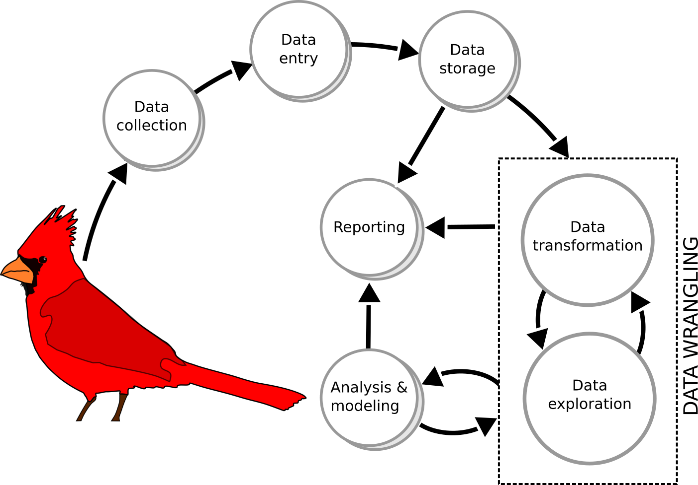

---
output:
  revealjs::revealjs_presentation:
    theme: simple
    highlight: pygments
    center: false
    transition: none
    progress: true
    font-family: Verdana
---

<style>
  code{
    background-color:#f2f2f2;
  }
  
  span.co{
    color:#000080;
    font-weight: bold;
  }
  
  img{
	      display: block;
	      padding-left: 15px;
        padding-right: 15px;
        padding-top: 10px;
        padding-bottom: 10px;
  }

  p{
    text-align: left;
    font-size: 18px;
  }

  ul{
    line-height: 27px;
    text-align: left;
    font-size: 18px;
    margin-left: 0px;
  }
  
  .row{
    margin: auto;
  }
  
  table {
    border-collapse: collapse;
}

table, td, th {
    border: 1px solid black;
    padding: 5px;
    text-align: right;
    vertical-align: middle;
}
  
  /* Create two equal columns that floats next to each other */
.column {
    float: left;
    width: 50%;
    padding: 10px;
}

/* Clear floats after the columns */
.row:after {
    content: "";
    display: table;
    clear: both;
}

</style>

```{r include = FALSE}
# Libraries:
library(tidyverse)

# Functions:

theme_add <- function(){
  theme(
    axis.title = element_text(size = rel(1.5))
  )
}

# Preset values

exampleFactor <- factor(c('three','two','one', 'one'))

exampleFactorLevels <- factor(
  exampleFactor,
  levels = c('one', 'two', 'three')
)

exampleFactorLabels <- factor(
  exampleFactorLevels,
  labels = c('One', 'Two', 'Three')
)

numericVector <- c(1, 1, 2, 3)


```


<h1 style="text-align: center;">Introduction to data science in R</br> Lesson 2:<br/>Querying data</h1>
<br>
<p style = "text-align: center; font-size: 18px;">Brian S. Evans, Ph.D.<br />
Migratory Bird Center<br />
Smithsonian Conservation Biology Institute</p>


##Querying data
<hr>

	      
	      