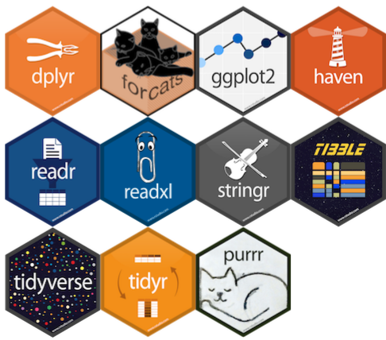

---
output:
  revealjs::revealjs_presentation:
    theme: simple
    highlight: pygments
    center: false
    transition: none
    progress: true
    font-family: Verdana
---

<head>
<link rel="stylesheet" href="https://cdnjs.cloudflare.com/ajax/libs/font-awesome/4.7.0/css/font-awesome.min.css">
</head>

<style>

code{
  background-color:#f2f2f2;
  border-radius: 25px;
}
 
span.co{
  color:#000080;
  font-weight: bold;
}
 
img{
  display: block;
  padding-left: 15px;
  padding-right: 15px;
  padding-top: 10px;
  padding-bottom: 10px;
}

p{
  text-align: left;
  font-size: 18px;
}

ul, ol{
  line-height: 27px;
  text-align: left;
  font-size: 18px;
  margin-left: 0px;
}
 
blockquote{
  font-size: 18px;
  border-left: 8px solid #292093;
  background-color: #e6ffff;
  padding-left: 16px;
  padding-right: 16px;
}
 
.row{
  margin: auto;
}
 
table {
  border-collapse: collapse;
}

table, td, th {
  border: 1px solid black;
  padding: 5px;
  text-align: center;
  vertical-align: middle;
}
 
 /* Create two equal columns that floats next to each other */
.column {
  float: left;
  width: 50%;
  padding: 10px;
}

/* Clear floats after the columns */
.row:after {
  content: "";
  display: table;
  clear: both;
}

.roundBorder {
  border-radius: 25px;
  border: 5px solid #30288C;
  background: #D6EAF8;
  padding-left: 20px;
  padding-right: 20px;
  padding-top: 10px;
  padding-bottom: 10px;
}

.roundBorderBlack {
  border-radius: 25px;
  border: 10px solid #D3D3D3;
  padding-left: 20px;
  padding-right: 20px;
  padding-top: 10px;
  padding-bottom: 10px;
}

.roundBorderBlackEx {
  border-radius: 5px;
  border: 5px solid #D3D3D3;
  padding-left: 5px;
  padding-right: 5px;
  padding-top: 2px;
}

.roundBorderEx {
  border-radius: 3px;
  border: 5px solid #30288C;
  background: #D6EAF8;
  padding-left: 5px;
  padding-right: 5px;
  padding-top: 2px;
}

.tt {
    position: relative;
    display: inline-block;
    class: inline; 
    font-weight: bold;
    font-family: "Avenir";
    font-size: 18px;
    border-bottom: 1px black;
}

/* Tooltip text */
.tt .ttText {
    visibility: hidden;
    font-weight: normal;
    font-size: 18px;
    width: 200px;
    background-color: black;
    border: 1px solid black;
    color: white;
    text-align: left;
    padding: 5px;
    border-radius: 6px;
    position: absolute;
    z-index: 1;
}

/* Show the tooltip text when you mouse over the tooltip container */
.tt:hover .ttText {
    visibility: visible;
}

</style>

<h2 style="text-align: center;">Introduction to data science in R</br>Lesson 5: Welcome to the <b>tidyverse</b>!</h2>
<br>
<p style = "text-align: center; font-size: 24px;">Brian S. Evans, Ph.D.<br />
Migratory Bird Center<br />
Smithsonian Conservation Biology Institute</p>
<br>


##
<h2>Setup for the lesson</h2>
<hr>
```{r eval = FALSE}
# Load RCurl library:

library(RCurl)

# Load a source script:

script <-
  getURL(
    "https://raw.githubusercontent.com/bsevansunc/workshop_languageOfR/master/sourceCode.R"
  )

# Evaluate then remove the source script:

eval(parse(text = script))

rm(script)

```

```{r, eval = TRUE, include  = FALSE}
# Load RCurl library:

library(RCurl)

# Load a source script:

script <-
  getURL(
    "https://raw.githubusercontent.com/bsevansunc/workshop_languageOfR/master/sourceCode.R"
  )

# Evaluate then remove the source script:

eval(parse(text = script))

rm(script)

library(knitr) ; library(kableExtra)

options(knitr.table.format = "html")
```

##
<h2>What is the tidyverse?</h2>
<hr>

<ul>
<li>Principles of tidy data</li>
<li>Functions to manipulate data from messy to tidy</li>
<li>Tools for tidy wrangling</li>
<li>Tidy functions to filter, summarize, and modify data*</li>
</ul>

##
<h2>What are tidy data?</h2>
<hr>
<p>From data science: The three normal forms (Codd et al.)</p>
<ol>
<li><b>First normal</b>:
<ul>
<li>All rows represent a unique record (primary key)</li>
<li>All values are atomic</li>
<li>Columns do not contain repeated grouping</li>
</ul>
</li>
<li><b>Second normal</b>: All columns are unique to the primary key (observation)</li>
<li><b>Third normal</b>: All columns are non-transitively dependent.
<ul><li>Column values are <b>only</b> directly dependent on the column that defines the observation</ul></li>
</li>
</ol>

##
<h2>What are tidy data?</h2>
<hr>

<p>From data science: The three normal forms (Codd et al.)</p>
<ol>
<li><b>First normal</b>:
<ul>
<li>All rows represent a unique record (primary key)</li>
<li style = "color: #D3D3D3;">All values are atomic</li>
<li style = "color: #D3D3D3;">Columns do not contain repeated grouping</li>
</ul>
</li>
</ol>

##
<h2>What are tidy data?</h2>
<hr>

<p>From data science: The three normal forms (Codd et al.)</p>
<ol>
<li><b>First normal</b>:
<ul>
<li>All rows represent a unique record (primary key)</li>
<li style = "color: #D3D3D3;">All values are atomic</li>
<li style = "color: #D3D3D3;">Columns do not contain repeated grouping</li>
</ul>
</li>
</ol>

```{r echo = FALSE}
kable(messy1NFa, "html") %>%
  kable_styling(bootstrap_options = c("striped", "hover"))
```

##
<h2>What are tidy data?</h2>
<hr>

<p>From data science: The three normal forms (Codd et al.)</p>
<ol>
<li><b>First normal</b>:
<ul>
<li>All rows represent a unique record (primary key)</li>
<li style = "color: #D3D3D3;">All values are atomic</li>
<li style = "color: #D3D3D3;">Columns do not contain repeated grouping</li>
</ul>
</li>
</ol>

```{r tidy1NFa, echo = FALSE}
kable(tidy1NFa, "html") %>%
  kable_styling(bootstrap_options = c("striped", "hover"))
```

##
<h2>What are tidy data?</h2>
<hr>
<p>From data science: The three normal forms (Codd et al.)</p>
<ol>
<li><b>First normal</b>:
<ul>
<li style = "color: #D3D3D3;">All rows represent a unique record (primary key)</li>
<li>All values are atomic</li>
<li style = "color: #D3D3D3;">Columns do not contain repeated grouping</li>
</ul>
</li>
</ol>

```{r badDate, echo = FALSE}
kable(badDate, "html") %>%
  kable_styling(bootstrap_options = c("striped", "hover"))
```

##
<h2>What are tidy data?</h2>
<hr>
<p>From data science: The three normal forms (Codd et al.)</p>
<ol>
<li><b>First normal</b>:
<ul>
<li style = "color: #D3D3D3;">All rows represent a unique record (primary key)</li>
<li>All values are atomic</li>
<li style = "color: #D3D3D3;">Columns do not contain repeated grouping</li>
</ul>
</li>
</ol>

```{r tidy1NFb0, echo = FALSE}
kable(tidy1NFb0, "html") %>%
  kable_styling(bootstrap_options = c("striped", "hover"))
```

##
<h2>What are tidy data?</h2>
<hr>
<p>From data science: The three normal forms (Codd et al.)</p>
<ol>
<li><b>First normal</b>:
<ul>
<li style = "color: #D3D3D3;">All rows represent a unique record (primary key)</li>
<li>All values are atomic</li>
<li style = "color: #D3D3D3;">Columns do not contain repeated grouping</li>
</ul>
</li>
</ol>

```{r tidy1NFb, echo = FALSE}
kable(tidy1NFb, "html") %>%
  kable_styling(bootstrap_options = c("striped", "hover"))
```

##
<h2>What are tidy data?</h2>
<hr>
<p>From data science: The three normal forms (Codd et al.)</p>
<ol>
<li><b>First normal</b>:
<ul>
<li style = "color: #D3D3D3;">All rows represent a unique record (primary key)</li>
<li  style = "color: #D3D3D3;">All values are atomic</li>
<li>Columns do not contain repeated grouping</li>
</ul>
</li>
</ol>

```{r messy1NFc, echo = FALSE}
kable(messy1NFc, "html") %>%
  kable_styling(bootstrap_options = c("striped", "hover"))
```

##
<h2>What are tidy data?</h2>
<hr>
<p>From data science: The three normal forms (Codd et al.)</p>
<ol>
<li><b>First normal</b>:
<ul>
<li style = "color: #D3D3D3;">All rows represent a unique record (primary key)</li>
<li  style = "color: #D3D3D3;">All values are atomic</li>
<li>Columns do not contain repeated grouping</li>
</ul>
</li>
</ol>

```{r tidy1NFc, echo = FALSE}
kable(exampleTidy1, "html") %>%
  kable_styling(bootstrap_options = c("striped", "hover"))
```

##
<h2>What are tidy data?</h2>
<hr>
<p>From data science: The three normal forms (Codd et al.)</p>
<ol start = "2">
<li><b>Second normal</b>: All columns are unique to the primary key (observation)</li>
</ol>
```{r messy2NF, echo = FALSE}
kable(messy2NF, "html") %>%
  kable_styling(bootstrap_options = c("striped", "hover"))
```

##
<h2>What are tidy data?</h2>
<hr>
<p>From data science: The three normal forms (Codd et al.)</p>
<ol start = "2">
<li><b>Second normal</b>: All columns are unique to the primary key (observation)</li>
</ol>
```{r tidy2NFa, echo = FALSE}
kable(tidy2NFobsLevel, "html") %>%
  kable_styling(bootstrap_options = c("striped", "hover"))
```
<br>
```{r tidy2NFb, echo = FALSE}
kable(tidy2NFsiteLevel, "html") %>%
  kable_styling(bootstrap_options = c("striped", "hover"))
```

##
<h2>What are tidy data?</h2>
<hr>

<p>From data science: The three normal forms (Codd et al.)</p>
<ol start = "3">
<li><b>Third normal</b>: All columns are non-transitively dependent.
<ul><li>Column values are <b>only</b> directly dependent on the column that defines the observation</ul></li>
</li>
</ol>

<p>Kent: Every non-key attribute must provide a fact about the key, the whole key, and nothing but the key. So help me Codd.</p>
```{r messy3NF1, echo = FALSE}
kable(messy3NF1, "html") %>%
  kable_styling(bootstrap_options = c("striped", "hover"))
```

##
<h2>What are tidy data?</h2>
<hr>

<p>From data science: The three normal forms (Codd et al.)</p>
<ol start = "3">
<li><b>Third normal</b>: All columns are non-transitively dependent.
<ul><li>Column values are <b>only</b> directly dependent on the column that defines the observation</ul></li>
</li>
</ol>

<p>Kent: Every non-key attribute must provide a fact about the key, the whole key, and nothing but the key. So help me Codd.</p>
```{r tidy3NF1, echo = FALSE}
kable(exampleTidy1, "html") %>%
  kable_styling(bootstrap_options = c("striped", "hover"))
```


##
<h2>What are tidy data?</h2>
<hr>
<p>From data science: The three normal forms (Codd et al.)</p>
<ol>
<li><b>First normal</b>:
<ul>
<li>All rows represent a unique record (primary key)</li>
<li>All values are atomic</li>
<li>Columns do not contain repeated grouping</li>
</ul>
</li>
<li><b>Second normal</b>: All columns are unique to the primary key (observation)</li>
<li><b>Third normal</b>: All columns are non-transitively dependent.
<ul><li>Column values are <b>only</b> directly dependent on the column that defines the observation</ul></li>
</li>
</ol>

##
<h2><i class= "fa fa-user-circle-o" style = "font-size: 150%;"></i> Exercise One:</h2>
<hr>
<p>Consider how to arrange the following dataset using Codd's rules:</p>
```{r exercise1messy, echo = FALSE}
kable(exercise1messy %>% select(-id), "html") %>%
  kable_styling(bootstrap_options = c("striped", "hover"))
```

##
<h2>What are tidy data?</h2>
<hr>
<p>From data science: The three normal forms (Codd et al.)</p>
<ol>
<li><b>First normal</b>:
<ul>
<li>All rows represent a unique record (primary key)</li>
<li>All values are atomic</li>
<li>Columns do not contain repeated grouping</li>
</ul>
</li>
<li><b>Second normal</b>: All columns are unique to the primary key (observation)</li>
<li><b>Third normal</b>: All columns are non-transitively dependent.
<ul><li>Column values are <b>only</b> directly dependent on the column that defines the observation</ul></li>
</li>
</ol>

##
<h2><i class= "fa fa-user-circle-o" style = "font-size: 150%;"></i> Exercise One:</h2>
<hr>
<p>Consider how to arrange the following dataset using Codd's rules:</p>
```{r exercise1cleanSiteXY1, echo = FALSE}
exercise1cleanSiteXY1 <- exercise1messy %>%
  separate(siteXY, into = c('x', 'y'), sep = ', ')
  
kable(exercise1cleanSiteXY1, "html") %>%
  kable_styling(bootstrap_options = c("striped", "hover"))
```

##
<h2><i class= "fa fa-user-circle-o" style = "font-size: 150%;"></i> Exercise One:</h2>
<hr>
<p>Consider how to arrange the following dataset using Codd's rules:</p>
```{r exercise1cleanSiteXY, echo = FALSE}
exercise1cleanSiteXY <- exercise1messy %>%
  separate(siteXY, into = c('x', 'y'), sep = ', ') %>%
  select(site, canopy, x, y) %>%
  distinct

kable(exercise1cleanSiteXY, "html") %>%
  kable_styling(bootstrap_options = c("striped", "hover"))
```

##
<h2><i class= "fa fa-user-circle-o" style = "font-size: 150%;"></i> Exercise One:</h2>
<hr>
<p>Consider how to arrange the following dataset using Codd's rules:</p>
```{r exercise1NoSite, echo = FALSE}
exercise1NoSite <- exercise1messy %>%
  select(birdID, date, site, mass, hTemp, spp)

kable(exercise1NoSite, "html") %>%
  kable_styling(bootstrap_options = c("striped", "hover"))
```

##
<h2><i class= "fa fa-user-circle-o" style = "font-size: 150%;"></i> Exercise One:</h2>
<hr>
<p>Consider how to arrange the following dataset using Codd's rules:</p>
```{r exercise1Visit, echo = FALSE}
visitId1 <- generateObservationID()
visitId2 <- generateObservationID()
visitId3 <- generateObservationID()
visitId4 <- generateObservationID()

exercise1Visit <- exercise1messy %>%
  select(site, date, hTemp) %>%
  distinct %>%
  mutate(visitId = c(visitId1, visitId2, visitId3, visitId4)) %>%
  arrange(date) %>%
  select(visitId, site:hTemp)

kable(exercise1Visit, "html") %>%
  kable_styling(bootstrap_options = c("striped", "hover"))
```

##
<h2><i class= "fa fa-user-circle-o" style = "font-size: 150%;"></i> Exercise One:</h2>
<hr>
<p>Consider how to arrange the following dataset using Codd's rules:</p>
```{r exercise1NoVisit, echo = FALSE}

exercise1NoVisit <- exercise1messy %>%
  select(birdID, date, site, mass, hTemp, spp) %>%
  left_join(exercise1Visit, by = c('site', 'date')) %>%
  select(birdID, visitId, mass, spp)

kable(exercise1NoVisit, "html") %>%
  kable_styling(bootstrap_options = c("striped", "hover"))
```

##
<h2><i class= "fa fa-user-circle-o" style = "font-size: 150%;"></i> Exercise One:</h2>
<hr>
<p>Consider how to arrange the following dataset using Codd's rules:</p>
```{r exercise1birdId, echo = FALSE}
birdId1 <- generateObservationID()
birdId2 <- generateObservationID()
birdId3 <- generateObservationID()

birdIdTable <- exercise1NoVisit %>%
  select(birdID, spp) %>% distinct

birdObsTable <- exercise1NoVisit %>%
  select(birdID, visitId, mass) 

kable(birdIdTable, "html") %>%
  kable_styling(bootstrap_options = c("striped", "hover"))
```

<br>
```{r exercise1birdObs, echo = FALSE}
kable(birdObsTable, "html") %>%
  kable_styling(bootstrap_options = c("striped", "hover"))

```

##
<h2>The tidyverse: Tibbles and pipes oh my!</h2>
<hr>



##
<h2>The tidyverse: Tibbles and pipes oh my!</h2>
<hr>

**A typical data frame**:  
```{r}
dfLong
```

##
<h2>The tidyverse: Tibbles and pipes oh my!</h2>
<hr>

**Summary data on a typical data frame**:  
```{r}
class(dfLong$subject)
str(dfLong)
```

##
<h2>The tidyverse: Tibbles and pipes oh my!</h2>
<hr>

**Summary data on a typical data frame**:  
```{r}
nrow(dfLong)
ncol(dfLong)
dim(dfLong)
```

##
<h2>The tidyverse: Tibbles and pipes oh my!</h2>
<hr>

**Tibbles**:  
- Show a reduced number of rows and columns, if necessary  
- Provide the dimensions of the data table
- Provide the class of fields in a data frame

```{r}
tbl_df(dfLong)
```

##
<h2>The tidyverse: Tibbles and pipes oh my!</h2>
<hr>


The **Pipe operator (%>%)** allows you to pass output from an argument on the left to an argument on the right without assigning a name or nesting functions. 

For example, we can make use the _tbl_df_ function and a _pipe_ to turn a regular data frame to a tibble:

<br style="clear:both" />

```{r, eval = FALSE}
dfLong %>%
  tbl_df
```

##
<h2>The tidyverse: Tibbles and pipes oh my!</h2>
<hr>


Note the convention to start a new line after each pipe. This is to make your code more readable.

<br style="clear:both" />

```{r, eval = FALSE}
dfLong %>%
  tbl_df
```


##
<h2>The tidyverse: Tibbles and pipes oh my!</h2>
<hr>

We can read a data table into R directly as a tibble using the **readr** function _read_csv_. 

```{r, eval = FALSE}
read_csv(dataFrame.csv)
```

```{r, echo = FALSE}
dfLong %>% 
  tbl_df
```

##
<h2>What are tidy data?</h2>
<hr>
<p>From data science: The three normal forms (Codd et al.)</p>
<ol>
<li><b>First normal</b>:
<ul>
<li>All rows represent a unique record (primary key)</li>
<li>All values are atomic</li>
<li>Columns do not contain repeated grouping</li>
</ul>
</li>
<li><b>Second normal</b>: All columns are unique to the primary key (observation)</li>
<li><b>Third normal</b>: All columns are non-transitively dependent.
<ul><li>Column values are <b>only</b> directly dependent on the column that defines the observation</ul></li>
</li>
</ol>

##
<h2>What are tidy data?</h2>
<hr>

<p>In statistical language (Wickham):</p>
<ul>
<li>Each variable forms a column</li>
<li>Each observation forms a row</li>
<li>Each level of observation forms a table</li>
</ul>
<p>Each tidy dataset arranging values into the <b>same</b> structure.</p>
<p>The best way to understand these rules is to look at examples of when they are broken.</p>

##
<h2>Tidy data: Each variable forms a column</h2>
<hr>

<p><b>Untidy problem</b>: More than one variable in a column</p>
<br>
```{r untidy HW1a, echo = FALSE}
kable(badDate, "html") %>%
  kable_styling(bootstrap_options = c("striped", "hover"))
```

##
<p><b>Tidy solution</b>: `separate`</p>

```{r untidy HW1c, eval = FALSE}
badDate

str(badDate)

badDate %>%
  separate(observationDate, into = c('date1', 'date2'), sep = ', ')
```

```{r untidy HW1d, echo = FALSE, warning = FALSE}
badDate %>%
  separate(observationDate, into = c('date1', 'date2'), sep = ', ')
```

##
<h2>Tidy data: Each variable forms a column</h2>
<hr>

<p><b>Untidy problem</b>: One variable split into multiple columns</p>
<br>
```{r untidy HW1e, echo = FALSE, warning = FALSE}
kable(dfWide, "html") %>%
  kable_styling(bootstrap_options = c("striped", "hover"))
```

##
<h2>Tidy data: Each variable forms a column</h2>
<hr>

<p><b>Tidy solution</b>: `gather`</p>
<br>
```{r untidy HW1f, eval = FALSE}
dfWide

str(dfWide)

dfWide %>%
  gather(year, mass, mass2016:mass2017)
```

```{r untidy HW1g, echo = FALSE, warning = FALSE}
dfWide %>%
  gather(mass, year, mass2016:mass2017)
```

##
<h2>Tidy data: Each observation forms a row</h2>
<hr>
<p><b>Untidy problem</b>: An observation occupies multiple rows</p>

```{r untidy HW2a, echo = FALSE, warning = FALSE}
kable(dfTooLong, "html") %>%
  kable_styling(bootstrap_options = c("striped", "hover"))
```

##
<h2>Tidy data: Each observation forms a row</h2>
<hr>
<p><b>Tidy solution</b>: `spread`</p>

```{r untidy HW2b, eval = FALSE}
dfTooLong

str(dfTooLong)

dfTooLong %>% 
  spread(measurement, value)
```

```{r untidy HW2c, echo = FALSE, warning = FALSE}
kable(dfTooLong %>% 
  spread(measurement, value), "html") %>%
  kable_styling(bootstrap_options = c("striped", "hover"))
```

##
<h2>Tidy data: Each level of observation forms a table</h2>
<hr>
<p><b>Untidy problem</b>: More than level of observation in a table</p>

```{r untidy HW3a, echo = FALSE, warning = FALSE}
kable(messyBander, "html") %>%
  kable_styling(bootstrap_options = c("striped", "hover"))
```

##
<h2>Tidy data: Each level of observation forms a table</h2>
<hr>
<p><b>Tidy solution</b>: `select`</p>

```{r untidy HW3b, eval = FALSE}
messyBander

str(messyBander)

messyBander %>% 
  select(site, canopyCover)

messyBander %>%
  select(id, site, birdID, observationDate, mass)
```

##
<h2>Why use tidy data?</h2>
<hr>

<ol>
<li>The same functions and steps can be applied across datasets</li>
<li>Modifications can be applied without modifying each table</li>
<li>Easy filtering and summarizing</li>
<li>Analysist can choose the level of analysis</li>
</ol>

##
<h2>Why would you create untidy data?</h2>
<hr>

<ol>
<li>You like to look at your data</li>
<li>Ease of data entry (Excel?)</li>
<li>You complete a step of wrangling in Excel</li>
<li>Planned redundancy (aka trust issues)</li>
<li>Structuring data for a planned analysis</li>
</ol>

##
<h2><i class= "fa fa-user-circle-o" style = "font-size: 150%;"></i> Exercise Two:</h2>
<hr>
<p>Arrange the dataset `someMessyData` using Codd & Wickham's rules:</p>

```{r exercise2b, echo = FALSE}
kable(someMessyData, "html") %>%
  kable_styling(bootstrap_options = c("striped", "hover"))
```
<p style = "font-size: 24px;"><i>Note: use the function `distinct` to remove duplicate records. See `?distinct`.</i></p>

##
<h2><i class= "fa fa-user-circle-o" style = "font-size: 150%;"></i> Exercise Two:</h2>
<hr>
<p>Arrange the dataset `someMessyData` using Codd & Wickham's rules:</p>
```{r exercise2c, eval = FALSE}
# Separate latitude and longitude:

someMessyData %>%
  separate(siteXY, into = c('x', 'y'), sep = ', ') %>%
  select(site, canopy, x, y) %>%
  distinct

# Site-level data with latitude and longitude:

someMessyData %>%
  separate(siteXY, into = c('x', 'y'), sep = ', ') %>%
  select(site, canopy, x, y) %>%
  distinct

# Observation-level data:

someMessyData %>%
  select(birdID, date, site, mass, spp)

```
