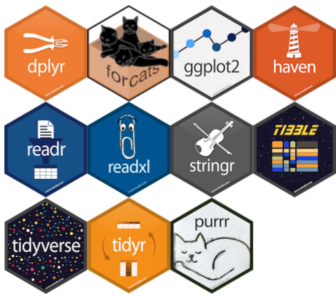

---
output:
  revealjs::revealjs_presentation:
    theme: simple
    highlight: pygments
    center: false
    transition: none
    progress: true
    font-family: Verdana
---

<head>
<link rel="stylesheet" href="https://cdnjs.cloudflare.com/ajax/libs/font-awesome/4.7.0/css/font-awesome.min.css">
</head>

<style>

code{
  background-color:#f2f2f2;
  border-radius: 25px;
}
 
span.co{
  color:#000080;
  font-weight: bold;
}
 
img{
  display: block;
  padding-left: 15px;
  padding-right: 15px;
  padding-top: 10px;
  padding-bottom: 10px;
  box-shadow: 0 0 0 0;
  text-shadow: 0px 0px;
}

p{
  text-align: left;
  font-size: 18px;
}

ul, ol{
  line-height: 27px;
  text-align: left;
  font-size: 18px;
  margin-left: 0px;
}
 
blockquote{
  font-size: 18px;
  border-left: 8px solid #292093;
  background-color: #e6ffff;
  padding-left: 16px;
  padding-right: 16px;
}
 
.row{
  margin: auto;
}
 
table {
  border-collapse: collapse;
}

table, td, th {
  border: 1px solid black;
  padding: 5px;
  text-align: center;
  vertical-align: middle;
}
 
 /* Create two equal columns that floats next to each other */
.column {
  float: left;
  width: 50%;
  padding: 10px;
}

/* Clear floats after the columns */
.row:after {
  content: "";
  display: table;
  clear: both;
}

.roundBorder {
  border-radius: 25px;
  border: 5px solid #30288C;
  background: #D6EAF8;
  padding-left: 20px;
  padding-right: 20px;
  padding-top: 10px;
  padding-bottom: 10px;
}

.roundBorderBlack {
  border-radius: 25px;
  border: 10px solid #D3D3D3;
  padding-left: 20px;
  padding-right: 20px;
  padding-top: 10px;
  padding-bottom: 10px;
}

.roundBorderBlackEx {
  border-radius: 5px;
  border: 5px solid #D3D3D3;
  padding-left: 5px;
  padding-right: 5px;
  padding-top: 2px;
}

.roundBorderEx {
  border-radius: 3px;
  border: 5px solid #30288C;
  background: #D6EAF8;
  padding-left: 5px;
  padding-right: 5px;
  padding-top: 2px;
}

.tt {
    position: relative;
    display: inline-block;
    class: inline; 
    font-weight: bold;
    font-family: "Avenir";
    font-size: 18px;
    border-bottom: 1px black;
}

/* Tooltip text */
.tt .ttText {
    visibility: hidden;
    font-weight: normal;
    font-size: 18px;
    width: 200px;
    background-color: black;
    border: 1px solid black;
    color: white;
    text-align: left;
    padding: 5px;
    border-radius: 6px;
    position: absolute;
    z-index: 1;
}

/* Show the tooltip text when you mouse over the tooltip container */
.tt:hover .ttText {
    visibility: visible;
}

</style>

<h3 style="text-align: center;">Introduction to data science in R</h3>
<h1 style="text-align: center;"><b>Lesson 6: Working with tidy data</b></h1>
<br>
<p style = "text-align: center; font-size: 24px;">Brian S. Evans, Ph.D.<br />
Migratory Bird Center<br />
Smithsonian Conservation Biology Institute</p>
<br><br>


##
<h2>Setup for the lesson</h2>
<hr>
```{r eval = FALSE}
# Load RCurl library:

library(RCurl)

# Load a source script:

script <-
  getURL(
    "https://raw.githubusercontent.com/bsevansunc/workshop_languageOfR/master/sourceCode.R"
  )

# Evaluate then remove the source script:

eval(parse(text = script))

rm(script)

library(lubridate)

```

```{r, eval = TRUE, include  = FALSE}
# Load RCurl library:

library(RCurl)

# Load a source script:

script <-
  getURL(
    "https://raw.githubusercontent.com/bsevansunc/workshop_languageOfR/master/sourceCode.R"
  )

# Evaluate then remove the source script:

eval(parse(text = script))

rm(script)

library(knitr) ; library(kableExtra)

options(knitr.table.format = "html")

library(lubridate)
```

##
<h2>Today's goals</h2>
<hr>


##
<h2>Today's goals</h2>
<hr>
<div class = "row">
<div class = "column" style = "width: 55%">
<br>
<ol>
<li>Nested code (<i>review</i>)</li>
<li>The pipe (<i>review</i>)</li>
<li>Joining data</li>
<li>Subsetting data</li>
<ul>
<li>Subset columns (<i>review</i>)</li>
<li>Subset rows </li>
</ul>
<li>Adding & modifying columns</li>
<li>Grouping data</li>
<li>Summarizing data</li>
</ol>
</div>
<div class = "column" style = "width: 45%">
<br>

</div>
</div>

##
<h2>Nested code</h2>
<hr>
<br>
<p>All functions can be nested inside other functions</p>
```{r, eval = FALSE}
# Non-nested form:

v <- c(1, 1, 2)

mean(v)

# Nested form:

mean(c(1,1,2))

# Check equivalence:

mean(v) == mean(c(1,1,2))
```

##
<h2>Nested code</h2>
<hr>
<br>
<p>$$Z_{1} = [1,2,3,4,5]$$</br>
$$Z_{2} = 2(Z_{1})$$</br>
$$Z_{3} = Z_{2} + 1$$</p>

<p>In base R, "chained" code blocks can be accomplished in one of three ways:</p>
<ul>
<li>Assigning a name to each object in a sequence</li>
<li>Overwrite the object for each step of a sequence</li>
<li>Nesting steps of a sequence</li>
</ul>

##
<h2>Nested code</h2>
<hr>
<br>
<p>$$Z_{1} = [1,2,3,4,5]$$</br>
$$Z_{2} = 2(Z_{1})$$</br>
$$Z_{3} = Z_{2} + 1$$</p>
```{r nested functions add z, eval = FALSE}
# Generate a vector of numbers from 1 through 5:

z <- 1:5
```

##
<h2>Nested code</h2>
<hr>
<br>
<p>$$Z_{1} = [1,2,3,4,5]$$</br>
$$Z_{2} = 2(Z_{1})$$</br>
$$Z_{3} = Z_{2} + 1$$</p>
```{r nested functions, eval = FALSE}
# Some very silly functions for illustration:

multiplyByTwo <- function(x){
  x*2
}

addOne <- function(x){
  x+1
}
```


##
<h2>Nested code</h2>
<hr>
<br>
<p>$$Z_{1} = [1,2,3,4,5]$$</br>
$$Z_{2} = 2(Z_{1})$$</br>
$$Z_{3} = Z_{2} + 1$$</p>

```{r nested functions new object, eval = FALSE}
# Non-nested, new object for each step:

z1 <- multiplyByTwo(z)

addOne(z1)
```

##
<h2>Nested code</h2>
<hr>
<br>
<p>$$Z_{1} = [1,2,3,4,5]$$</br>
$$Z_{2} = 2(Z_{1})$$</br>
$$Z_{3} = Z_{2} + 1$$</p>

```{r nested functions overwrite, eval = FALSE}
# Non-nested, overwrite object for each step:

z <- multiplyByTwo(z)

addOne(z)
```

##
<h2>Nested code</h2>
<hr>
<br>
<p>$$Z_{1} = [1,2,3,4,5]$$</br>
$$Z_{2} = 2(Z_{1})$$</br>
$$Z_{3} = Z_{2} + 1$$</p>

```{r nested functions nested, eval = FALSE}
# Nested:

addOne(multiplyByTwo(1:5))
```

##
<h2>Nested code</h2>
<hr>
<ul>
<li><b>Non-nested with new object</b>:
<ul>
<li>Strength: Easy to read.</li>
<li>Weaknesses: Script space. Intermediate object assignment (`z1`) may be hard to remember.</li>
</ul>
</li>
<li><b>Non-nested with overwritten object</b>:
<ul>
<li>Strengths: Easy to read. No new names.</li>
<li>Weaknesses: Script space. Loss of the initial value of `z`.</li>
</ul>
</li>
<li><b>Nested</b>:
<ul>
<li>Strengths: Concise. No new names.</li>
<li>Weaknesses: Difficult to read.</li>
</ul>
</li>
</ul>

##
<h2>The pipe</h2>
<hr>
<div class = "row">
<div class = "column" style = "width: 50%">
<br>
<ul>
<li><b>Steps in sequence</b></br> Easy to read & write</li>
<li><b>No intermediate objects</b></br> Nothing to remember</li>
<li><b>No overwritten objects</b></br> Safe!</li>
</ul>
</div>
<div class = "column" style = "width: 50%;">

</div>
</div>

##
<h2>The pipe</h2>
<hr>
<br>
<p>$$Z_{1} = [1,2,3,4,5]$$</br>
$$Z_{2} = 2(Z_{1})$$</br>
$$Z_{3} = Z_{2} + 1$$</p>
```{r pipe version, eval = F}
# Pipe version:

z %>%
  multiplyByTwo %>%
  addOne
``` 
<p><i>Every script is a communication!</i></p>

##
<h2>Joining data</h2>
<hr>
<p>Rules of tidy data: Each level of observation forms a table</p>
<br>
```{r messy2NF, echo = FALSE}
kable(messy2NF %>% slice(1:5), "html") %>%
  kable_styling(bootstrap_options = c("striped", "hover"))
```

##
<h2>Joining data</h2>
<hr>
<p>Rules of tidy data: Each level of observation forms a table</p>
<br>
```{r tidy2NFa, echo = FALSE}
kable(tidy2NFobsLevel %>% slice(1:5), "html") %>%
  kable_styling(bootstrap_options = c("striped", "hover"))
```
<br>
```{r tidy2NFb, echo = FALSE}
kable(tidy2NFsiteLevel %>% rename(siteId = id), "html") %>%
  kable_styling(bootstrap_options = c("striped", "hover"))
```

##
<h2>Joining data</h2>
<hr>
<br>
```{r messy habits, echo = FALSE}
birdCounts %>%
  left_join(birdHabits, by = 'species') %>%
  select(site, date, species, foraging, diet, count) %>%
  slice(1:10) %>%
  kable("html") %>%
  kable_styling(bootstrap_options = c("striped", "hover"))
```

##
<h2>Joining data</h2>
<hr>

```{r tables to join, eval = FALSE}
# Tables to join:

birdCounts

birdHabits
```

<br>
<div class = "row">
<div class = "column" style = "width: 60%;">
<h3>birdCounts</h3>
```{r display tables to join birdCounts, echo = FALSE}
kable(birdCounts %>% slice(1:5), "html") %>%
  kable_styling(bootstrap_options = c("striped", "hover"))
```
</div>
<div class = "column" style = "width: 40%;">
<h3>birdHabits</h3>
```{r display tables to join birdHabits, echo = FALSE}
kable(birdHabits %>% slice(1:5), "html") %>%
  kable_styling(bootstrap_options = c("striped", "hover"))
```
</div>
</div>

##
<h2>Joining data</h2>
<hr>
<p><b>left_join</b>: Join table y to table x using matching value in a column or columns.</p>
<p>
<b>x</b>: The target table</br>
<b>y</b>: The table to be joined to the target</br>
<b>by</b>: A character vector of the columns to join by
</p>

```{r left_join, eval = FALSE}
# Join tables:

left_join(x = birdCounts, y = birdHabits, by = 'species')

# Now you! Join birdHabits to birdCounts using a pipe:


```

##
<h2>Joining data</h2>
<hr>
<p><b>left_join</b>: Join table y to table x using matching value in a column or columns.</p>
<p>
<b>x</b>: The target table</br>
<b>y</b>: The table to be joined to the target</br>
<b>by</b>: A character vector of the columns to join by
</p>

```{r left_join pipe, eval = FALSE}
# Join tables:

left_join(x = birdCounts, y = birdHabits, by = 'species')

# Now you! Join birdHabits to birdCounts using a pipe:

birdCounts %>%
  left_join(birdHabits, by = 'species')

```

##
<h2>Subsetting data: Columns (review)</h2>
<hr>
<p><b>select</b>: Subset a column of a table by column name or index.</p>
```{r select indexing, eval = FALSE}
birdHabits

# Subset columns using indexing:

birdHabits[, c('species', 'foraging')]

birdHabits[,1:2]
```

##
<h2>Subsetting data: Columns (review)</h2>
<hr>
<p><b>select</b>: Subset a column of a table by column name or index.</p>
```{r select, eval = FALSE}
# Subset columns using select:

select(birdHabits, species, foraging)

# Now you! Select columns using a pipe:
```

##
<h2>Subsetting data: Columns (review)</h2>
<hr>
<p><b>select</b>: Subset a column of a table by column name or index.</p>
```{r select pipe, eval = FALSE}
# Subset columns using select:

select(birdHabits, species, foraging)

# Now you! Select columns using a pipe:

birdHabits %>%
  select(species, foraging)

```

##
<h2>Subsetting data: Rows</h2>
<hr>
<p><b>slice</b>: Subset a row of a table by index.</p>

```{r slice, eval = FALSE}
birdHabits

# Subset rows using indexing:

birdHabits[1:4,]

# Subset rows using slice:

slice(birdHabits, 1:4)

# Now you! Slice rows using a pipe:

```

##
<h2>Subsetting data: Rows</h2>
<hr>
<p><b>slice</b>: Subset a row of a table by index.</p>

```{r slice pipe, eval = FALSE}
birdHabits

# Subset rows using indexing:

birdHabits[1:4,]

# Subset rows using slice:

slice(birdHabits, 1:4)

# Now you! Slice rows using a pipe:

birdHabits %>%
  slice(1:4)

```

##
<h2>Subsetting data: Rows</h2>
<hr>
<p>Looking back at our previous output when selecting site and date from `birdCounts` ... what is wrong here?</p>
<br>
```{r distinct 0 , eval = FALSE}
# Subset birdCounts to site and date columns:

select(birdCounts, site, date)
```

```{r display table distinct 0, echo = FALSE}
kable(select(birdCounts, site, date) %>% slice(1:5), "html") %>%
  kable_styling(bootstrap_options = c("striped", "hover"))
```

##
<h2>Subsetting data: Rows</h2>
<hr>
<p>Looking back at our previous output when selecting site and date from `birdCounts` ... what is wrong here?</p>
<p><b>Rules of tidy data</b>: Each observation forms a row</p>

```{r distinct 1 , eval = FALSE}
# Subset birdCounts to site and date columns:

select(birdCounts, site, date)
```

```{r display table distinct 1, echo = FALSE}
kable(select(birdCounts, site, date) %>% slice(1:5), "html") %>%
  kable_styling(bootstrap_options = c("striped", "hover"))
```

##
<h2>Subsetting data: Rows</h2>
<hr>
<p>Looking back at our previous output when selecting site and date from `birdCounts` ... what is wrong here?</p>
<p><b>Rules of tidy data</b>: Each observation forms a row</p>
<p><b>distinct</b>: Subset a table to distinct rows.</p>
```{r distinct, eval = FALSE}
# Subset birdCounts to distinct records of site and date:

distinct(select(birdCounts, site, date))

# Now you! Subset to unique site and date records using a pipe:

```

##
<h2>Subsetting data: Rows</h2>
<hr>
<p>Looking back at our previous output when selecting site and date from `birdCounts` ... what is wrong here?</p>
<p><b>Rules of tidy data</b>: Each observation forms a row</p>
<p><b>distinct</b>: Subset a table to distinct rows.</p>
```{r distinct pipe, eval = FALSE}
# Subset birdCounts to distinct records of site and date:

distinct(select(birdCounts, site, date))

# Now you! Subset to unique site and date records using a pipe:

birdCounts %>%
  select(site, date) %>%
  distinct
```


##
<h2>Subsetting data: Rows</h2>
<hr>
<p><b>filter</b>: Subset a row of a table by condition.</p>


##
<h2>Subsetting data: Rows</h2>
<hr>
<p><b>filter</b>: Subset a row of a table by condition.</p>
```{r filter, eval = FALSE}
# Subset rows by condition in base R:

birdHabits[birdHabits$diet == 'omnivore',]

# Subset rows by condition using filter:

filter(birdHabits, diet == 'omnivore')

# Now you! Filter rows using a pipe:

```

##
<h2>Subsetting data: Rows</h2>
<hr>
<p><b>filter</b>: Subset a row of a table by condition.</p>
```{r filter pipe, eval = FALSE}
# Subset rows by condition in base R:

birdHabits[birdHabits$diet == 'omnivore',]

# Subset rows by condition using filter:

filter(birdHabits, diet == 'omnivore')

# Now you! Filter rows using a pipe:

birdHabits %>%
  filter(diet == 'omnivore')

```

##
<h2><i class= "fa fa-user-circle-o" style = "font-size: 150%;"></i> Exercise One:</h2>
<hr>
<p>Complete the following code to subset `birdCounts` to ground foraging birds!</p>

```{r exercise one, eval = FALSE}
# Subset birdCounts to ground foraging birds:

birdCounts %>%
  left_join(birdHabits # COMPLETE
  filter(foraging # COMPLETE
  select(s # COMPLETE  
         
```

##
<h2><i class= "fa fa-user-circle-o" style = "font-size: 150%;"></i> Exercise One:</h2>
<hr>
<p>Complete the following code to subset `birdCounts` to ground foraging birds!</p>

```{r exercise one answer, eval = FALSE}
# Subset birdCounts to ground foraging birds:

birdCounts %>%
  left_join(birdHabits, by = 'species') %>%
  filter(foraging == 'ground') %>%
  select(site:count)
         
```

##
<h2>Adding & modifying columns</h2>
<hr>
<p><b>mutate</b>: Modifies an existing column or adds a new column</p>

```{r mutate existing, eval = FALSE}
# Mutate species column in base R:

birdCounts

birdCounts$species <- toupper(birdCounts$species)

birdCount$species <- tolower(birdCount$species)

# Mutate species column using mutate:

mutate(birdCounts, species  = toupper(species))

# Now you! Mutate using a pipe:
         
```

##
<h2>Adding & modifying columns</h2>
<hr>
<p><b>mutate</b>: Modifies an existing column or adds a new column</p>

```{r mutate existing pipe, eval = FALSE}
# Mutate species column in base R:

birdCounts

birdCounts$species <- toupper(birdCounts$species)

birdCount$species <- tolower(birdCount$species)

# Mutate species column using mutate:

mutate(birdCounts, species  = toupper(species))

# Now you! Mutate using a pipe:

birdCounts %>%
  mutate(species = toupper(species))
```

##
<h2>Adding & modifying columns</h2>
<hr>
<p><b>mutate</b>: Modifies an existing column or adds a new column</p>

```{r mutate new, eval = FALSE}
# Add a year column in base R:

birdCounts$year <- year(birdCounts$date)

birdCounts

birdCounts <- birdCounts[,-5]

# Mutate year column using mutate:

mutate(birdCounts, year  = year(date))

# Now you! Mutate using a pipe:
         
```

##
<h2>Adding & modifying columns</h2>
<hr>
<p><b>mutate</b>: Modifies an existing column or adds a new column</p>

```{r mutate new pipe, eval = FALSE}
# Add a year column in base R:

birdCounts$year <- year(birdCounts$date)

birdCounts

birdCounts <- birdCounts[,-5]

# Mutate year column using mutate:

mutate(birdCounts, year  = year(date))

# Now you! Mutate using a pipe:

birdCounts %>%
  mutate(year = year(date))
         
```

##
<h2>Adding & modifying columns</h2>
<hr>
<p><b>transmute</b>: Mutates and subsets to specified columns</p>

```{r transmute, eval = FALSE}
# Add a year column, subset to site and year in base R:

newFrame <- data_frame(
  site = birdCounts$site,
  year = year(birdCounts$date)
)

# Transmute to add a year column, subset to site and year:

transmute(birdCounts,
          site,
          year = year(date))

# Now you! Transmute using a pipe:
```

##
<h2>Adding & modifying columns</h2>
<hr>
<p><b>transmute</b>: Mutates and subsets to specified columns</p>

```{r transmute pipe, eval = FALSE}
# Add a year column, subset to site and year in base R:

newFrame <- data_frame(
  site = birdCounts$site,
  year = year(birdCounts$date)
)

# Transmute to add a year column, subset to site and year:

transmute(birdCounts,
          site,
          year = year(date))

# Now you! Transmute using a pipe:

birdCounts %>%
  transmute(site, year = year(date))

```

##
<h2>Adding & modifying columns</h2>
<hr>
<p><b>select</b>: Selects column by position or name <b>and</b> can also be used to rename a column!</p>
<p><b>rename</b>: Renames a column by name</p>


```{r select and rename, eval = FALSE}
# Rename the species column using select:

select(birdCounts, site, date, spp = species, count)

# Rename the species column using rename:

rename(birdCounts, spp = species)

# Now you! Rename the species column to spp using rename and a pipe:
```

##
<h2>Adding & modifying columns</h2>
<hr>
<p><b>select</b>: Selects column by position or name <b>and</b> can also be used to rename a column!</p>
<p><b>rename</b>: Renames a column by name</p>


```{r select and rename pipe, eval = FALSE}
# Rename the species column using select:

select(birdCounts, site, date, spp = species, count)

# Rename the species column using rename:

rename(birdCounts, spp = species)

# Now you! Rename the species column to spp using rename and a pipe:

birdCounts %>%
  rename(spp = species)

```

##
<h2><i class= "fa fa-user-circle-o" style = "font-size: 150%;"></i> Exercise Two:</h2>
<hr>
<p>Filter `birdCounts` to point counts that took place in 2009.</p>

```{r exercise two, eval = FALSE}
# Subset birdCounts to point counts from 2009:

birdCounts %>%
  mutate(year # COMPLETE
  filter(year # COMPLETE
```

##
<h2><i class= "fa fa-user-circle-o" style = "font-size: 150%;"></i> Exercise Two:</h2>
<hr>
<p>Filter `birdCounts` to point counts that took place in 2009.</p>

```{r exercise two answer, eval = FALSE}
# Subset birdCounts to point counts from 2009:

birdCounts %>% 
  mutate(year = year(date)) %>%
  filter(year == 2009)
```

<p>Which rule did we break?</p>

##
<h2><i class= "fa fa-user-circle-o" style = "font-size: 150%;"></i> Exercise Two:</h2>
<hr>
<p>Filter `birdCounts` to point counts that took place in 2009.</p>

```{r exercise two answer better, eval = FALSE}
# Subset birdCounts to point counts from 2009:

birdCounts %>% 
  filter(year(date) == 2009)
```

##
<h2>Grouping data</h2>
<hr>
<p><b>group_by</b>: Assign groups to a data frame (split)</p>

```{r one group, eval = FALSE}
# Group birdCounts by site:

group_by(birdCounts, site)

# Now you! Group birdCounts by site using a pipe:
```

##
<h2>Grouping data</h2>
<hr>
<p><b>group_by</b>: Assign groups to a data frame (split)</p>

```{r one group pipe, eval = FALSE}
# Group birdCounts by site:

group_by(birdCounts, site)

# Now you! Group birdCounts by site using a pipe:

birdCounts %>%
  group_by(site)
```
<p><i>What did it do</i>?</p>


##
<h2>Grouping data</h2>
<hr>
<p><b>group_by</b>: Assign groups to a data frame (split)</p>

```{r one group show}
# Group birdCounts by site:

birdCounts %>%
  group_by(site)
```


##
<h2>Grouping data</h2>
<hr>
<p>`group_by` (split) with `mutate` (apply)</p>

```{r species richness}
# Species richness by site (across years):

birdCounts %>%
  group_by(site) %>%
  mutate(nSpecies = length(unique(species)))
```

##
<h2>Grouping data</h2>
<hr>
<p><b>group_by</b>: Assign groups to a data frame (split), two groups</p>

```{r two groups, eval = FALSE}
# Group birdCounts by site and year:

group_by(mutate(birdCounts, year = year(date)), site, year)

# Now you! Group birdCounts by site and year using a pipe:
```

##
<h2>Grouping data</h2>
<hr>
<p><b>group_by</b>: Assign groups to a data frame (split), two groups</p>

```{r two groups pipe, eval = FALSE}
# Group birdCounts by site and year:

group_by(mutate(birdCounts, year = year(date)), site, year)

# Now you! Group birdCounts by site and year using a pipe:

birdCounts %>%
  mutate(year = year(date)) %>%
  group_by(site, year)
```


##
<h2><i class= "fa fa-user-circle-o" style = "font-size: 150%;"></i> Exercise Three:</h2>
<hr>
<p>Complete the following to calculate the species richness for each site and year. Ensure that the resulting table is tidy.</p>

```{r exercise three, eval = FALSE}
# Calculate the species richness for each site and year:

birdCounts %>%
  mutate(year = # COMPLETE
  group_by(site, # COMPLETE
  mutate(nSpecies = # COMPLETE
  select(site, year, # COMPLETE
  # COMPLETE
```

##
<h2><i class= "fa fa-user-circle-o" style = "font-size: 150%;"></i> Exercise Three:</h2>
<hr>
<p>Complete the following to calculate the species richness for each site and year. Ensure that the resulting table is tidy.</p>

```{r exercise three answer, eval = FALSE}
# Calculate the species richness for each site and year:

birdCounts %>%
  mutate(year = year(date)) %>%
  group_by(site, year) %>%
  mutate(nSpecies = length(unique(species))) %>%
  select(site, year, nSpecies) %>%
  distinct
```

##
<h2>Summarizing data</h2>
<hr>
<p><b>summarize</b>: Calculates a summary function for a grouped variable.

```{r summarize, eval = FALSE}
# Species richness by site, across years:

summarize(group_by(birdCounts, site),
          nSpecies = length(unique(species)))

# Now you! Calculate species richness by site using a pipe:
```

##
<h2>Summarizing data</h2>
<hr>
<p><b>summarize</b>: Calculates a summary function for a grouped variable.

```{r summarize pipe, eval = FALSE}
# Species richness by site, across years:

summarize(group_by(birdCounts, site),
          nSpecies = length(unique(species)))

# Now you! Calculate species richness by site using a pipe:

birdCounts %>%
  group_by(birdCounts, site) %>%
  summarize(nSpecies = length(unique(species)))

```

##
<h2><i class= "fa fa-user-circle-o" style = "font-size: 150%;"></i> Exercise Four:</h2>
<hr>
<p>Complete the following to calculate the species richness for each site and year. Ensure that the resulting table is tidy.</p>

```{r exercise four, eval = FALSE}
# Calculate the species richness for each site and year:

birdCounts %>%
  mutate(year # COMPLETE
  group_by(site, # COMPLETE 
  summarize(nSpecies = # COMPLETE
```

##
<h2><i class= "fa fa-user-circle-o" style = "font-size: 150%;"></i> Exercise Four:</h2>
<hr>
<p>Complete the following to calculate the species richness for each site and year. Ensure that the resulting table is tidy.</p>

```{r exercise four answer, eval = FALSE}
# Calculate the species richness for each site and year:

birdCounts %>%
  mutate(year = year(date)) %>%
  group_by(site, year) %>%
  summarize(nSpecies = length(unique(species)))
```

