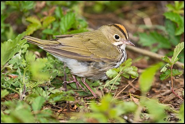
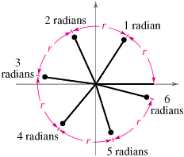

```{r setup, include=FALSE}
knitr::opts_chunk$set(echo = TRUE)
```

<head>
<link rel="stylesheet" href="N:/Capacity Building and Academic Programs/SI-Mason Grad & Prof Training/Individual Courses--Folders/Bird Migration/2018/Materials/Distance/Exercises">
<link rel="stylesheet" type="text/css" href="styles.css">
</head>

#Occupancy Modeling Demo Exercise
<p><i>Joe Kolowski, Ph.D.</i></p>

## Project Description and Context



We are working here with a dataset provided by Mike Hallworth, and collected at Hubbard Brook New Hampshire, USA. The full data set at Hubbard Brook had 373 point count survey locations systematically placed throughout Hubbard Brook Valley along 15 transects. Our data set includes 296 of these survey points. Point counts were conducted 4 times per year, and have been collected since 1999. Here we are working with a single year's data. Surveys typically started at the end of May, and all 4 surveys were typically done within a month. Each point count was split into 3 consecutive "periods" of 3 minutes, 20 seconds each (so the observer spent 10 minutes at each location during a survey). These data are part of a large, long-term study focused on investigating many aspects of songbird ecology including habitat use, recruitment, species richness and abundance, and many others. In this demo we'll be working only with the ovenbird (OVEN) information, but the dataset includes records of Red-eyed Vireo (REVI), Black-throated Blue Warbler (BTBW), and Blackburnian Warbler (BLBW). Here our goal is to assess what factors influence occupancy probability of ovenbirds in this landscape, while accounting for factors that may influence detection. 

##Exercise Objectives
  * Learn how to import and format raw data from point count field studies for occupancy analysis
  * Learn how to prepare data for use in the package `unmarked` and how to summarize that data
  * Run a single season occupancy modeling analysis with covariates on occupancy and detection probability
  * Become familiar with output results of occupancy models and how to compare models using model selection approaches
  * Create response curves for model covariates to assist in model interpretation

###Libraries/Setup
Let's first call the packages we'll need in this exercise. Use `install.packages` if you do not have these packages already on your machine.
```{r, warning = FALSE, message = FALSE}
library(unmarked)
library(tidyverse)
library(lubridate) #for the `yday` function
```

###Data Import and Exploration
<p>We can bring in data using our `read.csv` command, with our data files stored in our course dropbox folder as opposed to on our local computer.

```{r}
counts <- 
  read.csv('https://www.dropbox.com/s/fdotemoww8qdu8l/countData.csv?dl=1')

visits <- 
  read.csv('https://www.dropbox.com/s/wr961cx2lxxfssp/visitData.csv?dl=1')

siteCovs <-
  read.csv('https://www.dropbox.com/s/gbrxt85jwid2t55/siteData.csv?dl=1')
```

<p>Let's have a look at what these files contain. The countData file contains all observations during this study of each of our 5 bird species, across 4 sampling ocassions. Although the plot ID goes to 400, every plot number is not represented in this data set. We can use the `unique` function to see that we actually have 296 plots in the data set. 
```{r}
head(counts)
str(counts)
summary(counts)
length(unique(counts$plot))
```

<p>The siteCovs file contains covariates associated wtih these 296 sampled sites. Here we will just be working with elevation, aspect and slope as site covariates.
```{r}
head(siteCovs)
str(siteCovs)
summary(siteCovs)
```

<p>We also have survey covariates as well. These are covariates associated with each visit to each site. In other words, the values can vary across our 4 ocassions. That means we have 4*296 rows of data here. We have time of survey, observer, and two climatic variables representing the cloud cover (sky) and wind level (wind).  
```{r}
head(visits)
str(visits)
summary(visits)
```

###Data Formatting
When data is collected, we often have what our `counts` object looks like, a row for each observation. This demo analysis will focus on the ovenbird though, so we need to `filter` the data to pull out only the ovenbird observations. In addition we only need the data included in the columns `replicate` and `plot` so we'll use `select` to pull out only those columns. Also, the original data recorded the actual number of birds seen at each visit of each species, but here we will just be interested in whether or not the species was seen at all (i.e. 1 vs. 0). We'll use `mutate` to create a new column in our new `ovenCounts` object, with a 1 for each row, indicating the species was present. Finally, for occupancy we don't necessarily care if our species was seen multiple times across sampling 'periods', within the same site visit. So we'll use `distinct` to keep only 1 record of our species, within each unique combination of replicate and plot.

```{r, warning = F}
ovenCounts <-
  counts %>%
  filter(species == 'OVEN') %>%
  select(plot, replicate) %>%
  mutate(n = 1) %>%
  distinct
```

<p>Let's look at `ovencounts` and make sure we understand what the code above has done.
```{r}
head(ovenCounts)
```

<p>Our data is almost ready, but remember that the rows we have represent all the observations. Occupancy modeling draws key pieces of information from absences as well. Our `visits` object let's us know which sites were visited, regardless of what was seen there. We need to use this information to make sure we represent every site visit, even when the species wasn't seen. The code below first `select`s the plot and replicate columns from the `visits` object. We then use `left_join` to essentially merge `visits` with `ovenCounts`, using our plot and replicate columns. The `left_join` indicates we want to keep everything in the `visits` object (i.e. all the sites). We then use the amazing `spread` function to expand this data into a full matrix, according to the information in replicate, which is each of 4 values (0-3). For any situation where there is not an existing combination of replicate and plot, a zero will be `fill`ed. These are our absences. Lastly we will remove the plot column (column 1) with the `select` function and convert the object to a matrix.
<p>*Note that the spread function below will not work perfectly if one did not visit each site the same number of times, even though this is perfectly acceptable for a study design. Other R functions could be used to account for this situation.*

```{r}
detectionFrameOven <-
  visits %>%
  select(plot, replicate) %>%
  left_join(ovenCounts,
            by = c('plot', 'replicate')) %>%
  distinct %>%
  spread(replicate, n, fill = 0) %>%
  select(-1) %>%
  as.matrix
```

<p>Let's confirm what we have now, which should be a matrix of 296 sites (rows) and 4 occasions (columns) indicating in which situations the species was observed or not observed. 
```{r}
head(detectionFrameOven)
```


<p>Finally we need to create a list, which includes our survey covariates. Each element in the list should be a dataframe, with a row for each site, and a column for each sampling ocassion. Here again, as above, we use the `select` function to choose which columns of data we want from the `visits` object, then we use the `spread` function to expand the data in a long-form matrix. We then remove the plot column, as it is no longer needed and cannot remain in these data frames. We also need to change our time and date variables from factor variables to something we can analyze.


```{r}
obsCovs <-
  list(
    observer = visits %>%
      select(plot, replicate, observer) %>%
      spread(replicate, observer) %>%
      mutate(plot = NULL),
    timeOfDay = visits %>%
      select(plot, replicate, time) %>%
      mutate(time = as.numeric(time)) %>%
      spread(replicate, time) %>%
      mutate(plot = NULL),
    dayOfYear = visits %>%
      select(plot, replicate, date) %>%
      mutate(date = yday(strptime(date, format = "%m/%d/%Y"))) %>%
      spread(replicate, date) %>%
      mutate(plot = NULL),
    sky = visits %>%
      select(plot, replicate, sky) %>%
      spread(replicate, sky) %>%
      mutate(plot = NULL),
    wind = visits %>%
      select(plot, replicate, wind) %>%
      spread(replicate, wind) %>%
      mutate(plot = NULL)
  )
```

<p>Our data are now ready for the `unmarkedFrameOccu` function which prepares our data for occupancy analysis.We need to provide three objects, the detection matrix, our site covariates data frame, and a list of dataframes for our observation/survey covariates. 
```{r}
umfOven <-
  unmarkedFrameOccu(y = detectionFrameOven,
  siteCovs = siteCovs,
  obsCovs = obsCovs)
```
<p>We can look at a general summary of the data using `summary` on this object
```{r}
summary(umfOven)
```
<p>This show us naive occupancy here is 87%, that is ovenbirds were found at 87% of the sites.
<p>The `unmarked` package also has a built in `plot` setting to show you detections across sites and ocassions. It is a bit crazy looking, but gives at least some sense of how your presences and absences fall out over sites and ocassions.
```{r}
plot(umfOven)
```

###Model Fitting and Model Selection - Occupancy covariates
Let's run some models! First let's look at factors influencing occupancy, while holding a general model for detection. We'll try all combinations of our 3 site covariates. Note that in the model formula statement, the detection model comes first, followed by the occupancy model.

```{r}
Psidot_pFull <- occu( ~ wind + sky + dayOfYear + observer + timeOfDay 
                      ~ 1, data = umfOven) 
PsiElev_pFull <- occu( ~ wind + sky + dayOfYear + observer + timeOfDay 
                       ~ elevation, data = umfOven)
PsiSlope_pFull <- occu( ~ wind + sky + dayOfYear + observer + timeOfDay 
                        ~ slope, data = umfOven)
PsiAspect_pFull <- occu( ~ wind + sky + dayOfYear + observer + timeOfDay 
                        ~ aspect, data = umfOven)
PsiAspectElev_pFull <- occu( ~ wind + sky + dayOfYear + observer + timeOfDay 
                        ~ aspect + elevation, data = umfOven)
PsiAspectSlope_pFull <- occu( ~ wind + sky + dayOfYear + observer + timeOfDay 
                        ~ aspect + slope, data = umfOven)
PsiSlopeElev_pFull <- occu( ~ wind + sky + dayOfYear + observer + timeOfDay 
                        ~ slope + elevation, data = umfOven)
PsiAspectSlopeElev_pFull <- occu( ~ wind + sky + dayOfYear + observer + timeOfDay 
                        ~ aspect +slope + elevation, data = umfOven)

```
<p>Once we have our models run, we can use the `fitList` function to compile the models together, in preparation for model selection. We then use the `modSel` function to bring together the model results and compare using AIC-based approaches. Note that putting parentheses around code that creates something, will print that object automatically to the console
```{r, warning = F, message = F}
ObsModsO <- fitList(Psidot_pFull,PsiElev_pFull,PsiSlope_pFull, PsiAspect_pFull, PsiAspectElev_pFull, PsiAspectSlope_pFull,PsiSlopeElev_pFull,PsiAspectSlopeElev_pFull)
(ObsModsRank <- modSel(ObsModsO))
```
<p>We can see that our best model includes both aspect and elevation. Before we focus on interpreting the results, let's see if we can simplify our detection model by trying various more simple combinations of our 5 survey covariates, along with our best occupancy model from above. Unfortunately, with even just 5 covariates, we have a lot of potential models we can test...27 to be exact! You'll note below that I've had to specify starting values to get some of these models to run. We run into some challenges with this dataset, because ovenbirds were seen at some many of our sites. This reduces the amount of variation available for different covariates to try to explain. This also means that for some levels or combinations of covariates, there may be no sites, or ocassions, where birds were not seen. This all causes some models to fail to find maximum likelihood values, and starting values can help with this. These starting values represent estimated coefficient values for all model parameters. To get these, we can take a model that did run, and use the `coef` function to look at the coefficient values and help us get a sense of what we should use. 

###Model Fitting and Selection - Detection covariates

```{r}

PsiAspectElev_pdot <- occu( ~ 1
                            ~ aspect + elevation,
                            data = umfOven,
                            starts = c(.6,-.4, .004, 1)
)
PsiAspectElev_pwind <- occu( ~ wind
                             ~ aspect + elevation,
                             data = umfOven,
                             starts = c(.6,-.4, .004, 2.3,-.15)
)
PsiAspectElev_psky <- occu( ~ sky
                            ~ aspect + elevation,
                            data = umfOven,
                            starts = c(.6,-.4, .004, 2.3,-.07)
)
PsiAspectElev_pobs <- occu( ~ observer
                            ~ aspect + elevation,
                            data = umfOven,
                            starts = c(.6, -.4, .004, 1.3, -.6, -.9, -.09)
)
PsiAspectElev_pday <- occu(~ dayOfYear
                           ~ aspect + elevation, data = umfOven)

PsiAspectElev_ptime <- occu(~ timeOfDay
                            ~ aspect + elevation, data = umfOven)

PsiAspectElev_pWindSky <- occu( ~ wind + sky
                                ~ aspect + elevation,
                                data = umfOven,
                                starts = c(.6, -.4, .004, 2.3, -.15, -.07)
)

PsiAspectElev_pWindday <- occu(~ wind + dayOfYear
                               ~ aspect + elevation, data = umfOven)

PsiAspectElev_pWindObs <- occu( ~ wind + observer
                                ~ aspect + elevation,
                                data = umfOven,
                                starts = c(.6, -.4, .004, 2.3, -.15, -.62, -.97, -.12)
)

PsiAspectElev_pWindTime <- occu( ~ wind + timeOfDay
                                 ~ aspect + elevation, data = umfOven)

PsiAspectElev_pSkyDay <- occu( ~ sky + dayOfYear
                               ~ aspect + elevation, data = umfOven)

PsiAspectElev_pSkyObs <- occu( ~ sky + observer
                              ~ aspect + elevation,
                              data = umfOven,
                              starts = c(.6, -.4, .004, 2.3, -.07, -.62, -.97, -.12)
)

PsiAspectElev_pSkyTime <- occu(~ sky + timeOfDay
                               ~ aspect + elevation, data = umfOven)

PsiAspectElev_pDayofYearObs <- occu(~ dayOfYear + observer
                                    ~ aspect + elevation, data = umfOven)

PsiAspectElev_pDayTime <- occu(~ dayOfYear + timeOfDay
                               ~ aspect + elevation, data = umfOven)

PsiAspectElev_pObsTime <- occu(~ observer + timeOfDay
                               ~ aspect + elevation, data = umfOven)

PsiAspectElev_pWindSkyDay <- occu(~ wind + sky + dayOfYear
                                  ~ aspect + elevation, data = umfOven)

PsiAspectElev_pWindSkyObs <- occu(~ wind + sky + observer
                                  ~ aspect + elevation,
                                  data = umfOven,
                                  starts = c(.6, -.4, .004, 2.3, -.15, -.07, -.62, -.97, -.12)
)

PsiAspectElev_pWindSkyTime <- occu(~ wind + sky + timeOfDay
                                   ~ aspect + elevation, data = umfOven)

PsiAspectElev_pWindDayObs <- occu(~ wind + dayOfYear + observer
                                  ~ aspect + elevation, data = umfOven)

PsiAspectElev_pWindDayTime <- occu(~ wind + dayOfYear + timeOfDay
                                   ~ aspect + elevation, data = umfOven)

PsiAspectElev_pSkyDayObs <- occu(~ sky + dayOfYear + observer
                                 ~ aspect + elevation, data = umfOven)

PsiAspectElev_pSkyDayTime <- occu(~ sky + dayOfYear + timeOfDay
                                  ~ aspect + elevation, data = umfOven)
PsiAspectElev_pDayObsTime <- occu( ~ dayOfYear + observer + timeOfDay
                                   ~ aspect + elevation, data = umfOven)

PsiAspectElev_pWindSkyDayObs <- occu( ~ wind + sky + dayOfYear + observer
                                      ~ aspect + elevation, data = umfOven)

PsiAspectElev_pSkyDayObsTime <- occu( ~ sky + dayOfYear + observer + timeOfDay
                                      ~ aspect + elevation, data = umfOven)

PsiAspectElev_pWindSkyObsTime <- occu( ~ wind + sky + observer + timeOfDay
                                       ~ aspect + elevation, data = umfOven)
```

```{r, warning = F, message = F}
ObsModsP <-
  fitList(
  PsiAspectElev_pdot,
  PsiAspectElev_pwind,
  PsiAspectElev_psky,
  PsiAspectElev_pobs,
  PsiAspectElev_pday,
  PsiAspectElev_ptime,
  PsiAspectElev_pWindSky,
  PsiAspectElev_pWindday,
  PsiAspectElev_pWindObs,
  PsiAspectElev_pWindTime,
  PsiAspectElev_pSkyDay,
  PsiAspectElev_pSkyObs,
  PsiAspectElev_pSkyTime,
  PsiAspectElev_pDayofYearObs,
  PsiAspectElev_pDayTime,
  PsiAspectElev_pObsTime,
  PsiAspectElev_pWindSkyDay,
  PsiAspectElev_pWindSkyObs,
  PsiAspectElev_pWindSkyTime,
  PsiAspectElev_pWindDayObs,
  PsiAspectElev_pWindDayTime,
  PsiAspectElev_pSkyDayObs,
  PsiAspectElev_pSkyDayTime,
  PsiAspectElev_pDayObsTime,
  PsiAspectElev_pWindSkyDayObs,
  PsiAspectElev_pSkyDayObsTime,
  PsiAspectElev_pWindSkyObsTime
  )

(ObsModsRankP <- modSel(ObsModsP))
```
<p> We can see from our model selection table that in the end, only wind level and observer are important covariates in determining probability of detection of ovenbirds across our site. Let's move forward with some interpretation of what seems to be our best supported model, `PsiAspectElev_pWindObs`.

###Model Interpretation and Value Prediction
<p>We can first look at a basic summary of this model using the `summary` function. Remember that we can look at just the coefficients with the `coef` function as well.
```{r}
summary(PsiAspectElev_pWindObs)
```
<p>We can see, based on coefficient values, that as wind level increases, probability of detection decreases. Regarding observer, we see that observer AJS is not shown in the coefficient list. This means that the detection probability parameter of AJS is accounted for in the intercept term. The values of the other coefficients are relative to this AJS baseline. The other three observers show lower detection probabilities than AJS, this being a substantial difference in the case of CH and DJW.  
<p>We can use the `predict` function to look at estimated probabilities of detection and occupancy based on our actual site data. We need to set the type of estimate of we want as either "state" for occupancy values or "det" for detection probability.This will show us values for all 296 sites, so let's use the `head` function to show just the first 20.
```{r}
head(predict(PsiAspectElev_pWindObs, type = "state"), 20)
```
<p> Keep in mind these values can be associated back to our site covariates in `obsCovs` and `siteCovs`, in the order they appear there, but the row numbers here do not represent actual site numbers. In others words row 10 here is not necessarily our site #10, but it is the 10th site in our siteCovs file. We can summarize our predicted values to see the range of predicted occupancy values.
```{r}
summary(predict(PsiAspectElev_pWindObs, type = "state"))
```
<p> We can see that our minimum predicted site occupancy value is 51.5%, but average site occupancy across our sites is 87.8%. Why is this so close to our naive occupancy estimate? To find out, let's look at our detection probability estimates. 
```{r}
head(predict(PsiAspectElev_pWindObs, type = "det"), 20)
summary(predict(PsiAspectElev_pWindObs, type = "det"))
```
<p>Predicted detection probability, per ocassion, is between 48.5% and 81.1%. The mean across our sites is 69.9%. If this is the probability of detecting an ovenbird, when present, within a single occassion, what is the probability of missing a bird, on all 4 ocassions?
$$Pr(0000 | \Psi = 1, p) = (1-p_0) * (1-p_1) * (1-p_2) * (1-p_3)$$ 
$$ = (1-p)^4$$
<p>For our scenario this value is `r round((1-.699)^4,3)`.

<p> If we subtract this value from 1, we get "pcap" or p prime, which is the probability of seeing an ovenbird at least once across the 4 ocassions, if the site is occupied. This value is `r round(1-((1-.699)^4),3)`. And so it follows that our naive occupancy should be very similar to our estimated probability of occupancy for this species. It is VERY unlikely that an observer would visit a site occupied by ovenbirds 4 times, and never detect a single ovenbird.

###Graphical Interpretation of Model Covariates
<p> Let's now take a look at how our covariates influence occupancy and detection. We know that as wind increases, probability of detection decreases, but we can create a response curve which allows us to visualize how dramatic this effect is, across a set of values of wind. To do this we use the predict function, but this time we provide the set of values we want to use for the prediction. We will vary the values of wind from its minimum to its maximum. In order to graphically show its effect though, we need to hold the other covariates constant. 

<p>Let's first save our best model with a shorter name.
```{r}
best <- PsiAspectElev_pWindObs
```
<p>To predict across a particular set of values using our model equation, we need to create a new dataframe. Remember the names of your columns here need to be exactly the same as the names of your covariates in the unmarked data objects.Here we are predicting across all possible values of the wind covariate (0-6), and setting the observer to "AJS". 

```{r}
newDataDetWind_AJS <- data.frame(wind = seq(0, 6),
                                 observer = factor("AJS",
                                 levels = c("AJS", "CH", "DJW", "JDW")))
head(newDataDetWind_AJS)                                               
```
<p>We will now use this dataframe to create predictions of detection probability, using our equation from our best model.
```{r}
EstDetWindAJS <- predict(best,
                         type = "det",
                         newdata = newDataDetWind_AJS,
                         appendData = TRUE)
head(EstDetWindAJS)
```
Let's repeat this for the other three observers.
```{r}
newDataDetWind_CH <- data.frame(wind = seq(0, 6),
                                observer = factor("CH", levels = c("AJS", "CH", "DJW", "JDW")))

EstDetWindCH <- predict(best,
                        type = "det",
                        newdata = newDataDetWind_CH,
                        appendData = TRUE)

newDataDetWind_DJW <- data.frame(wind = seq(0, 6),
                                 observer = factor("DJW",
                                 levels = c("AJS", "CH", "DJW", "JDW")))
EstDetWindDJW <- predict(best,
                         type = "det",
                         newdata = newDataDetWind_DJW,
                         appendData = TRUE)

newDataDetWind_JDW <- data.frame(wind = seq(0, 6),
                                 observer = factor("JDW",
                                 levels = c("AJS", "CH", "DJW", "JDW")))
EstDetWindJDW <- predict(best,
                         type = "det",
                         newdata = newDataDetWind_JDW,
                         appendData = TRUE)
```
<p>Now we have predicted values of detection probability for all values of wind, and for all values of oberver. Let's graph them together to see what the relationships look like. 

```{r}
#AJS
plot(
  Predicted ~ wind,
  EstDetWindAJS,
  type = "l",
  ylim = c(0, 1),
  xlab = "Wind Level",
  ylab = "Expected detection probability",
  las = 1,
  bty = "n"
  )
#Upper and Lower Confidence Intervals
lines(
  lower ~ wind,
  EstDetWindAJS,
  type = "l",
  lty = 3
  )
lines(
  upper ~ wind,
  EstDetWindAJS,
  type = "l",
  lty = 3
  )
      
#CH
lines(
  Predicted ~ wind,
  EstDetWindCH,
  type = "l",
  col = "green"
  )
lines(
  lower ~ wind,
  EstDetWindCH,
  type = "l",
  col = "green",
  lty = 3
  )
lines(
  upper ~ wind,
  EstDetWindCH,
  type = "l",
  col = "green",
  lty = 3
  )

#DJW
lines(
  Predicted ~ wind,
  EstDetWindDJW,
  type = "l",
  col = "red"
  )

lines(
  lower ~ wind,
  EstDetWindDJW,
  type = "l",
  col = "red",
  lty = 3
  )
lines(
  upper ~ wind,
  EstDetWindDJW,
  type = "l",
  col = "red",
  lty = 3
  )

#JDW
lines(
  Predicted ~ wind,
  EstDetWindJDW,
  type = "l",
  col = "blue"
  )

lines(
  lower ~ wind,
  EstDetWindJDW,
  type = "l",
  col = "blue",
  lty = 3
  )

lines(
  upper ~ wind,
  EstDetWindJDW,
  type = "l",
  col = "blue",
  lty = 3
  )

legend(
  "bottomleft",
  legend = c("AJS", "CH", "DJW", "JDW"),
  lty = 1,
  col = c("black", "green", "red", "blue"),
  bty = "n"
  )

```
<p>While interpreting the model coefficients directly can be tricky, we can now see clearly that DJW had the lowest detection probability, and both AJS and JDW displayed similarly high relative detection probablity. We can also now see how wind level affects detection probability. 
<p>But typically detection covariates are not the part of the model we are most interested. We tpyically want to know how covariates influence occupancy. Let's now look at how aspect and elevation influence ovenbird occupancy. As above we need to first create a new dataframe. Let's start with looking at our most important covariates, aspect and elevation. Our model for occupancy has two covariates, so that is what we need in the new dataframe.We need two separate dataframes though, one which allows aspect to vary and holds elevation constant, the other which allows elevation to vary.
```{r}
newDataOccAspect <-
  data.frame(
  aspect = seq(min(siteCovs$aspect), max(siteCovs$aspect), length.out = 100),
  elevation = median(siteCovs$elevation)
  )
EstOccAspect <- predict(best,
                        type = "state",
                        newdata = newDataOccAspect,
                        appendData = TRUE)
head(EstOccAspect)

newDataOccElev <- data.frame(
  aspect = median(siteCovs$aspect),
  elevation = seq(
  min(siteCovs$elevation),
  max(siteCovs$elevation),
  length.out = 100
  )
  )
EstOccElev <- predict(best,
                      type = "state",
                      newdata = newDataOccElev,
                      appendData = TRUE)
head(EstOccElev)
```
<p>Now let's graph the relationships.
```{r}
par(mfrow = c(1,2))
#Aspect
plot(
  Predicted ~ aspect,
  EstOccAspect,
  type = "l",
  col = "red",
  ylim = c(0, 1),
  xlab = "Aspect",
  ylab = "Expected occupancy probability",
  las = 1,
  bty = "n"
  )

lines(
  lower ~ aspect,
  EstOccAspect,
  type = "l",
  lty = 2,
  col = "red"
  )
lines(
  upper ~ aspect,
  EstOccAspect,
  type = "l",
  lty = 2,
  col = "red"
  )
#Elevation
plot(
  Predicted ~ elevation,
  EstOccElev,
  type = "l",
  col = "blue",
  ylim = c(0, 1),
  xlab = "Elevation (m)",
  ylab = "Expected occupancy probability",
  las = 1,
  bty = "n"
  )

lines(
  lower ~ elevation,
  EstOccElev,
  type = "l",
  lty = 2,
  col = "blue"
  )
lines(
  upper ~ elevation,
  EstOccElev,
  type = "l",
  lty = 2,
  col = "blue"
  )

```
________________________________________________________________________________________________

<p> A Note about Aspect: You'll notice aspect ranges from around zero to a bit more than 6. Aspect here was recorded in radians, which can be converted to degrees by multiplying the value by 180 degrees and dividing by Pi. Refer to the figure here to see what these radian values refer to, in terms of cardinal directions. As you can see, a value near zero represents east, with increasing values moving counterclockwise. Do you see any potential issues with how we have analyzed aspect here?
