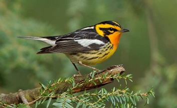

```{r setup, include=FALSE}
knitr::opts_chunk$set(echo = TRUE)
```

<head>
<link rel="stylesheet" href="N:/Capacity Building and Academic Programs/SI-Mason Grad & Prof Training/Individual Courses--Folders/Bird Migration/2018/Materials/Distance/Exercises">
<link rel="stylesheet" type="text/css" href="styles.css">
</head>

#Occupancy Modeling Student Exercise Key - Blackburnian Warbler
<p><i>Joe Kolowski, Ph.D.</i></p>

## Project Description and Context



<p>We are working here with the same dataset described in the Ovenbird demo exercise. The data were provided by Mike Hallworth, and collected at Hubbard Brook New Hampshire, USA. The full data set at Hubbard Brook had 373 point count survey locations systematically placed throughout Hubbard Brook Valley along 15 transects. Our data set includes 296 of these survey points. Point counts were conducted 4 times per year, and have been collected since 1999. Here we are working with a single year's data. Surveys typically started at the end of May, and all 4 surveys were typically done within a month. Each point count was split into 3 consecutive "periods" of 3 minutes, 20 seconds each (so the observer spent 10 minutes at each location during a survey). These data are part of a large, long-term study focused on investigating many aspects of songbird ecology including habitat use, recruitment, species richness and abundance, and many others. In this demo we'll be working only with the Blackburnian Warbler (BLBW). Here our goal is to assess what factors influence occupancy probability of blackburnian warblers in this landscape, while accounting for factors that may influence detection.</p>

## Exercise Objectives

  * Continue to practice with importing and formating raw data from point count field studies for occupancy analysis
  * Practice functions in the package `unmarked` for single-season occupancy analysis
  * Independently run a single season occupancy modeling analysis with covariates on both occupancy and detection probability
  * Independently interpret output results of occupancy models and use model selection approaches to address competing ecological hypotheses
  * Create response curves for model covariates to assist in model interpretation

### Libraries/Setup

<p>Let's first call the packages we'll need in this exercise. Use `install.packages` if you do not have these packages already on your machine.</p>

```{r, warning = FALSE, message = FALSE}
library(unmarked)
library(tidyverse)
library(lubridate) #for the `yday` function
```

<p>Remember also when starting a new analysis to clear your environment. This is generally always a good idea, particularly in cases where you might be using models of the same names as previous analyses.</p>

```{r, eval = F}
rm(list = ls())
```

### Data Import and Exploration

<p>We can bring in data using our `read.csv` command, with our data files stored in our course dropbox folder as opposed to on our local computer.</p>

```{r}
counts <- 
  read.csv('https://www.dropbox.com/s/fdotemoww8qdu8l/countData.csv?dl=1')

visits <- 
  read.csv('https://www.dropbox.com/s/wr961cx2lxxfssp/visitData.csv?dl=1')

siteCovs <-
  read.csv('https://www.dropbox.com/s/gbrxt85jwid2t55/siteData.csv?dl=1')
```

### Data Formatting

<p>Since we are using the same data set from the ovenbird demonstration, we need to perform the same formatting steps to prepare the data for analysis.</p>

<p>Step1: Using the ovenbird demo as a guide, first pull out only the Blackburnian warbler observation from the `counts` object, select out the `plot` and `replicate` columns, and create a new column for counts (`n`) that is set to 1. Remember to keep only unique rows, since we sometimes have more than one observation within a 10 minute period. Review your new counts object to make sure everything worked properly.</p>

<p>**Q1: How many observations of Blackburnian Warblers were recorded?**</p>

<p>A1: 544</p>

```{r, warning = F}
BlbwCounts <-
  counts %>%
  filter(species == 'BLBW') %>%
  select(plot, replicate) %>%
  mutate(n = 1) %>%
  distinct
```

<p>Let's look at `Blbwcounts` and make sure we understand what the code above has done.</p>

```{r}
head(BlbwCounts)
```

<p>Step 2: Create a detection frame for these counts, being sure to account for visits where no observations were recorded. This requires use of the `visits` object. View your detection frame to make sure everything worked properly.</p>

```{r}
detectionFrameBlbw <-
  visits %>%
  select(plot, replicate) %>%
  left_join(BlbwCounts,
            by = c('plot', 'replicate')) %>%
  distinct %>%
  spread(replicate, n, fill = 0) %>%
  select(-1) %>%
  as.matrix
```

<p>Let's confirm what we have now, which should be a matrix of 296 sites (rows) and 4 occasions (columns) indicating in which situations the species was observed or not observed.</p>

```{r}
head(detectionFrameBlbw)
```

<p>Step3: Our last step in data formatting will be to create a list of our survey covariates. These are stored in the `visits` object. But now each separate covariates needs to exist in its own data frame within a list. Each data frame should have 296 rows (for each site) and 4 columns (for each ocassion). This code should be the same as in the ovenbird demo, since these covariates are not specific to the species we are analyzing.</p>

```{r}
obsCovs <-
  list(
    observer = visits %>%
      select(plot, replicate, observer) %>%
      spread(replicate, observer) %>%
      mutate(plot = NULL),
    timeOfDay = visits %>%
      select(plot, replicate, time) %>%
      mutate(time = as.numeric(time)) %>%
      spread(replicate, time) %>%
      mutate(plot = NULL),
    dayOfYear = visits %>%
      select(plot, replicate, date) %>%
      mutate(date = yday(strptime(date, format = "%m/%d/%Y"))) %>%
      spread(replicate, date) %>%
      mutate(plot = NULL),
    sky = visits %>%
      select(plot, replicate, sky) %>%
      spread(replicate, sky) %>%
      mutate(plot = NULL),
    wind = visits %>%
      select(plot, replicate, wind) %>%
      spread(replicate, wind) %>%
      mutate(plot = NULL)
  )
```

<p>Our data are now ready for the `unmarkedFrameOccu` function which prepares our data for occupancy analysis.We need to provide three objects, the detection matrix, our site covariates data frame, and a list of dataframes for our observation/survey covariates.</p>

<p>Step4: Create an unmarked frame for use in our occupancy models and use `summary` to review this object.</p>

```{r}
umfBlbw <-
  unmarkedFrameOccu(y = detectionFrameBlbw,
  siteCovs = siteCovs,
  obsCovs = obsCovs)
```

<p>We can look at a general summary of the data using `summary` on this object</p>

```{r}
summary(umfBlbw)
```

<p>**Q2: What is our naive occupancy probability for this species?**</p>

<p>A2: `r 244/296`</p>

###Model Fitting and Model Selection - Occupancy and Detection Covariates

<p>We now are ready to run some single-season occupancy models. Remember that it is best practice to first test a range of models that investigate potential hypotheses for what covariates are impacting occupancy, while using a fully general model for detection probability. Once you refine your occupancy variables you can then refine/simplify your detection covariates if possible. Use the ovenbird demo exercise as a guide. Here again, as in the ovenbird demo, you may need to use starting values if some models fail to run.</p>

<p>Step 5: Conduct a complete model selection and comparison work flow to arrive at a best final model describing occupancy/detection of this species.</p> 

<p>**Q3: Which covariates are important in determing probability of occupancy of this species?**</p>

```{r}
Psidot_pFull <- occu( ~ wind + sky + dayOfYear + observer + timeOfDay 
                      ~ 1, data = umfBlbw) 
PsiElev_pFull <- occu( ~ wind + sky + dayOfYear + observer + timeOfDay 
                       ~ elevation, data = umfBlbw)
PsiSlope_pFull <- occu( ~ wind + sky + dayOfYear + observer + timeOfDay 
                        ~ slope, data = umfBlbw)
PsiAspect_pFull <- occu( ~ wind + sky + dayOfYear + observer + timeOfDay 
                        ~ aspect, data = umfBlbw)
PsiAspectElev_pFull <- occu( ~ wind + sky + dayOfYear + observer + timeOfDay 
                        ~ aspect + elevation, data = umfBlbw)
PsiAspectSlope_pFull <- occu( ~ wind + sky + dayOfYear + observer + timeOfDay 
                        ~ aspect + slope, data = umfBlbw)
PsiSlopeElev_pFull <- occu( ~ wind + sky + dayOfYear + observer + timeOfDay 
                        ~ slope + elevation, data = umfBlbw)
PsiAspectSlopeElev_pFull <- occu( ~ wind + sky + dayOfYear + observer + timeOfDay 
                        ~ aspect +slope + elevation, data = umfBlbw)

```

<p>Once we have our models run, we can use the `fitList` function to compile the models together, in preparation for model selection. We then use the `modSel` function to bring together the model results and compare using AIC-based approaches. Note that putting parentheses around code that creates something, will print that object automatically to the console</p>

```{r, warning = F, message = F}
ObsModsBB <- fitList(Psidot_pFull,PsiElev_pFull,PsiSlope_pFull, PsiAspect_pFull, PsiAspectElev_pFull, PsiAspectSlope_pFull,PsiSlopeElev_pFull,PsiAspectSlopeElev_pFull)
(ObsModsRankBB <- modSel(ObsModsBB))
```

<p>A3: We can see that our best model includes both aspect and elevation.These are the same two covariates that were most important in determining occupancy of ovenbirds.</p>

<p>**Q4: What are the most important covariates in determining detection probability of this species?**</p>

<p> Here again, as in the ovenbird demo, I've had to use starting values, for the same problematic models. I cheated a bit here and just used the same starting values as for the ovenbird, which is not necessarily the best approach. But in this case, these starting values did help in getting the models to coverge properly.</p>

```{r}

PsiAspectElev_pdot <- occu( ~ 1
                            ~ aspect + elevation,
                            data = umfBlbw,
                            starts = c(.6,-.4, .004, 1)
)
PsiAspectElev_pwind <- occu( ~ wind
                             ~ aspect + elevation,
                             data = umfBlbw,
                             starts = c(.6,-.4, .004, 2.3,-.15)
)
PsiAspectElev_psky <- occu( ~ sky
                            ~ aspect + elevation,
                            data = umfBlbw,
                            starts = c(.6,-.4, .004, 2.3,-.07)
)
PsiAspectElev_pobs <- occu( ~ observer
                            ~ aspect + elevation,
                            data = umfBlbw,
                            starts = c(.6, -.4, .004, 1.3, -.6, -.9, -.09)
)
PsiAspectElev_pday <- occu(~ dayOfYear
                           ~ aspect + elevation, data = umfBlbw)

PsiAspectElev_ptime <- occu(~ timeOfDay
                            ~ aspect + elevation, data = umfBlbw)

PsiAspectElev_pWindSky <- occu( ~ wind + sky
                                ~ aspect + elevation,
                                data = umfBlbw,
                                starts = c(.6, -.4, .004, 2.3, -.15, -.07)
)

PsiAspectElev_pWindday <- occu(~ wind + dayOfYear
                               ~ aspect + elevation, data = umfBlbw)

PsiAspectElev_pWindObs <- occu( ~ wind + observer
                                ~ aspect + elevation,
                                data = umfBlbw,
                                starts = c(.6, -.4, .004, 2.3, -.15, -.62, -.97, -.12)
)

PsiAspectElev_pWindTime <- occu( ~ wind + timeOfDay
                                 ~ aspect + elevation, data = umfBlbw)

PsiAspectElev_pSkyDay <- occu( ~ sky + dayOfYear
                               ~ aspect + elevation, data = umfBlbw)

PsiAspectElev_pSkyObs <- occu( ~ sky + observer
                              ~ aspect + elevation,
                              data = umfBlbw,
                              starts = c(.6, -.4, .004, 2.3, -.07, -.62, -.97, -.12)
)

PsiAspectElev_pSkyTime <- occu(~ sky + timeOfDay
                               ~ aspect + elevation, data = umfBlbw)

PsiAspectElev_pDayofYearObs <- occu(~ dayOfYear + observer
                                    ~ aspect + elevation, data = umfBlbw)

PsiAspectElev_pDayTime <- occu(~ dayOfYear + timeOfDay
                               ~ aspect + elevation, data = umfBlbw)

PsiAspectElev_pObsTime <- occu(~ observer + timeOfDay
                               ~ aspect + elevation, data = umfBlbw)

PsiAspectElev_pWindSkyDay <- occu(~ wind + sky + dayOfYear
                                  ~ aspect + elevation, data = umfBlbw)

PsiAspectElev_pWindSkyObs <- occu(~ wind + sky + observer
                                  ~ aspect + elevation,
                                  data = umfBlbw,
                                  starts = c(.6, -.4, .004, 2.3, -.15, -.07, -.62, -.97, -.12)
)

PsiAspectElev_pWindSkyTime <- occu(~ wind + sky + timeOfDay
                                   ~ aspect + elevation, data = umfBlbw)

PsiAspectElev_pWindDayObs <- occu(~ wind + dayOfYear + observer
                                  ~ aspect + elevation, data = umfBlbw)

PsiAspectElev_pWindDayTime <- occu(~ wind + dayOfYear + timeOfDay
                                   ~ aspect + elevation, data = umfBlbw)

PsiAspectElev_pSkyDayObs <- occu(~ sky + dayOfYear + observer
                                 ~ aspect + elevation, data = umfBlbw)

PsiAspectElev_pSkyDayTime <- occu(~ sky + dayOfYear + timeOfDay
                                  ~ aspect + elevation, data = umfBlbw)
PsiAspectElev_pDayObsTime <- occu( ~ dayOfYear + observer + timeOfDay
                                   ~ aspect + elevation, data = umfBlbw)

PsiAspectElev_pWindSkyDayObs <- occu( ~ wind + sky + dayOfYear + observer
                                      ~ aspect + elevation, data = umfBlbw)

PsiAspectElev_pSkyDayObsTime <- occu( ~ sky + dayOfYear + observer + timeOfDay
                                      ~ aspect + elevation, data = umfBlbw)

PsiAspectElev_pWindSkyObsTime <- occu( ~ wind + sky + observer + timeOfDay
                                       ~ aspect + elevation, data = umfBlbw)
```

```{r, warning = F, message = F}
ObsModsP <-
  fitList(
  PsiAspectElev_pdot,
  PsiAspectElev_pwind,
  PsiAspectElev_psky,
  PsiAspectElev_pobs,
  PsiAspectElev_pday,
  PsiAspectElev_ptime,
  PsiAspectElev_pWindSky,
  PsiAspectElev_pWindday,
  PsiAspectElev_pWindObs,
  PsiAspectElev_pWindTime,
  PsiAspectElev_pSkyDay,
  PsiAspectElev_pSkyObs,
  PsiAspectElev_pSkyTime,
  PsiAspectElev_pDayofYearObs,
  PsiAspectElev_pDayTime,
  PsiAspectElev_pObsTime,
  PsiAspectElev_pWindSkyDay,
  PsiAspectElev_pWindSkyObs,
  PsiAspectElev_pWindSkyTime,
  PsiAspectElev_pWindDayObs,
  PsiAspectElev_pWindDayTime,
  PsiAspectElev_pSkyDayObs,
  PsiAspectElev_pSkyDayTime,
  PsiAspectElev_pDayObsTime,
  PsiAspectElev_pWindSkyDayObs,
  PsiAspectElev_pSkyDayObsTime,
  PsiAspectElev_pWindSkyObsTime
  )

(ObsModsRankP <- modSel(ObsModsP))
```

<p>A4: We can see from our model selection table that wind level, day of year and observer are important covariates in determining probability of detection of blackburnians across our site. Let's move forward with some interpretation of what seems to be our best supported model, `PsiAspectElev_pWindDayObs`.</p>

### Model Interpretation and Value Prediction

<p>Step6: Now that you have identified your best model, use the `summary` function to review the details of the results. Remember that you can look at just the coefficients with the `coef` function as well.</p>

```{r}
summary(PsiAspectElev_pWindDayObs)
```

<p>**Q5: Review the coefficient values of your parameters. Describe the relationship between each parameter and its response variable (i.e. occupancy or detection).**</p>

<p>A5: We can see, based on coefficient values, that as wind level increases, probability of detection decreases. The same pattern appears with day of year. As we get further into summer, detection of this species declines. Regarding observer, we see that observer AJS is not shown in the coefficient list. This means that the detection probability parameter of AJS is accounted for in the intercept term. The values of the other coefficients are relative to this AJS baseline. The other three observers show higher detection probabilities than AJS, this being a substantial difference in the case of CH and DJW. Interestingly, with respect to observers, this is opposite to the results for ovenbirds. For occupancy, as aspect increases, so does probability of occupancy. The opposite is true for elevation.</p>

<p>Step7: Use the `predict` function, to predict values for detection probability, over a range of values for each important covariates. Use these predicted values to create response curves for detection covariates, and occupacy covariates. If observer is an important factor in the deteciton model, have each graph of any other detection covariates show a separate line for each observer.</p>

```{r}
head(predict(PsiAspectElev_pWindDayObs, type = "state"), 10)
summary(predict(PsiAspectElev_pWindDayObs, type = "state"))
```

```{r}
head(predict(PsiAspectElev_pWindDayObs, type = "det"), 10)
summary(predict(PsiAspectElev_pWindDayObs, type = "det"))
```

<p>**Q6: What are the average, min and max predicted values of occupancy across our sites? How does this compare to naive occupancy?**</p>

<p>A6: We can see that our minimum predicted site occupancy value is 67.6%, with a max value of 96.5%. Average site occupancy across our sites is 86.34%. Our naive occupancy estimate is `r round(244/296, 3)`. Let's look at our detection probability estimates. </p>

<p>**Q7: What is our average detection probability across our sites and how does this compare to our value for ovenbird detection probability?**</p>

<p>A7: Mean detection probability across our sites is about 53% (lower than nearly 70% for ovenbirds).</p>

<p>**Q8: With this average detection probability, what is the probability of not detecting this species at a site at least once (i.e. missing it 4 times in a row) if it was actually present?**</p>

<p>A8: `r round((1-.53)^4,3)`</p>

### Graphical Interpretation of Model Covariates

<p>Let's now take a graphical look at how our covariates influence occupancy and detection.</p>

<p>Step7: UUse the `predict` function to predict values for detection probability, over a range of values for each important covariates. Use these predicted values to create response curves for detection covariates, and occupacy covariates. If observer is an important factor in the deteciton model, have each graph of any other detection covariates show a separate line for each observer.</p>

<p>Hint: If something like time of day, or day of year are important, you'll need to figure out how to set mean or median values of these covariates (which are stored as times or dates in `visits`). Check back for code in the ovenbird demo that shows how we converted them to numeric values.</p>

<p>Let's first save our best model with a shorter name.</p>

```{r}
best <- PsiAspectElev_pWindDayObs
```

<p>To predict across a particular set of values using our model equation, we need to create a new dataframe. Remember the names of your columns here need to be exactly the same as the names of your covariates in the unmarked data objects. Here we are predicting across all possible values of the wind covariate (0-6), and setting the observer to "AJS". We need some extra code to convert the day of year to a numeric value, so that we can calculate the mean. These numeric values are those that were used in teh modeling itself, so we have to be consistent in these formats.</p>

```{r}
newDataDetWind_AJS <- data.frame(
  wind = seq(0, 6),
  observer = factor("AJS",
    levels = c("AJS", "CH", "DJW", "JDW")),
  dayOfYear = mean(yday(
    strptime(visits$date, format = "%m/%d/%Y")
  )))
head(newDataDetWind_AJS)                                               
```

<p>We will now use this dataframe to create predictions of detection probability, using our equation from our best model.</p>

```{r}
EstDetWindAJS <- predict(best,
                         type = "det",
                         newdata = newDataDetWind_AJS,
                         appendData = TRUE)
head(EstDetWindAJS)
```

<p>Let's repeat this for the other three observers.</p>

```{r}
newDataDetWind_CH <- data.frame(wind = seq(0, 6),
                                observer = factor("CH", levels = c("AJS", "CH", "DJW", "JDW")),
                                dayOfYear = mean(yday(
    strptime(visits$date, format = "%m/%d/%Y")
  )))

EstDetWindCH <- predict(best,
                        type = "det",
                        newdata = newDataDetWind_CH,
                        appendData = TRUE)

newDataDetWind_DJW <- data.frame(wind = seq(0, 6),
                                 observer = factor("DJW",
                                 levels = c("AJS", "CH", "DJW", "JDW")),
                                 dayOfYear = mean(yday(
    strptime(visits$date, format = "%m/%d/%Y")
  )))

EstDetWindDJW <- predict(best,
                         type = "det",
                         newdata = newDataDetWind_DJW,
                         appendData = TRUE)

newDataDetWind_JDW <- data.frame(wind = seq(0, 6),
                                 observer = factor("JDW",
                                 levels = c("AJS", "CH", "DJW", "JDW")),
                                 dayOfYear = mean(yday(
    strptime(visits$date, format = "%m/%d/%Y")
  )))
EstDetWindJDW <- predict(best,
                         type = "det",
                         newdata = newDataDetWind_JDW,
                         appendData = TRUE)
```

<p>Let's do this for `dayofYear` as well. Now we'll try a different approach, using a function called `expand.grid`. What we end up with here is a single dataframe, with the first 100 values for AJS, the next 100 for CH and so on.</p>

```{r}
newDataDetDay <- data.frame(expand.grid(
  wind = mean(visits$wind),
  observer = c("AJS", "CH", "DJW", "JDW"),
  dayOfYear = seq(min(yday(
  strptime(visits$date, format = "%m/%d/%Y")
  )), max(yday(
  strptime(visits$date, format = "%m/%d/%Y")
  )), length.out = 100)
  ))
newDataDetDay <- newDataDetDay[order(newDataDetDay$observer),]
```

```{r}
EstDetDayAllObs <- predict(best,
                         type = "det",
                         newdata = newDataDetDay,
                         appendData = TRUE)
```

<p>Now we have predicted values of detection probability for all values of wind, and for all values of oberver. Let's graph them together to see what the relationships look like. </p>


```{r}
#AJS
plot(
  Predicted ~ wind,
  EstDetWindAJS,
  type = "l",
  ylim = c(0, 1),
  xlab = "Wind Level",
  ylab = "Expected detection probability",
  las = 1,
  bty = "n"
  )
#Upper and Lower Confidence Intervals
lines(
  lower ~ wind,
  EstDetWindAJS,
  type = "l",
  lty = 3
  )
lines(
  upper ~ wind,
  EstDetWindAJS,
  type = "l",
  lty = 3
  )
      
#CH
lines(
  Predicted ~ wind,
  EstDetWindCH,
  type = "l",
  col = "green"
  )
lines(
  lower ~ wind,
  EstDetWindCH,
  type = "l",
  col = "green",
  lty = 3
  )
lines(
  upper ~ wind,
  EstDetWindCH,
  type = "l",
  col = "green",
  lty = 3
  )

#DJW
lines(
  Predicted ~ wind,
  EstDetWindDJW,
  type = "l",
  col = "red"
  )

lines(
  lower ~ wind,
  EstDetWindDJW,
  type = "l",
  col = "red",
  lty = 3
  )
lines(
  upper ~ wind,
  EstDetWindDJW,
  type = "l",
  col = "red",
  lty = 3
  )

#JDW
lines(
  Predicted ~ wind,
  EstDetWindJDW,
  type = "l",
  col = "blue"
  )

lines(
  lower ~ wind,
  EstDetWindJDW,
  type = "l",
  col = "blue",
  lty = 3
  )

lines(
  upper ~ wind,
  EstDetWindJDW,
  type = "l",
  col = "blue",
  lty = 3
  )

legend(
  "bottomleft",
  legend = c("AJS", "CH", "DJW", "JDW"),
  lty = 1,
  col = c("black", "green", "red", "blue"),
  bty = "n"
  )

```

<p>Let's use our expanded grid for varying day of survey to look at how day of year affects detection probability. Note that here we have one dataframe to pull information from, so we just need to keep track of what rows of the dataframe represent each of the 4 observers.</p>

```{r}
#AJS
plot(
  Predicted ~ dayOfYear,
  EstDetDayAllObs[1:100,],
  type = "l",
  ylim = c(0, 1),
  xlab = "Day of Year",
  ylab = "Expected detection probability",
  las = 1,
  bty = "n"
  )
#Upper and Lower Confidence Intervals
lines(
  lower ~ dayOfYear,
  EstDetDayAllObs[1:100,],
  type = "l",
  lty = 3
  )
lines(
  upper ~ dayOfYear,
  EstDetDayAllObs[1:100,],
  type = "l",
  lty = 3
  )
      
#CH
lines(
  Predicted ~ dayOfYear,
  EstDetDayAllObs[101:200,],
  type = "l",
  col = "green"
  )
lines(
  lower ~ dayOfYear,
  EstDetDayAllObs[101:200,],
  type = "l",
  col = "green",
  lty = 3
  )
lines(
  upper ~ dayOfYear,
  EstDetDayAllObs[101:200,],
  type = "l",
  col = "green",
  lty = 3
  )

#DJW
lines(
  Predicted ~ dayOfYear,
  EstDetDayAllObs[201:300,],
  type = "l",
  col = "red"
  )

lines(
  lower ~ dayOfYear,
  EstDetDayAllObs[201:300,],
  type = "l",
  col = "red",
  lty = 3
  )
lines(
  upper ~ dayOfYear,
  EstDetDayAllObs[201:300,],
  type = "l",
  col = "red",
  lty = 3
  )

#JDW
lines(
  Predicted ~ dayOfYear,
  EstDetDayAllObs[301:400,],
  type = "l",
  col = "blue"
  )

lines(
  lower ~ dayOfYear,
  EstDetDayAllObs[301:400,],
  type = "l",
  col = "blue",
  lty = 3
  )

lines(
  upper ~ dayOfYear,
  EstDetDayAllObs[301:400,],
  type = "l",
  col = "blue",
  lty = 3
  )

legend(
  "bottomleft",
  legend = c("AJS", "CH", "DJW", "JDW"),
  lty = 1,
  col = c("black", "green", "red", "blue"),
  bty = "n"
  )

```

<p>STEP8: Now look at how our covariates influence blackburnian occupancy. As above we need to first create a new dataframe. Create a graph representing the relationship between each of your significant occupancy covariates, and probability of occupancy.</p>

```{r}
newDataOccAspect <-
  data.frame(
  aspect = seq(min(siteCovs$aspect), max(siteCovs$aspect), length.out = 100),
  elevation = median(siteCovs$elevation)
  
  )
EstOccAspect <- predict(best,
                        type = "state",
                        newdata = newDataOccAspect,
                        appendData = TRUE)
head(EstOccAspect)

newDataOccElev <- data.frame(
  aspect = median(siteCovs$aspect),
  elevation = seq(
  min(siteCovs$elevation),
  max(siteCovs$elevation),
  length.out = 100
  )
  )
EstOccElev <- predict(best,
                      type = "state",
                      newdata = newDataOccElev,
                      appendData = TRUE)
head(EstOccElev)
```

<p>Now let's graph the relationships.</p>

```{r}
par(mfrow = c(1,2))
#Aspect
plot(
  Predicted ~ aspect,
  EstOccAspect,
  type = "l",
  col = "red",
  ylim = c(0, 1),
  xlab = "Aspect",
  ylab = "Expected occupancy probability",
  las = 1,
  bty = "n"
  )

lines(
  lower ~ aspect,
  EstOccAspect,
  type = "l",
  lty = 2,
  col = "red"
  )
lines(
  upper ~ aspect,
  EstOccAspect,
  type = "l",
  lty = 2,
  col = "red"
  )
#Elevation
plot(
  Predicted ~ elevation,
  EstOccElev,
  type = "l",
  col = "blue",
  ylim = c(0, 1),
  xlab = "Elevation (m)",
  ylab = "Expected occupancy probability",
  las = 1,
  bty = "n"
  )

lines(
  lower ~ elevation,
  EstOccElev,
  type = "l",
  lty = 2,
  col = "blue"
  )
lines(
  upper ~ elevation,
  EstOccElev,
  type = "l",
  lty = 2,
  col = "blue"
  )

```

### Final Conclusions

<p> Our ultimate goal in this analysis was to investigate the factors influencing occupancy of Blackburnian Warblers across the Hubbard Brook valley. To do this in the most robust way, we also wanted to account for imperfect detection, and we included a range of covariates to further assist us in accounting for those factors that may cause detection probability to vary across sites or site visits. </p>

<p>**Q9: Describe in a few sentences what we have learned about Blackburnian Warblers in this landscape, with respect to both how they are detected and what influences their occupancy.**</p>

<p>**Q10: Let's assume the Blackburnian Warbler was endangered. Think about how a manager might use this information from this analysis to better manage this population.**</p>

<p>**Q11: This analysis was simplified for this exercise, particularly with respect to the small number of covariates on occupancy. What other covariates might be interesting to test in this situation?**</p>