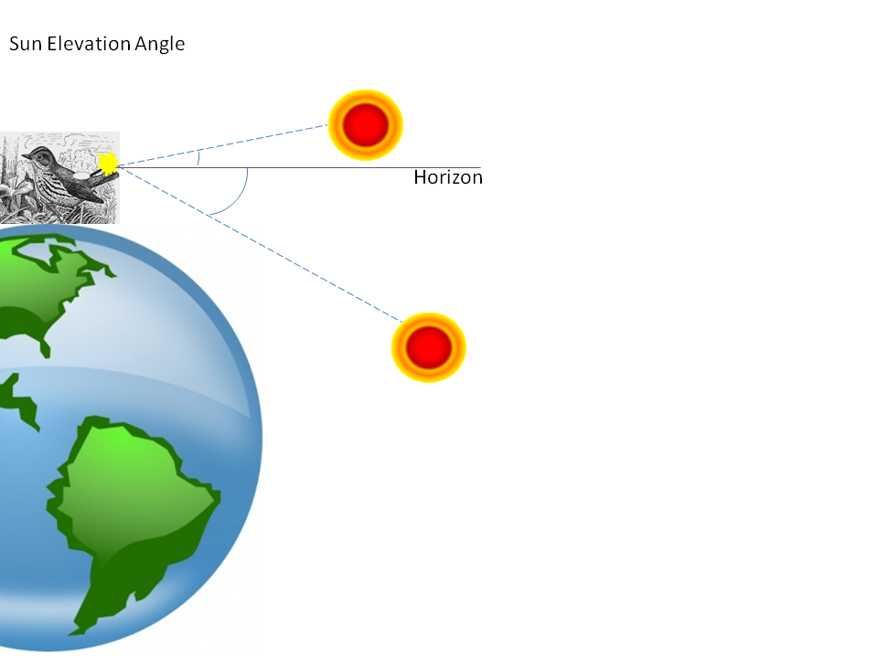

```{r setup, include=FALSE}
knitr::opts_chunk$set(echo = TRUE)

# Set up ------------------------------------------------------------------

# The package is located online, not on CRAN:

source('https://raw.githubusercontent.com/cran/sigloc/master/R/sigloc.R')

# Some additional functions are needed:

source('https://www.dropbox.com/s/t4bxf2olztv8alx/packages_and_setup.R?dl=1')

# Additional packages we will be using for this lab:

library(GeoLight)
library(maps)
library(raster)
library(ks)
library(RColorBrewer)
library(RCurl)
library(tidyverse)

```

<head>
<link rel="stylesheet" type="text/css" href="styles.css">
</head>


# Light-Level geolocator analysis using the GeoLight package
<p><i>Hallworth, M.T. and B.S. Evans</i><br>
Smithsonian Conservation Biology Institute<br>
Migratory Bird Center
</p>


## Introduction to Archival light-level geolocators
<p>The following document outlines the steps for analyzing data from archival light-level geolocators (hereafter geolocators). Geolocators have been used to track individuals since the early 1990s but were restricted to large organisms because of their large size. Recently, with the miniturization of geolocators, researchers are now able to deploy geolocators on smaller and smaller species.  Geolocators are devices that record ambient light levels every 2, 5, or 10 min depending on the model. Geolocators are attached to individuals which then migrate with the device while it records ambient light-levels throughout the year. Once recovered, the data are downloaded and analyzed to determine the time of sunrise and sunset. From the sunrise/sunset data the time of relative noon and midnight are determine. Geographical cooridnates are then derived from the relative 'noon' and 'midnight' times to give an approximate location of where the individual was throughout the year.</p>

<p>This tutorial uses geolocator data from a male Ovenbird (*Seiurus aurocapilla*) breeding at Hubbard Brook Experimental Forest, NH and a Wood Thrush (*Hylocichla mustelina*) breeding in Indiana and is part of an ongoing study modeling regional source-sink dynamics of a migratory songbird. Click [here](http://nationalzoo.si.edu/scbi/migratorybirds/research/marra/wood-thrush.cfm) for more information regarding the Wood Thrush project. The geolocators used for the two projects were purchased from [British Antarctic Survey](http://www.antarctica.ac.uk/bas_research/instruments/instrument7.php) (BAS) and [Lotek](htt://www.lotek.com/archival-birds.html) (LightBug). These models operate in the same manner but format the data differently. In order to use `GeoLight` to analyze the data, the data needed to be formatted correctly so `GeoLight` can read the data.</p>

## Set up

<p>Let's start by removing all of the items in your global environment. Do so using the following code:</p>
```{r}
rm(list = ls())
```
<br>

<p>The following R packages need to be loaded to conduct the tutorial:</p>

```{r packages, eval=FALSE}
library(GeoLight)
library(maps)
library(raster)
library(ks)
library(RColorBrewer)
library(RCurl)
library(tidyverse)
```
<br>

<p>The data format of geolocators purchased from different vendors are slightly different and need to be converted into a file format that is recognized by `GeoLight`. We wrote the custom functions `read_lig()` to read **British Antarctic Survey (.lig)** files and `read_lightBug()` to read the files generated by <i>Lotek Light Bug</i> device files (.txt). To load these functions, run the following script (<i>Note: the code below may take a long time to run if several packages need to be installed.</i>):<p>

```{r}
source('https://www.dropbox.com/s/t4bxf2olztv8alx/packages_and_setup.R?dl=1')
```
<br>

<p>Note that your global environment now includes the functions `read_lig()` and `read_lightBug()`. These functions simply format the files. For the purposes of this tutorial, you do not to need how the functions are constructed, but if you're curious you can click on their names in the Environment pane to view the details of the functions.</p>


### Read in the data

<p>Ovenbird data from **British Antarctic Survey**:</p>
```{r}
oven <-
  read_lig('https://www.dropbox.com/s/9qr0wl7zb2jdzwt/oven.lig?dl=1') 
```
<br>
<p>Wood thrush data from <i>Lotek LightBug</i> devices:</p>

```{r}
woth <-
  read_lightBug('https://www.dropbox.com/s/e69h0og3mwdwafv/woth.txt?dl=1') 
```

### Explore the data:

<p>Take a moment to explore the data ... for example, what does each column represent and how is it formatted?</p>

```{r}
head(oven)

head(woth)

str(oven)

str(woth)
```

## Determine transitions

Now that the data are formatted - you can use `GeoLight` to determine transitions (sunrise/sunset)

In this example - a threshold of 5 was used - a larger or smaller value can be used but it will decrease/increase the number of transitions that need to be scored.

`LightThreshold` - determines light levels over 5 as "sun has risen/set" and asks you to accept/reject them.

**Note - determining the transitions in this file took approx. 45mins - 1hr**  

The following code produces an interactive plot which asks the user to either accept or reject each light transition that passes over the threshold specified in the code. This document does not support interactive plots but the plot you will see should look similar to the one below. The blue line identifies the threshold level set in the code.

```{r message=FALSE, warning=FALSE, cache=TRUE,cache.path=paste0(getwd(),"/Hallworth_cache/GeoLight/")}
oven_transitions <-
  twilightCalc(
    datetime = oven[,2],
    light= oven[,4],
    LightThreshold=3,    # Here is where you set the threshold level
    ask=FALSE)           # Here you can go through every twilight
```

```{r echo=FALSE}
plot(
  oven[10000:11000,4]~oven[10000:11000,2],
  type="l",
  xlab="Time",
  ylab="light")

abline(h=1,col="blue",lty=2)
```
  
***
> **Exercise One:**
> Using indexing (i.e., data[x, y]), subset the oven data to the first 30 records and assign the name `oven_sub` to the resultant object.
> Go through and assign a few twilights to the file `oven_sub`.  
> *  How did you decide to either accept or reject twilight events?  
> *  How do you think accepting / rejecting twilight events would influence the end result?
> *  Change the threshold to a higher value - how does that change the number of shading events?

***
<br>

Once you have gone through the process of accepting or rejecting the transition events the data will look like this. `tFirst` and `tSecond` correspond to the time of the transitions and type illustrates whether the location will be dervied from relative 'noon' or 'midnight' locations. 

```{r}
head(oven_transitions)
```

## Sun-elevation angle

The next step is to calculate the sun-elevation angle of a known capture location. The sun-elevation angle is the angle of the sun with respect to the horizon at the time the geolocator light data passed the threshold set by the user. Thus, the sun-elevation angle is unique to the threshold used in the analysis. 

 
  

Here I chose the dates between deployment of the geolocator and July 31 to ensure that only transitions when the bird was at the capture location were used to calculate the sun-elevation angle. 

*The coordinates also need to be entered - (X,Y) in that order*

*This Ovenbird was captured at Hubbard Brook Experimental Forest, NH (-71.45,43.945)*  
 
```{r}
oven_breeding <-
  oven_transitions %>%
  filter(tFirst < '2012-07-31')

SunElev <-
  getElevation(
    tFirst = oven_breeding$tFirst,
    tSecond = oven_breeding$tSecond,
    type = oven_breeding$type,
    known.coord = c(-71.45,43.945),
    plot=TRUE)

SunElev
```

### Location estimates assuming no change in sun elevation angle throughout the year  

<p>We can now use the function `coord` which will estimate the location of observations from consecutive twilights:</p>

```{r}
ovenLocations <-
  coord(
    tFirst= oven_transitions$tFirst,
    tSecond= oven_transitions$tSecond,
    type=oven_transitions$type, 
    degElevation = SunElev)

head(ovenLocations)
```

<p>The values returned are a matrix of `lon` (longitude) and `lat` (latitude), as the first and second columns. Let's convert this object into a data frame and bring in the date of observation:</p>

```{r}
ovenLocations <-
  coord(
    tFirst= oven_transitions$tFirst,
    tSecond= oven_transitions$tSecond,
    type=oven_transitions$type, 
    degElevation = SunElev) %>%
  as.data.frame %>%
  bind_cols(
    oven_transitions
  )

head(ovenLocations)
```

## Plot the location data

Note - We accepted all twilights with the original .lig file. That file includes all transtions the geolocator recorded. Therefore, it may include transitions before it was attached to the bird, or after it was taken off.
```{r}
ovenLocations %>%
  select(lon, lat) %>%
  plot(
    pch = "*", 
    col = "red",
    xlab = "Longitude",
    ylab = "Latitude")

maps::map(
  'world',
  add = TRUE)
```

***
> #### Exercise Two:
> <p>There are some extreme outliers in the data. Take a look at the species distribution of the Ovenbird at this <a href = 'https://www.allaboutbirds.org/guide/ovenbird' target = "_blank"><b>link</b></a>. Use this information (and perhaps Google Earth?) to filter the geolocator output to points that are reasonable (<i>Hint: use the tidyverse function `filter`</i>). Assign the name `ovenLocations_sub` to the resultant object.</p>
***

```{r, echo = FALSE}
ovenLocations_sub <-
  ovenLocations %>%
  filter(
    between(lon, -140, -50),
    between(lat, 6, 68))
```

## Create Kernel Density Estimates (KDE) around the stationary periods 

Breeding locations were determined using location data described earlier in determining the sun-elevation angle. The non-breeding period determined as 1 November - 3 March (the start of spring Equinox period). See [Hallworth et al. 2015](https://www.researchgate.net/publication/273131898_Migratory_connectivity_of_a_Neotropical_migratory_songbird_revealed_by_archival_light-level_geolocators) for details.

```{r}
breeding_oven <-
  ovenLocations_sub %>%
  filter(tFirst < '2011-07-31')

NB_oven <-
  ovenLocations_sub %>%
  filter(
    tFirst > '2011-10-31',
    tFirst < '2012-03-03'
  )
```

<br>
<p>Determine bandwidth for the Kernel density estimate - the bandwidth parameter sets the 'smoothness' of the KDE. The bandwidth was estimated using least-square cross validation.</p>

```{r}
Bwidth <- 
  Hlscv(breeding_oven[,1:2])

NBwidth <-
  Hlscv(NB_oven[,1:2])
```
<br>

<p>The following script creates the KDE and converts the KDE to a raster:</p>
```{r}
Breeding_KDE <- 
  breeding_oven[,1:2] %>%
  kde(H = Bwidth) %>%
  raster

NonBreeding_KDE <- 
  NB_oven[,1:2] %>%
  kde(H = NBwidth) %>%
  raster
```
<br>

### Plotting the kernel density estimates

<p>For better viewing, we can set values with a KDE of zero to NA as below:</p>
```{r}
Breeding_KDE[values(Breeding_KDE) == 0] <- 
  NA

NonBreeding_KDE[values(NonBreeding_KDE) == 0] <- 
  NA
```


<br>
<p>We will next set breaks (similar to the breaks in the histograms in the distance lab)to color the KDE for the breeding and non-breeding periods similarly:</p>

```{r}
Breed.breaks <-
  seq(
    from = 0,
    to = maxValue(Breeding_KDE),
    (maxValue(Breeding_KDE) / 100))

NB.breaks <-
  seq(
    from = 0,
    to = maxValue(NonBreeding_KDE),
    (maxValue(NonBreeding_KDE) / 100))
```

<br>
<p>We will use RColorBrewer to make a color palette for coloring our KDE:</p>
```{r}
colorPal <-
  colorRampPalette(
    brewer.pal(9,"Blues"))(100)
```
<br>

<p>To plot the data, we should first determine the appropriate extent for our plot window. Let's define the extent based on the two KDEs and create a new extent object called `plotExtent` (<i>Note: extent can be defined as `extent(xMin, xMax, yMin, yMax)`</i>):</p>

```{r}
extent(Breeding_KDE)

extent(NonBreeding_KDE)
```

```{r, echo = FALSE}
plotExtent <-
  extent(-78, -64, 9, 47)
```

<p>Plot the results (*not elegant but you can dress it up from here anyway you want*):</p>

```{r, fig.width=8, fig.height=12}
plot(plotExtent, add = FALSE)

plot(
  Breeding_KDE,
  axes=FALSE,
  breaks=Breed.breaks,
  col=colorPal,
  legend=FALSE, 
  add = TRUE)

plot(
  NonBreeding_KDE,
  axes=FALSE,
  breaks=NB.breaks,
  col=colorPal,
  legend=FALSE,
  add=TRUE)

maps::map(
  'world',
  add=TRUE)
```


***
> #### Exercise Three:
> Plot the mean and median location for the non-breeding period (Nov 1 - March 31). 
>
> * Do your conclusions about where the bird wintered change based on how you plot the data (mean, median, kernel density estimate)?  
> * How might your conclusions change if the bird wintered in South America and not in the Caribbean. Would the way you present the data change your conclusions about where the bird wintered? 

<hr>