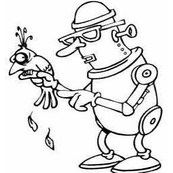

---
output:
  html_document:
    theme: yeti
---

<!-- html head --> 

<head>
<link rel="stylesheet" href="https://cdnjs.cloudflare.com/ajax/libs/font-awesome/4.7.0/css/font-awesome.min.css">
<link rel="stylesheet" type="text/css" href="css/styles.css">
<!--link rel="stylesheet" href="https://maxcdn.bootstrapcdn.com/bootstrap/3.3.7/css/bootstrap.min.css"-->
</head>

 

<h2 style="text-align: left;">The Ecology and Conservation of Migratory Birds</h2>

Welcome to the Ecology and Conservation of Migratory Birds, 2018! This website will be our home base for the R portion of the course. R has become the universal quantitative interface for ecologists - it's free, powerful, flexible enough to do everything but write manuscripts for you, and is relatively user-friendly. Each lesson has accompanying hyperlinks that may include:

<ul>
<li><b>Lesson instructions</b>: Website with written-out instructions and exercises associated with a presentation or lab activity (<i>Note: The instructions hyperlinks are the highlighted lesson titles</i>).</li>
<li><b>Lesson code</b>: The R code that accompanies a lesson, when applicable (<i>Note: These links will download an R file</i>).</li>
<li><b>Exercises</b>: Some labs will have accompanying exercises to be completed separately after the instructor demonstrates the material (<i>Note: The hyperlinks are the highlighted exercise titles</i>).</li>
</ul>

 

<h3>Preliminary exercises</h3>

We ask that, regardless of your current level of R knowledge, you please complete the following preliminary exercises prior to attending the course. Please feel free to email Brian Evans with any questions at <a href="mailto:evansbr@si.edu">evansbr@si.edu</a>

 
<ul>
<li><b><a href = "https://smbc.shinyapps.io/mb2018-L0-intro_RStudio" target="_blank">Introduction to R Studio</a></b>. This lesson will provide new R users with the baseline knowledge necessary to use R and R Studio and align experienced R users with some of the terminology and best management practices used throughout this course.
</li>
<li><b><a href = "https://smbc.shinyapps.io/mb2018-L1-rValues" target="_blank">Lesson 1: Values</a></b>. Learn the primary classes of values you will use in this course</li>
<li><b><a href = "https://smbc.shinyapps.io/mb2018-L2-rObjects" target="_blank">Lesson 2: Objects</a></b>. Learn the primary types of objects that are used to store values</li>
<li><b><a href = "https://smbc.shinyapps.io/mb2018-L3-indexing" target="_blank">Lesson 3: Indexing</a></b>. Learn how to query objects using indexing in base R</li>
<li><b><a href = "https://smbc.shinyapps.io/mb2018-L4-functions" target="_blank">Lesson 4: Functions</a></b>. Learn how to write custom functions</li>
</ul>

Do you want to do more course preparation or practice your R skills? If so, we strongly recommend completing these <a href = "https://smbc-nzp.github.io/mb2018/mb2018-swirl.html" target = "_blank"><b>SWIRL courses</b></a> prior to the course.

 
<h3>Classroom exercises</h3>

In this section you will find links to the exercises that we will complete in the computer classroom. I will provide the links at the beginning of each day.
 

<ul>
<li><b><a href = "https://smbc-nzp.github.io/mb2018/mb2018-intro.html" target="_blank">Introduction to R and review</a></b>. Re-thinking our ideas about data while reviewing the course preparation materials above.</li>
<li><b><a href = "https://smbc-nzp.github.io/mb2018/mb2018-wrangling.html" target="_blank">Data wrangling in the tidyverse</a></b>. Learn how to store and modify data for easy analysis.</li>
<li><a href = "https://smbc-nzp.github.io/mb2018/mb2018-markRecapture.html" target="_blank"><b>Mark-recapture lab</b></a></li>
<li><a href = "https://smbc-nzp.github.io/mb2018/HouseWrenExercise_distance_2.html" target="_blank"><b>Distance classroom demo, House wren</b></a></li>
<li><a href = "https://smbc-nzp.github.io/mb2018/AmakihiDistanceSampling_2018_ExerciseRmd.html" target="_blank"><b>Distance participant exercise, Amakihi</b></a></li>
</ul>

<i>
<b>About the Instructor</b>: Brian Evans is an avian ecologist and data scientist at the Smithsonian Migratory Bird Center. He received his Ph.D. in quantitative ecology from the University of North Carolina in 2015. Brian has been using R for over 10 years and has been teaching classes and workshops in R and data management since 2012. Follow Brian on Twitter: <a href = "https://twitter.com/bsevans_unc">@bsevans_unc</a></i>

