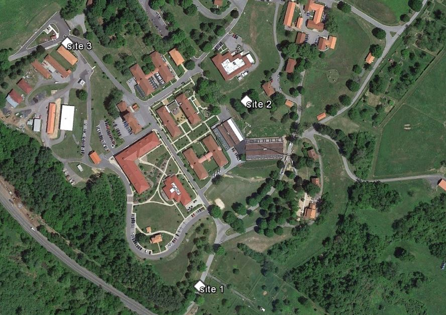
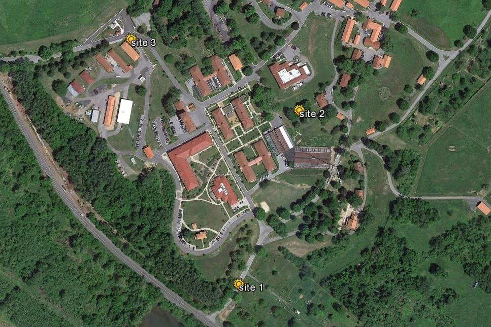
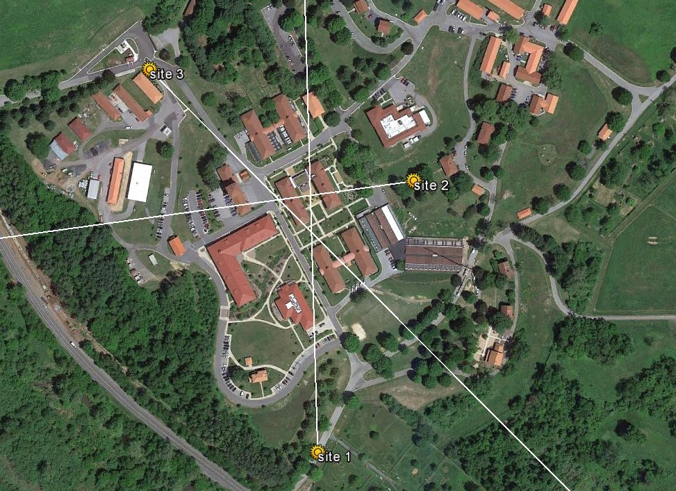
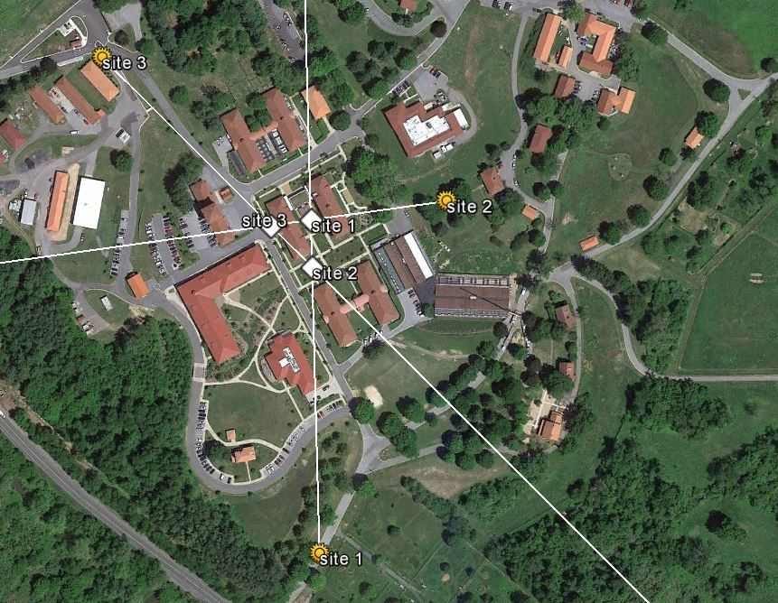
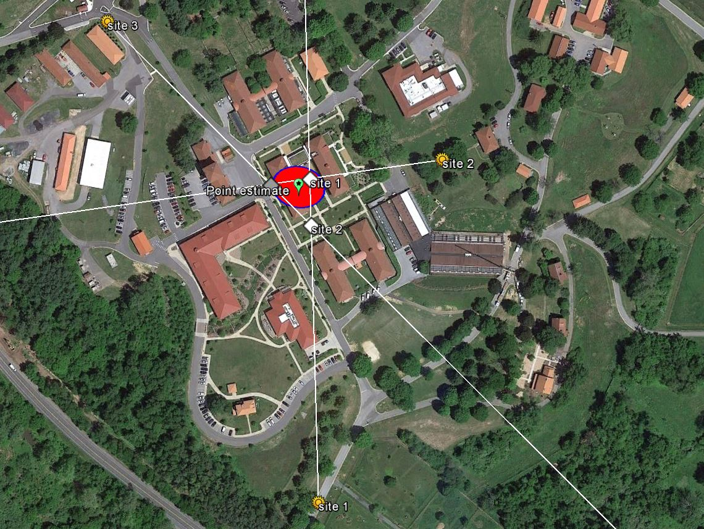

```{r setup, include=FALSE}
knitr::opts_chunk$set(echo = TRUE)

# Set up ------------------------------------------------------------------

# The package is located online, not on CRAN:

source('https://raw.githubusercontent.com/cran/sigloc/master/R/sigloc.R')

# Some additional functions are needed:

source('https://www.dropbox.com/s/t4bxf2olztv8alx/packages_and_setup.R?dl=1')

# Additional packages we will be using for this lab:

library(tidyverse)
library(sp)
library(rgdal)
library(maptools)
library(nleqslv)
library(ellipse)
```

<head>
<link rel="stylesheet" type="text/css" href="styles.css">
</head>


# Triangulation of radio telemetry data in R
<p><i>Brian S. Evans, Ph.D.</i></p>

## Project Description and Context


<p>Radio telemetry, using very high frequency (VHF) transmitters, provides researchers with the ability to determine (homing) or estimate (triangulation) the location of tagged individuals. In this module you will learn how to use triangulation to estimate where birds are. We will use Google Earth heavily in this module, because I believe that interacting with the data in Google Earth is very helpful for visualizing and exploring the data.</p>

<p>To find out more about the use of radio telemetry to study birds and other animals, see this <a target="_blank" href=" http://www.migratoryconnectivityproject.org/vhf-radios/"> link</a>.</p>

## Exercise Objectives
  * Practice and expand upon the process of exporting point data to Google Earth
  * Learn the basics of using triangulation to estimate point locations
  * Learn how to make error ellipses with triangulation data
  * Learn how to export shape files to Google Earth
  
## Setup

We will start by loading the primary libraries that provide us with the tools for analyzing triangulation data.

```{r, eval=F}
library(RCurl)
library(tidyverse)
library(sp)
library(rgdal)
library(maptools)
library(nleqslv)
library(ellipse)
```

Then set some options for this session:

```{r, eval=F}
select <- 
  dplyr::select
```

For this lab, you will be interacting with data through your computer's file system. Be sure you know what directory R is reading and writing from/to (<i>Note: your output will be different than mine here</i>).

```{r, eval=F}
getwd()
```

Unfortunately, the R package that is best suited for analyzing triangulation data is no longer available in the Comprehensive R Archive Network (CRAN) where packages are stored. Luckily the package has a Github repository that we can read into R using the function `source`. This repository provides the functions necessary for analyzing triangulation data. The functions were written by Berg (2015) to provide an open-source and free method of analyzing triangulation data that is comparable in performance to expensive software packages.

```{r, eval= FALSE}
source('https://raw.githubusercontent.com/cran/sigloc/master/R/sigloc.R')
```

The package provides a rigorous set of triangulation tools that are elsewhere only available in programs that cost money. I found the package to be a little limiting in regards to some of the output it generates, so I wrote some custom functions to aid our efforts. We can load the additional functions using the `source` function. These functions will continue to be available to you in your Dropbox folder after the course is completed.

```{r, eval= FALSE}
source('https://www.dropbox.com/s/t4bxf2olztv8alx/packages_and_setup.R?dl=1')
```

## Loading telemetry data in R and Google Earth

We'll next load example telemetry data that will we use in this module. Please take a moment to load and explore these data.

```{r}
telemetryData <-
  read.csv('https://www.dropbox.com/s/rzi1ghq0bg24coh/exampleTelemetry.csv?dl=1')

telemetryData
```

The data consist of three points. Each point has a longitude (x), latitude (y), and compass bearing. The data were gathered with a GPS unit and recorded in decimal degrees with the World Geodetic System 1984 datum (WGS 84). Using this information, we can define the coordinate reference system (CRS) of the data and transform the data frame to a spatial points object.

```{r}
telemetryData_sp <-
  telemetryData %>%
  select(x, y) %>%
  SpatialPointsDataFrame(
    data = telemetryData,
    proj4string = CRS('+proj=longlat +ellps=WGS84 +datum=WGS84')
  )

telemetryData_sp
```

We'll now convert this file to a KML (keyhole markup language) file for viewing in Google Earth. To do so, we'll use the function `kmlPoints`. In the simplest version of this function, you specify the spatial point file you would like to save to KML and the name of file you would like to create.

```{r eval = FALSE}
kmlPoints(
    telemetryData_sp,
    kmlfile = 'telemetryData.kml')
```

Of course, we could have written the above code more parsimoniously using piping. 

```{r eval = FALSE}
telemetryData %>%
  select(x, y) %>%
  SpatialPointsDataFrame(
    data = telemetryData,
    proj4string = CRS('+proj=longlat +ellps=WGS84 +datum=WGS84')
  ) %>%
  kmlPoints(
    kmlfile = 'telemetryData.kml',
  )
```

Now open Google Earth. On the menu in the upper left hand corner, click File/Open...and select the file telemetryData.kml. This loads your point file into the Temporary Places folder in Google Earth. The image you see should be similar to the image below:



If you expand the "telemetryData.kml" file, you can see that each point, displayed as "site <i>x</i>" is its own subfile. If you right-click on the point subfile or on the map point and select "Properties", you can modify how the point is displayed.  

An alternate to setting the display by hand in Google Earth is to use R to code some display options in when writing the file. For example, the code below adds a custom icon to the points and changes how the name of the file will be displayed in Google Earth. Let's move back to R and set the name and icons used (<i>Note: icons can be found on the Google Maps development website found <a href = "http://sites.google.com/site/gmapsdevelopment" target="_blank">here</a></i>). 

```{r eval = FALSE}
telemetryData %>%
  select(x, y) %>%
  SpatialPointsDataFrame(
    data = telemetryData,
    proj4string = CRS('+proj=longlat +ellps=WGS84 +datum=WGS84')
  ) %>%
  kmlPoints(
    kmlfile = 'telemetryData.kml',
    kmlname = 'Example telemetry data',
    icon = 'http://maps.google.com/mapfiles/ms/micons/sunny.png'
  )
```

Move back to Google Earth, load the file as above, and accept that you be overwriting the data. Your new map should look something like this:



## Signal-location frames

Our first real analytic goal in triangulating telemetry data is generating what is known as a <b>signal-location frame</b>. We do so using the function `make_sigFrame` on the file. In doing so, it is necessary that the latitude, latitude, longitude, and bearings are labeled in the same way as the file `telemetryData`.

```{r}
observations <- 
  telemetryData %>%
  make_sigFrame

observations
```

<p>The variables in this object include:</p>
<ul>
<li>Date: Date of the observation, which is set as NA</li>
<li>GID: Group identifier, which is set as 1</li>
<li>Time: Time of observation, which is set as NA</li>
<li>Easting: The longitude of the observation</li>
<li>Northing: the latitude of the observation</li>
<li>Azimuth: The compass bearing in which the antenna was pointed</li>
</ul>

Careful looking will show you that the object may look like a data frame, but it is not. Take a moment to explore the class and structure of the above object:

```{r}
# Compare class of objects:

class(telemetryData)

class(observations)

# Compare structure of objects:

str(telemetryData)

str(observations)

# Compare object summary information:

summary(telemetryData)

summary(observations)
```

The `observations` object that we created is a special type of object called a `receiver` object (a type of list). This object is actually very cool. Among other things that are under-the-hood. The `plot` function acts differently on a `receiver` object than a normal data frame. Running `plot` with the following line of code shows the three observation points:

```{r}
plot(observations)
```

Plotting `observations` with the additional argument `bearings = TRUE` provides us with our first look at where our transmitter might be located:

```{r}
plot(observations, bearings = TRUE)
```

It still isn't very useful without viewing it on a map. Let's use a custom function `made_bearingLines` to change the bearing lines to a spatial object.

```{r}
make_bearingLines(telemetryData)
```

We can use the function `kmlLines` to save the line data as a KML that we can view in Google Earth:


```{r, eval = F}
make_bearingLines(telemetryData) %>%
  kmlLines(
    kmlfile = 'bearingLines.kml',
    col = 'white',
    lwd = 2)
```

Let's step outside of R for a moment to look at the bearing lines in Google Earth.



## Find intersection points

Our next task is to find the intersection points where our trajectories (bearing lines) cross. We do so with a custom function called `findintersects`:

```{r}
crossPoints <- 
  findintersects(observations)

crossPoints

plot(observations, bearings = TRUE)

plot(crossPoints, add = TRUE)
```

We can use the custom function `get_intersects_sp` to transform the data object `crossPoints` to a spatialPointsDataFrame. We will use the `kmlPoints` method to add these points to Google Earth, as above.

```{r, eval = FALSE}
# Let's add these intersects to our Google Earth map:

crossPoints %>%
  get_intersects_sp %>%
  kmlPoints(
    kmlfile = 'crossPoints.kml',
    kmlname = 'Cross points'
  )
```



We might think that we are there. In fact, a lot of triangulation efforts might stop at this point with the assumption that the location of the transmitter lies somewhere between the three cross points. We've got one more function to go ...

## Maximum likelihood estimation of the transmitter location

The `locate` function provides a maximum likelihood approach to estimate location and  developed by Lenth (1981) and adapted by Berg (2015). The input of this function is simply the observations file.

```{r}
loc <- 
  locate(observations)

loc
```

The `locate` function output can be plotted to provide a 95% confidence interval error ellipse and estimated location of the point. We can plot these data as follows:

```{r}
loc <- 
  locate(observations)

plot(observations, bearings = TRUE)

plot(crossPoints, add = TRUE)

plot(loc, add = TRUE)
```

Of course, we'll want to view these data in Google Earth. Let's first make a kml file of our point estimate:

```{r, eval = FALSE}
loc_df <-
  data.frame(loc)

loc_df %>%
  select(X, Y) %>%
  SpatialPointsDataFrame(
    data = loc_df,
    proj4string = CRS('+proj=longlat +ellps=WGS84 +datum=WGS84')
  ) %>%
  kmlPoints(
    kmlfile = 'pointEstimate.kml',
    kmlname = 'Point estimate',
    name = "Point estimate",
    icon = 'http://maps.google.com/mapfiles/kml/paddle/grn-stars.png'
  )
```

Next, we'll add the error ellipse. To do so we'll need to use the custom function `make_ellipsePolygon`, which transforms the ellipse into a spatial polygon. The spatial polygon is then saved as a KML file using the function `kmlPolygon`. In the script below, I define the appearance of the polygon as it is generated (see `?kmlPolygon`).

```{r, eval = FALSE}
loc %>% 
  make_ellipsePolygon %>%
  kmlPolygon('errorEllipse.kml',
             col = 'red',
             lwd = 2,
             border = 'blue') 
```

Have a look at the output in Google Earth. It should look something like the below:



<hr>
>## Exercise
> Use your triangulation data from today's field activity to determine the location of your transmitter. Compare the estimated location with the GPS location that you recorded in the field.  
<hr>


## Citations

Lenth, R.V. (1981). On Finding the Source of a Signal. Technometrics, 23(2), 149-154.

Berg, S. S. (2015). The Package `sigloc` for the R Software: A Tool for Triangulating Transmitter Locations in Ground-Based Telemetry Studies of Wildlife Populations. The Bulletin of the Ecological Society of America, 96(3), 500-507.