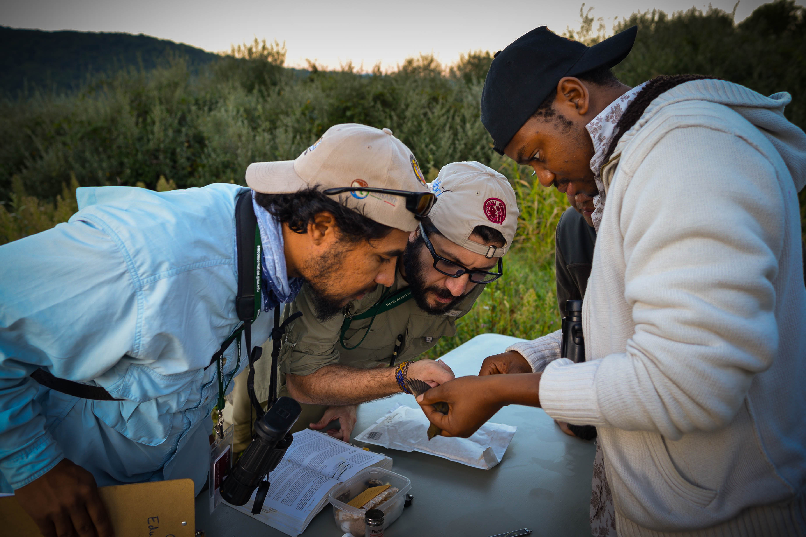

 

<h2 style = "text-align: center;">Workshop announcement: The Ecology and Conservation of Migratory Birds</h2>

Hi Folks,

The Smithsonian Migratory Bird Center is pleased to announce that we will be conducting our course "The Ecology and Conservation of Migratory Birds" during the peak of 2018's fall migration (September 17-28, 2018). This popular course generally receives roughly 75 applications for just 15 slots. The applications are from graduate students from all over the world (21 countries) as well as professionals wanting learn new techniques. The two week course is unique in what it teaches and the depth and breadth of the material covered. We emphasize emerging technologies and tools for advancing ornithological science. Students leave having been immersed in the theory and practice of modern ornithology, with skill gains ranging from advanced R programming, to evaluating molt, to how to attach a radio transmitter. We also take full advantage of DC resources including guest lectures by ornithological professionals ranging from top scientists in the field to policy makers. We truly fill every student's mind to the brim – so much so that it has been described by one of our former students as "two years of graduate school in two weeks". This course is not about making profit. It is about advancing critical knowledge to the next generation.

Each time the course is offered we raise funds to offer several scholarships - primarily for students from less developed countries. This year funding may be in jeopardy.

So - I am asking two things.

<b>First</b>: Please promote the below course advertisements on your networks. We want to get the announcement out far and wide.

<b>Second</b>: Please consider sponsoring a student or two from your professional society. It’s inexpensive and is a wonderful activity for a professional society to engage in with its members. The total cost for this course is $2925.50 (Course fee of $2100 + Housing and Dining Package of $825.50). Those applying as citizens of "less-developed"" nations qualify for a reduced course fee of $1200, making the total cost including housing (shared double room) and dining package $2025.50.

<a href = "https://smconservation.gmu.edu/programs/graduate-and-professional/professional-training-courses/species-monitoring-and-conservation-bird-migration/"><b>Please see this link for more information and to register for the course</b></a>

Please <a href="mailto: marrap@si.edu"><b>contact me</b></a> if you have any questions.

Best,

Peter Marra

