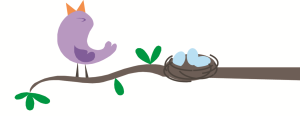

---
output:
  html_document:
    theme: united
---

<html>

<head>
<title>Calendar_nnTraining</title>
</head>

<body>
<h2>Neighborhood Nestwatch and The Ecology of Urban Songbirds training: What you should know</h2>

 

<b>Overview:</b> The primary goal of this training is to maximize the experience of Neighborhood Nestwatch (NN) and The Ecology of Urban Songbirds participants and ensure that outreach efforts are equivalent across regional hubs and technicians. Specifically, our objectives include:

<ul>
<li>Official onboarding and training necessary to be a Smithsonian field technician (Animal Care and Use, ACUC) and collect data on project participants (Human subjects, IRB)</li>
<li>Thorough training on field protocols including (but not limited to!) net setup, banding, and resighting</li>
<li>Presentations and discussions of the science, outreach, and protocols of NN</li>
<li>Training on the four modules of The Ecology of Urban Songbirds
<ul>
<li>Module 1: Bird banding demonstration</li>
<li>Module 2: Population modeling</li>
<li>Module 3: Habitat detectives</li>
<li>Module 4: Conservation action plans</li>
</ul>
</li>
<li>Practice public banding demonstrations and outreach with Zoo Guests and during Earth Optimism Day event</li>
<li>Practice outreach, including banding demonstrations, at Earth Optimism Day</li>
<li>Practice NN visit</li>
</ul>
 

<iframe src="https://calendar.google.com/calendar/embed?src=bglqinuh5sujgftt0og0sfp07o%40group.calendar.google.com&ctz=America%2FNew_York" style="border: 20px" width="800" height="600" frameborder="0" scrolling="no"></iframe>

<b>Is there anything you should do to prepare yourself for the training?</b> Prior to attending the training, please thoroughly read the <a href = "https://github.com/bsevansunc/Nestwatch/raw/master/nn_protocolDocument.pdf" download>Neighborhood Nestwatch protocols</a>. Additionally, on Tuesday at 2 pm we will host a paper discussion on some of the foundational papers of Neighborhood Nestwatch. The goal of this discussion is to provide you with an understanding of the science that you will be a part of. Please read at least the abstracts of the following papers by next Tuesday:

<ul>
<li>Evans, C., Abrams, E., Roux, K., Salmonsen, L., Reitsma, R., & Marra, P. P. (2004). <a href="https://repository.si.edu/handle/10088/6012" target="_blank">The Neighborhood Nestwatch Program: sense of place and science literacy in a citizen-based ecological research project</a>. Conservation Biology, 19(3), 589-594.</li>
<li>Ryder, T. B., Reitsma, R., Evans, B., & Marra, P. P. (2010). <a href="https://repository.si.edu/handle/10088/16206" target="_blank">Quantifying avian nest survival along an urbanization gradient using citizen- and scientist-generated data</a>. Ecological Applications, 20(2), 419-426. http://doi.org/10.1890/09-0040.1</li>
<li>Evans, B. S., Ryder, T. B., Reitsma, R., Hurlbert, A. H., & Marra, P. P. (2015). <a href="https://repository.si.edu/handle/10088/25701" target="_blank">Characterizing avian survival along a rural-to-urban land use gradient</a>. Ecology, 96(6), 1631-1640. http://doi.org/10.1890/14-0171.1</li>
<li>Narango, D. L., Tallamy, D. W., & Marra, P. P. (2017). <a href="https://repository.si.edu/bitstream/handle/10088/33595/NZP_Marra_2017-Native_plants_improve_breeding_and_foraging_habitat_for_an_insectivorous_bird.pdf?sequence=1&isAllowed=y/" target="_blank">Native plants improve breeding and foraging habitat for an insectivorous bird</a>. Biological Conservation , 213 , 42-50. http://doi.org/10.1016/J.BIOCON.2017.06.029</li>
</ul>

<b>Where should you go?</b> We are located on Adam's Mill Road NW in the Adams Morgan neighborhood of Washington, DC. Navigating to "Blue road Washington, DC" on your smart phone will get you where you need to go. There is a security gate at the top of Blue road. Press the red button - it will connect you to Zoo police. Tell them your name and that you are meeting with Dr. Brian Evans. They will open the gate.  Drive down the hill and park on the left side of the drive. Please see <a href = "https://drive.google.com/open?id=12IdQYiXF5tuLG4DfISc7Wrpslks&usp=sharing" target = "_blank">this link</a> for directions to SMBC. Take a moment to study this map. It includes pictures and texts describing important spots to guide your trip to the office. If you're in any doubt once you're on the Blue Road, just follow the arrows to the Smithsonian Conservation Biology Institute.

 

<b>What should you wear?</b> Please be sure to dress appropriately for the field. You must wear closed toed shoes (waterproof hiking boots are best), long pants, and shirts that are appropriate for talking to the public. It is best to dress during the training period in the field outfit you will be wearing during the coming field season. You will be walking in the hallway of offices from multiple Smithsonian departments. As such, please dress as professionally as possible (you'll be wearing field clothes -- I'm not asking for business casual, just no torn/dirty clothes, band gear, or offensive slogans).

 

<b>What else should you bring?</b> You are not required to bring any field equipment with you. You may want to bring binoculars and a field guide if you plan to bird, though you are more than welcome to use ours during your stay.

</body>
</html>
