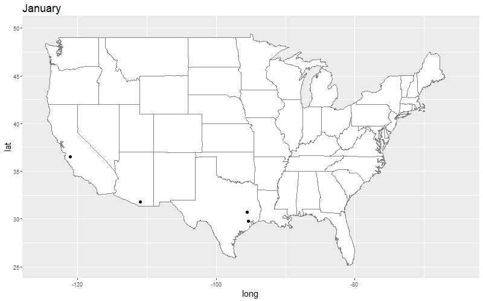
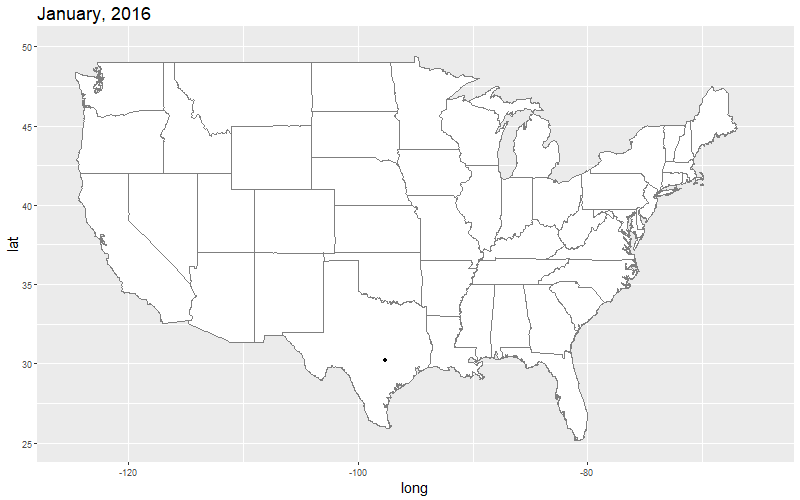

```{r setup, include=FALSE}
knitr::opts_chunk$set(echo = TRUE)
```

<head>
<link rel="stylesheet" href="https://cdnjs.cloudflare.com/ajax/libs/font-awesome/4.7.0/css/font-awesome.min.css">
</head>

<style type="text/css">
.main-container {
  max-width: 900px;
  margin-left: auto;
  margin-right: auto;
}

p, ol, li {
  font-size: 16px;
}

h1 {
  font-size: 32px;
}

h2 {
  font-size: 26px;
}

blockquote{
  font-size: 18px;
  border-left: 8px solid #292093;
  background-color: #e6ffff;
  padding-left: 16px;
  padding-right: 16px;
}

</style>

# Don't download that! Improve your workflow with web APIs
<br>
<p>In this lesson, we will be accessing data via web APIs (Application Programming Interfaces). This process improves workflow by avoiding the potentially repetitive data acquisition process of finding and downloading data using a web browser. Working with APIs can also be a great way to share data. For example, most of the lessons in this workshop have been accessed using GitHub's API. Using a web API to access data can also lead to a more reproducible workflow, as your scripts can include <b>how</b> you collected your data, rather than simply what you did with it.</p>
<br>


## Set up

<p>Please load the following libraries prior to continuing with this session. If one of the libraries is not currently installed on your computer (`Error in library(jpeg) : there is no package called ...`), use the function `install.packages()` to get the package. Remember that every package that is installed also needs to be loaded (`library()`)!</p>

```{r, message = FALSE, warning = FALSE}
library(httr)

library(rinat)

library(magick)

library(robis)

library(tidyverse)
```
<br>

<p>We will also be using a program called "ImageMagick". This is a program (not an R package) that provides lots of functionality for working with images. Please visit <a href = "https://imagemagick.org/" target = "_blank">this website</a> to learn more about, and download, this program onto your computer. <i><b>Important!</b> You need to have admin rights on your computer to install ImageMagick!</i></p>

<hr>

## Introduction to reading data from a web API:

<br>
<p>We will start by talking directly to an API using the R package `httr`. We will query the <a href = "http://www.omdbapi.com" target = "_blank">Open Movie Database (OMDb) API</a> to load and explore movie data.</p>

<p>Let's contact OMDb and query the database for the movie Zoolander:</p>

```{r}
zooUrl <-
  'http://www.omdbapi.com/?apikey=6fa7876b&t=Zoolander'
```
<br>

<p>Let's take moment to explore the url above:</p>
<ul>
  <li>`http://`: This is the internet protocol (in this case the unsecure Hypertext transfer protocol.</li>
  <li>`www.omdbapi.com`: This is the domain (hostname).</li>
  <li>`?`: This initiates our query.</li>
  <li>`apikey=6fa7876b`: This provides the server with out API key (which provides us with access to the data.</li>
  <li>`&`: This allows us to provide an additional argument to the server</li>
  <li>`t=Zoolander`: This is our query, which queries based on the parameter `t`, which stands for the title of the movie.</li>
</ul>

<p><i>Note that the above demonstrates that it is important to know the parameters used to query a server's database. It's generally necessary to look at the metadata of an API prior to submitting a request (take a look at the "Parameters" section of the <a href = "http://www.omdbapi.com" target = "_blank">OMDb</a>).</i></p>
<br>

<p>We can now use the http verb `GET` to read the data from the OMDb API:</p>


```{r}

api_data <- 
  httr::GET(zooUrl)
```
<br>

<p>What did that return? Let's look at `api_data`:</p>

```{r}
api_data
```
<br>

<div>

<p>The above tells us the response to our request, returning:</p>
  
<ul>
<li>The request</li>
<li>The date and time the request was received</li>
<li>A status message indicating whether the request was successful (200 indicates success -- see <a href = "https://http.cat" target = "_blank">status codes)</a></li>
<li>The type of content that is returned</li>
<li>The amount of data returned (better have some data in there!)</li>
</ul>
</div>
<br>

<div>
<p>To look at the data that was returned, explore the following using the `httr::content()` function. The argument of the function `as` describes the format of the data you that would like to use.</p>

```{r eval = FALSE}
# extract the content:

httr::content(api_data, as = 'raw')

httr::content(api_data, as = 'text')

httr::content(api_data, as = 'parsed') 
```
</div>

<br>
<p>The default of this function is `as = NULL`, which tries to automatically determine the most appropriate content type (see `?httr::content`)</p>


```{r}

api_content <-
  httr::content(api_data) 
```

<br>
<p>Let's look at the content. We'll start by looking at the structure (`str`) of the output:</p>

```{r}
str(api_content)
```

<br>
<p>We can see that our request returned a list composed of a lot of different classes of list items (including more lists!). Let's view the names of the list items:</p>

```{r}
names(api_content)
```

<br>
<p>As with all list objects, we can use indexing to query the list. Let's query the list by the item named "Plot":</p>

```{r}
api_content[['Plot']]
```

<br>
<p>We can create a tibble of api content that we want to look at:</p>

```{r}
tibble(
  title = api_content[['Title']],
  year = api_content[['Year']],
  plot = api_content[['Plot']],
  poster = api_content[['Poster']]
)

```

<br>
<p>Because these items are objects in a list, this is a great use of mapping with `purrr`! We'll use `purrr::map_dfc` to create a data frame by binding the output as columns:</p>

```{r eval = FALSE}

# Because these items are objects in a list, this is a great use of map!

purrr::map_dfc(
  c('Title', 'Year', 'Plot', 'Poster'),
  function(x) {
    tibble(
      api_content[[x]]) %>%
      set_names(x)
  }
)
```

<br>
<p>We can also use `purrr` to string together multiple API calls:</p>

```{r eval = FALSE}

# string together multiple api calls --------------------------------------

movies <-
  c('Zoolander',
    'Harold+and+Maude',
    'The+Life+Aquatic',
    'Idiocracy',
    'The+Royal+Tenenbaums')

api <- 'http://www.omdbapi.com/?apikey=6fa7876b&t='

# Use purrr::map_dfr to query the database by the movies vector:

movie_frame <-
  purrr::map_dfr(
  movies,
  function(x) {
    api_content <-
      # construct request:
      paste0(api, movie_title) %>%
      # make request to api: 
      httr::GET() %>%
      # get content:
      httr::content()
    tibble(
      title = api_content$Title,
      year = api_content$Year,
      plot = api_content$Plot,
      poster = api_content$Poster
    )
  }
)

# what did we get?

movie_frame

View(movie_frame)
```

<br>
<p>The above could have been simplified by using a map function, as below. There's a function from the `magrittr` package (loaded with `tidyverse`) called `extract` that allows us to pull just the variables of interest from a list.</p>

```{r}
purrr::map_dfr(
  c(
    'Zoolander',
    'Harold+and+Maude',
    'The+Life+Aquatic',
    'Idiocracy',
    'The+Royal+Tenenbaums'),
  function(x) {
    paste0('http://www.omdbapi.com/?apikey=6fa7876b&t=', x) %>%
      # make request to api: 
      httr::GET() %>%
      # get content:
      httr::content() %>%
      # extract variables of interest:
      magrittr::extract(c('Title', 'Year', 'Plot', 'Poster'))
  }
)
```
<br>
<br>
<blockquote>
<h3><i class= "fa fa-user-circle-o" style = "font-size: 150%;"></i> Exercise: Querying the Dark Sky</h3>
<ol>
<li>Go to the website <a href = "https://darksky.net/dev" target = "_blank">Dark Sky API</a> and create an account (to generate an API key).</li>
<li>Visit the Dark Sky API documentation <a href = "https://darksky.net/dev/docs" target = "_blank">here</a> for instructions on how to query this API.</li>
<li>My office is located at a longitude of -77.05 and a latitude of 38.93. Query the API such that it returns the current weather conditions at my office (<i>Note: Feel free to use your home instead of my office!</i>).</li>
<li><b>For advanced R users</b>: Without assigning any intermediate objects, repeat the query above and return as a dataframe with the variables: summary, temperature, dewPoint, humidity, pressure, and windSpeed.</li>
</ol>
<br>
</blockquote>
<br>

<hr>
## Application: Using the `rinat` package to query the iNaturalist API
<br>

<br>
<p>
The iNaturalist project is an amazing citizen science project from the California Acadamy of Sciences and the National Geographic Society (learn more <a href = "https://www.inaturalist.org" target = "_blank">here</a>). At the time of this writing, iNaturalist nearly 700,000 users have submitted 25 million observations of 230,000 different species.
</p>
<br>

### The Susquehanna
<br>
<p>Let's start by using `httr::GET` to query to iNaturalist API for observations were recorded in the <a href = "https://www.srbc.net" target = "_blank">Susquehanna River Basin</a>in 2018.

```{r eval = FALSE}
susquehanna <-
  httr::GET('http://www.inaturalist.org/observations.csv?q=susquehanna&year=2018)  %>%
  httr::content()
```
<br>

<p>The query returned a very wide dataframe (38 columns) with only 30 records. We can increase the number of records returned using the `per_page` parameter:</p>
```{r eval = FALSE}
susquehanna <-
  httr::GET('http://www.inaturalist.org/observations.csv?q=susquehanna&year=2018&per_page=200')  %>%
  httr::content()
```
<br>
<p>We can use `names()` to determine the names of the resultant tibble. We can use `dplyr::select()` to subset the tibble to only the variables of interest:</p>
```{r eval = FALSE}
susquehanna <-
  httr::GET('http://www.inaturalist.org/observations.csv?q=susquehanna&year=2018&per_page=200')  %>%
  httr::content() %>%
  dplyr::select(
    c(
      'user_id',
      'user_login',
      'observed_on',
      'common_name',
      'scientific_name',
      'longitude',
      'latitude',
      'description'
      ))
```
<br>

<p>R Users have built packages to assist in querying and getting data from APIs. The package `rinat` helps us construct queries for the <b>iNaturalist</b> API. Let's try to recreate our query of iNaturalist observations in the <a href = "https://www.srbc.net" target = "_blank">Susquehanna River Basin</a> in 2018. There are lots of observations in the iNaturalist database, so we will use the `maxresults` argument to return a maximum of 500 results.</p>


```{r eval = FALSE}
susquehanna <-
  get_inat_obs(
    query = 'susquehanna',
    year = 2018,
    maxresults = 200) %>%
  as_tibble()
```

<br>
<blockquote>
<h3><i class= "fa fa-user-circle-o" style = "font-size: 150%;"></i> Exercise: Observations at Susquehanna</h3>
<p>Use the susquehanna tibble to answer the following questions</p>
<ul>
<li>What are the names of the resultant tibble?</li>
<br>
<li>Subset susquehanna to the columns common_name and scientific_name (do not assign a name to the object). How many distinct species were observed in the Susquehanna River Basin in 2018?</li>
<br>
<li>Subset susquehanna to the columns common_name and scientific_name (do not assign a name to the object) and observations that contain the word "Moth" (common_name). Which moth species were obseved  were observed in the Susquehanna River Basin in 2018?</li>
<br>
</ul>
</blockquote>
<br>

### The brown-headed cowbird
<br>
<p>There are lots of arguments that you can use with the `rinat` package that can help you narrow down your results. See `?rinat::get_inat_obs` for a complete list. In the below, let's query the iNaturalist API to observations that were: of the taxon <i>Molothrus ater</i> (<a href = "https://www.allaboutbirds.org/guide/Brown-headed_Cowbird/overview" target = "_blank">Brown-headed cowbird</a>), made in 2018, of research quality, and at georeferenced locations.</p>

```{r eval = FALSE}
get_inat_obs(
  taxon_name = "Molothrus ater",
  year = 2018,
  quality = 'research',
  geo = TRUE,
  maxresults = 1000) %>%
  as_tibble()
```

<br>
<blockquote>
<h3><i class= "fa fa-user-circle-o" style = "font-size: 150%;"></i> Exercise: Brown-headed cowbirds in Virginia</h3>
<p>The `bounds` argument can be used to query the iNaturalist database to only observations in a given area (see `?rinat::get_inat_obs`).</p> 
<ol>
<li>Use Google Earth to find the maximum and minimum longitude (-180 to 180, in decimal degrees) and latitude (-90 to 90, in decimal degrees) that bounds Virginia, USA.</li>
<li>Repeat the Brown-headed cowbird query above, but this time subset the query to the region you determined above.</li>
</ol>
<br>
</blockquote>
<br>

### Are Green darners migratory?
<br>
<p>After dinner one night, Laura, Gina, and I spotted some big dragonflies that I assumed was Green darners (<i>Anax junius</i>). I wondered whether or not they were migratory. While we could have figured this out with a search engine, I thought it might be fun to observe their migration with the data.</p>

<p>Let's start by querying the iNaturalist API for Green darners with a bounding box of `c(24, -125, 50, -66)` (roughly the continental US), the year 2018, and the month of September:</p>

```{r eval = FALSE}
get_inat_obs(
  taxon_name = "Anax junius",
  year = 2018,
  month = 9,
  geo = TRUE,
  bounds = c(24, -125, 50, -66)
)
```
<br>

<p>Take a moment to explore the data frame that the query above returns.</p>

<p>We can build a <i>for loop</i> to generate a list, with each list item the observations of Green darners for a given month:</p>

```{r}
gDarner_monthList <-
  vector('list', length = 12)

for(i in 1:12) {
  gDarner_monthList[[i]] <-
    get_inat_obs(
      taxon_name = "Anax junius",
      year = 2018,
      month = i,
      geo = TRUE,
      bounds = c(24, -125, 50, -66)
    )
}
```
<br>

<p>We can plot a single map of observations as follows:</p>

```{r, message = FALSE, warning = FALSE}
map_data('usa') %>%
  ggplot(aes(x = long, y = lat)) +
  geom_polygon(
    aes(group = group),
    fill = 'white') +
  borders('state') +
  geom_point(
    data = gDarner_monthList[[9]],
    aes(x = longitude, y = latitude)) +
  xlim(-125, -65) +
  ylim(25, 50) +
  labs(title = month.name[9]) +
  theme(
    title = element_text(size = rel(1.4))
  )
```
<p><i>There are components of the ggPlot code above that may be new to you. use `?[package::function]` to explore how this plot was generated.</i></p>
<br>

<p>We can use the purrr::map function to watch Green darner migration!</p>

```{r eval = FALSE}
purrr::map(
  1:12,
  function(i) {
    map_data('usa') %>%
      ggplot(aes(x = long, y = lat)) +
      geom_polygon(
        aes(group = group),
        fill = 'white') +      
      borders('state') +
      geom_point(
        data = gDarner_monthList[[i]],
        aes(x = longitude, y = latitude)) +
      xlim(-125, -65) +
      ylim(25, 50) +
      labs(title = month.name[i])) +
  theme(
    title = element_text(size = rel(1.4))
  )})
```
<br>

<p>You can use ImageMagick to generate a GIF of Green darner observations over time. Here's how to create the GIF (make sure that you have installed ImageMagick onto your computer!):</p>


```{r eval = FALSE}

# Clear plot window:

plot.new()

# Open a connection to write png files:

png('gDarner_%02d.png', width = 800, height = 500)

# Map to run across each month:

purrr::map(
  1:12,
  function(i) {
      map_data('usa') %>%
        ggplot(aes(x = long, y = lat)) +
        geom_polygon(
          aes(group = group), 
          fill = 'white',
          color = 'gray40',
          size = 0.2) +
        borders('state') +
        geom_point(
          data = gDarner_monthList[[i]],
          aes(x = longitude, y = latitude),
          size = 2) +
        xlim(-125, -65) +
        ylim(25, 50) +
        labs(title = month.name[i]) +
        theme(
          title = element_text(size = rel(1.4))
        )
  })

 # Close png device:

    dev.off()

list.files(pattern = "*.png", full.names = T) %>% 
  # Read each file in the path:
  purrr::map(
    magick::image_read) %>%
  # Join images together:
  magick::image_join() %>% 
  # Animate, defining frames per second:
  magick::image_animate(fps=1) %>% 
  # Write to file:
  magick::image_write("gDarner.gif")
```
<br>
</img>


<br>
<blockquote>
<h3><i class= "fa fa-user-circle-o" style = "font-size: 150%;"></i> Exercise: Green darner migration</h3>
<p><b>A challenge!</b> Are you convinced that the Green darner is migratory? Perhaps we should look at more years of observations.</p>
<ol>
<li>We used a <i>for loop</i> to create the file `gDarner_monthList`. Repeat this process using `purrr::map`.</li>
<br>
<li>The tidyverse function `crossing` produces a tibble that contains all possible combinations of two vectors. Explore the output of the code below.</li>
```{r eval = FALSE}
yearMonth <-
  crossing(
    year  = 2016:2018, 
    month = 1:12)
```
</li>
<br>
<li>Using the tibble `yearMonth` (above) and `purrr::map`, query the iNaturalist API to generate a list that contains the observations of Green darner for each month and year (i.e., each list item would include only the observations for a given month and year). Assign the name `gDarner_ym` to the resultant object.</li>
<br>
<li>Use your list above to generate a plot of observations by month and year, as below.</li>
<br>
</img>
<br>
</ol>
</p>
</blockquote>
<br>

<hr>

## Application: Using the `robis` package to query the OBIS API
<br>
<p>The <a href = "https://obis.org/about/" target = "blank">The Ocean Biogeographic Information System</a> (OBIS) is an amazing resource where users can retrieve and submit biogeographic data relating to the world's oceans. OBIS contains over 50 million recorded observations of marine species!</p>

<p>We will contact the OBIS to query observations of Sperm whale (<i>Physeter macrocephalus</i>). Let's first user `httr::GET` to contact the OBIS API directly:</p>

```{r eval = FALSE}
httr::GET('https://api.obis.org/v3/occurrence?scientificname=Physeter+macrocephalus&size=200') %>%
  httr::content()
```
<br>
<p>Have a look at the resultant object. It's pretty difficult to read, yeah? In factor to get even get the names of the object, we have to dive pretty far into the list:</p>

```{r eval = FALSE}
httr::GET('https://api.obis.org/v3/occurrence?scientificname=Physeter+macrocephalus&size=200') %>%
  httr::content() %>%
  .[['results']] %>%
  .[[1]] %>%
  names()
```

<br>
<p>Luckily, there is an R Package, `robis`, that can help us get and format data from the OBIS API. Using the function `occurrence`, it's easy to write a query. Let's pull observations of Sperm whale's from 2018:</p>

```{r}
sWhale <- 
  occurrence(
    scientificname = 'Physeter macrocephalus',
    startdate = '2018-01-01',
    enddate = '2019-01-01')
```

<br>
<p>There's even a custom function for plotting OBIS data in an interactive <b>Leaflet</b> map:</p>

```{r}
map_leaflet(
  sWhale,
  provider_tiles = 'OpenStreetMap')
```
<br>
<p>In a later lesson, we will explore how to generate our own custom Leaflet maps using Sperm whale observations from OBIS!</p>


<br>
<br>
<blockquote>
<h3><i class= "fa fa-user-circle-o" style = "font-size: 150%;"></i> Exercise: Query OBIS</h3>
<p>Repeat the OBIS query of Sperm Whale observations in 2018 using the `httr` package (<i>Note: `startdate` and `enddate` are query parameters for the OBIS API</i>).</p>
<br>
</blockquote>
<br>

