---
output:
  revealjs::revealjs_presentation:
    theme: simple
    highlight: pygments
    center: false
    transition: none
    progress: true
    font-family: Verdana
---

<head>
<link rel="stylesheet" href="https://cdnjs.cloudflare.com/ajax/libs/font-awesome/4.7.0/css/font-awesome.min.css">
</head>

<style>

code{
  background-color:#f2f2f2;
  border-radius: 25px;
}
 
span.co{
  color:#000080;
  font-weight: bold;
}
 
img{
  display: block;
  margin-left: auto;
  margin-right: auto;
	padding: 10px;
  border: 0px solid white;
	box-shadow: 0px 0px 0px 0px;
  text-shadow: 0px 0px;
}

p{
  text-align: left;
  font-size: 24px;
}

p, ul, ol, h1, h2, blockquote{
  font-family: "Avenir";
}

ul, ol{
  line-height: 27px;
  text-align: left;
  font-size: 24px;
  margin-left: 0px;
}
 
blockquote{
  font-size: 24px;
  border-left: 8px solid #292093;
  background-color: #e6ffff;
  padding-left: 16px;
  padding-right: 16px;
}
 
.row{
  margin: auto;
}
 
table {
  border-collapse: collapse;
}

table, td, th {
  border: 1px solid black;
  padding: 5px;
  text-align: center;
  vertical-align: middle;
}
 
 /* Create two equal columns that floats next to each other */
.column {
  float: left;
  width: 50%;
  padding: 10px;
}

/* Clear floats after the columns */
.row:after {
  content: "";
  display: table;
  clear: both;
}


pre{
  border-color: white;
  background-color: #f2f2f2;
}

.roundBorder {
  border-radius: 25px;
  border: 5px solid #30288C;
  background: #D6EAF8;
  padding-left: 20px;
  padding-right: 20px;
  padding-top: 10px;
  padding-bottom: 10px;
}

.roundBorderBlack {
  border-radius: 25px;
  border: 10px solid #D3D3D3;
  padding-left: 20px;
  padding-right: 20px;
  padding-top: 10px;
  padding-bottom: 10px;
}

.roundBorderBlackEx {
  border-radius: 5px;
  border: 5px solid #D3D3D3;
  padding-left: 5px;
  padding-right: 5px;
  padding-top: 2px;
}

.roundBorderEx {
  border-radius: 3px;
  border: 5px solid #30288C;
  background: #D6EAF8;
  padding-left: 5px;
  padding-right: 5px;
  padding-top: 2px;
}

.tt {
    position: relative;
    display: inline-block;
    class: inline; 
    font-weight: bold;
    font-family: "Avenir";
    font-size: 18px;
    border-bottom: 1px black;
}

/* Tooltip text */
.tt .ttText {
    visibility: hidden;
    font-weight: normal;
    font-size: 18px;
    width: 200px;
    background-color: black;
    border: 1px solid black;
    color: white;
    text-align: left;
    padding: 5px;
    border-radius: 6px;
    position: absolute;
    z-index: 1;
}

/* Show the tooltip text when you mouse over the tooltip container */
.tt:hover .ttText {
    visibility: visible;
}

</style>

<p style="text-align: center; font-size: 32px;"><b>Data visualization</b></p>
<hr>
<br>
<br>
<p style = "text-align: center; font-size: 24px;">Brian S. Evans, Ph.D.<br />
Migratory Bird Center<br />
Smithsonian Conservation Biology Institute</p>
<br><br>


```{r setup eval, eval = TRUE, include  = FALSE}
# Load libraries:

library(RCurl)
library(lubridate)

# Load a source script:

script <-
  getURL(
    "https://raw.githubusercontent.com/bsevansunc/workshop_languageOfR/master/sourceCode_lesson6.R"
  )

# Evaluate then remove the source script:

eval(parse(text = script))

rm(script)

library(knitr) ; library(kableExtra)

options(knitr.table.format = "html")

mass_histogram <- 
  birdMeasures %>%
  filter(spp %in% c('BCCH', 'CACH')) %>%
  ggplot(aes(x = mass)) +
  geom_histogram(aes(fill = spp))

massDensity <- 
  birdMeasures %>%
  filter(spp %in% c('BCCH', 'CACH')) %>%
  ggplot(aes(x = mass)) +
  geom_density(aes(fill = spp))

zPalette <- c('#9EB8C5', '#F32017')
```

##
<h2>Today's goals</h2>
<hr>
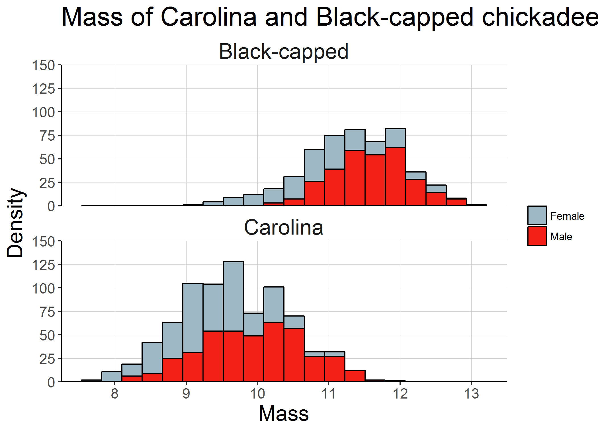


##
<h2>Setup</h2>
<hr>
<p>Get the data:</p>
```{r eval = FALSE}
library(tidyverse)

gitUrl <-
  'https://raw.githubusercontent.com/bsevansunc/'

courseData <-
  'smsc_data_science/master/data/'
```

##
<h2>Setup</h2>
<hr>
<p>Get the data:</p>
```{r the data, eval = FALSE}
birdMeasures <- 
  read_csv(
    paste0(
      gitUrl,
      courseData,
      'birdMeasures.csv'))
```

##
<h2>Initiating a plot</h2>
<hr>
```{r ggplot show, eval = FALSE}
ggplot(birdMeasures)
```


##
<h2>Aesthetics</h2>
<hr>
<p><b>Aesthetics</b> describe mapping the value of some variable to an observable feature.</p>

```{r eval = FALSE}
ggplot(
  birdMeasures, 
  aes(x = spp))
```


	      
## 
<h2>Geometries</h2>
<hr>
<p>A geometry plot element provides a visible representation of observations. They are called using the function geom_[geometry]. Geometries are frequently used include:</p>

<ul>
<li>geom_bar: Bars for bar plots</li>
<li>geom_histogram: Histogram plot for observing distributions</li>
<li>geom_density: Density plot for observing distributions</li>
<li>geom_point: Point plot for observing raw data</li>
</ul>

## 
<h2>Geometries</h2>
<hr>
```{r eval = FALSE}
ggplot(
  birdMeasures, 
  aes(x = spp)) +
  geom_bar()
```


## 
<h2>Geometries</h2>
<hr>
<p>Piping helps!</p>
```{r eval = FALSE}
birdMeasures %>%
  ggplot(aes(x = spp)) +
  geom_bar()
```	      


	      
## 
<h2>Geometries</h2>
<hr>
<p>Piping helps!</p>
```{r eval = FALSE}
birdMeasures %>%
  filter(spp != 'NOCA') %>%
  ggplot(aes(x = spp)) +
  geom_bar()
```	      


##<!--- Exercise 1 --->
<h2><i class= "fa fa-user-circle-o" style = "font-size: 150%;"></i> Exercise One:</h2>
<hr>
<p>The function `geom_density` can be used to display the density distribution of a vector. Using the aesthetic `x = mass`, display the distribution of Black-capped and Carolina chickadee mass measurements:</p>

##
<h2><i class= "fa fa-user-circle-o" style = "font-size: 150%;"></i> Exercise One:</h2>
<hr>
<p>The function `geom_density` can be used to display the density distribution of a vector. Using the aesthetic `x = mass`, display the distribution of Black-capped and Carolina chickadee mass measurements:</p>

```{r exercise one, eval = FALSE}
# Subset birdCounts to BCCH and CACH and plot density:

birdMeasures %>%
  filter(spp %in% c('BCCH', 'CACH')) %>%
  ggplot(aes(x = mass)) +
  geom_density()
```

##
<h2><i class= "fa fa-user-circle-o" style = "font-size: 150%;"></i> Exercise One:</h2>
<hr>
<br>

	      
##<!--- Geometries: Adding arguments --->
<h2>Geometries: Adding arguments</h2>
<hr>
```{r histogram, eval = FALSE}
birdMeasures %>%
  filter(spp %in% c('BCCH', 'CACH')) %>%
  ggplot(aes(x = mass)) +
  geom_histogram()
```
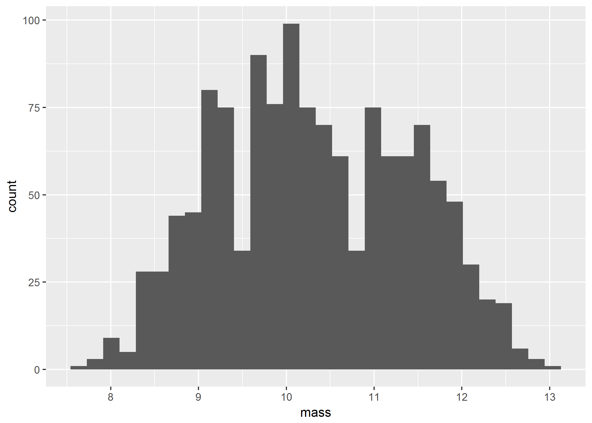
	      
##
<h2>Geometries: Adding arguments</h2>
<hr>
```{r histogram binwidth, eval = FALSE}
birdMeasures %>%
  filter(spp %in% c('BCCH', 'CACH')) %>%
  ggplot(aes(x = mass)) +
  geom_histogram(binwidth = 1)
```

	      
##
<h2>Geometries: Adding arguments</h2>
<hr>
```{r histogram bins, eval = FALSE}
birdMeasures %>%
  filter(spp %in% c('BCCH', 'CACH')) %>%
  ggplot(aes(x = mass)) +
  geom_histogram(bins = 20)
```


##
<h2>Geometries: Adding arguments</h2>
<hr>
```{r barplot fill, eval = FALSE}
birdMeasures %>%
  filter(spp != 'NOCA') %>%
  ggplot(aes(x = spp)) +
  geom_bar(fill = 'gray')
```
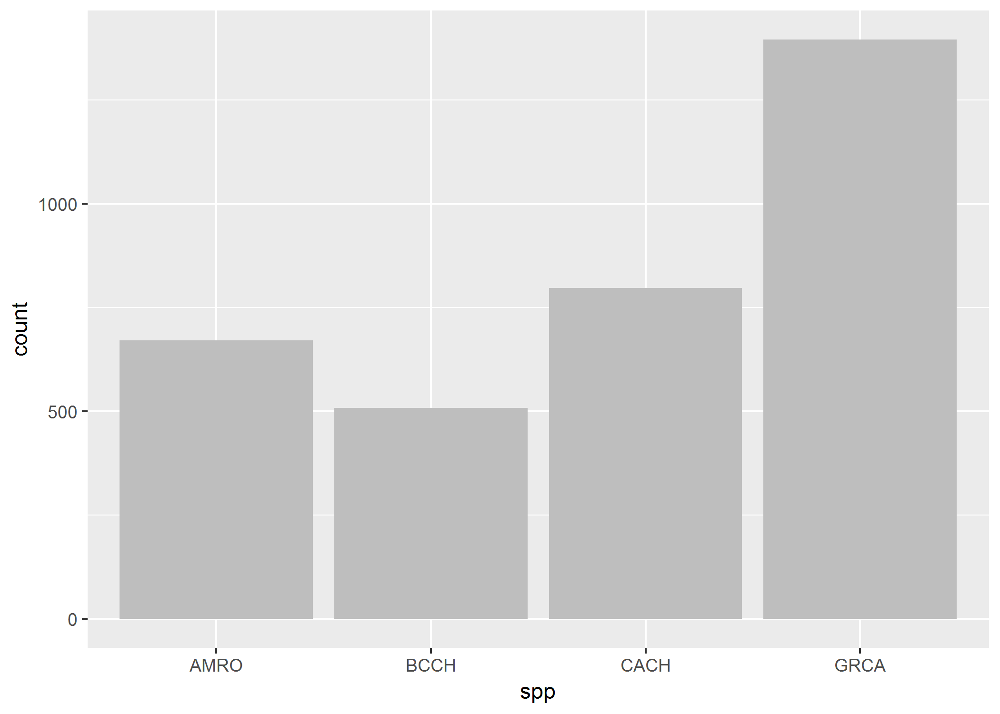
	      
##
<h2>Geometries: Adding arguments</h2>
<hr>
```{r barplot color, eval = FALSE}
birdMeasures %>%
  filter(spp != 'NOCA') %>%
  ggplot(aes(x = spp)) +
  geom_bar(
    fill = 'gray', 
    color = 'black')
```

##
<h2>Geometries: Adding arguments</h2>
<hr>
<br>
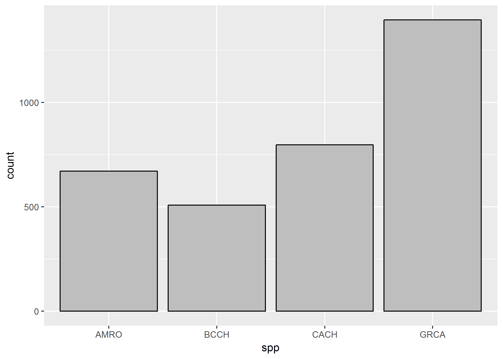
	      
##
<h2>Geometries: Adding arguments</h2>
<hr>
```{r barplot size, eval = FALSE}
birdMeasures %>%
  filter(spp != 'NOCA') %>%
  ggplot(aes(x = spp)) +
  geom_bar(fill = 'gray', 
           color = 'black',
           size = 0.7)
```

##
<h2>Geometries: Adding arguments</h2>
<hr>
<br>
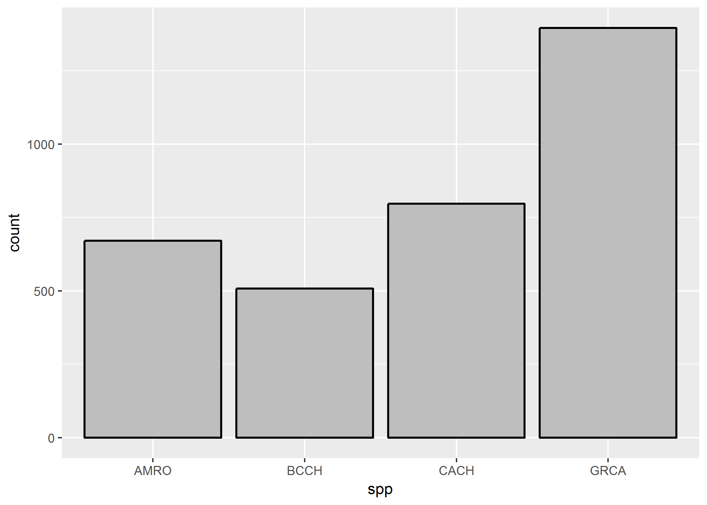
	      
##<!--- Exercise 2 --->
<h2><i class= "fa fa-user-circle-o" style = "font-size: 150%;"></i> Exercise Two:</h2>
<hr>
<p>Modify your density plot from Exercise One:</p>
<ul>
<li>Use the `fill` argument to fill your density shape with the color "gray":</li>
<li>The argument `alpha` can be applied to a geometry to adjust its transparency. Adjust the density shape to `alpha =  0.7`</li>
</ul>


##
<h2><i class= "fa fa-user-circle-o" style = "font-size: 150%;"></i> Exercise Two:</h2>
<hr>
```{r exercise two, eval = FALSE}
# Subset birdCounts to BCCH and CACH and plot density:

birdMeasures %>%
  filter(spp %in% c('BCCH', 'CACH')) %>%
  ggplot(aes(x = mass)) +
  geom_density()
```

##
<h2><i class= "fa fa-user-circle-o" style = "font-size: 150%;"></i> Exercise Two:</h2>
<hr>

	      
##<!--- Geometries: Adding aesthetics --->
<h2>Geometries: Adding aesthetics</h2>
<hr>
<p><b>Aesthetics</b> describe mapping the value of some variable to an observable feature.</p>
```{r geometry aes, eval = FALSE}
birdMeasures %>%
  filter(spp != 'NOCA') %>%
  ggplot(aes(x = spp)) +
  geom_bar(aes(fill = region))
```

##<!--- Geometries: Adding aesthetics --->
<h2>Geometries: Adding aesthetics</h2>
<hr>
<p><b>Aesthetics</b> describe mapping the value of some variable to an observable feature.</p>


##
<h2>Geometries: Adding aesthetics</h2>
<hr>
```{r geometry aes hist, eval = FALSE}
birdMeasures %>%
  filter(spp %in% c('BCCH', 'CACH')) %>%
  ggplot(aes(x = mass)) +
  geom_histogram(
    aes(fill = sex),
    bins = 20)
```

##
<h2>Geometries: Adding aesthetics</h2>
<hr>
<br>
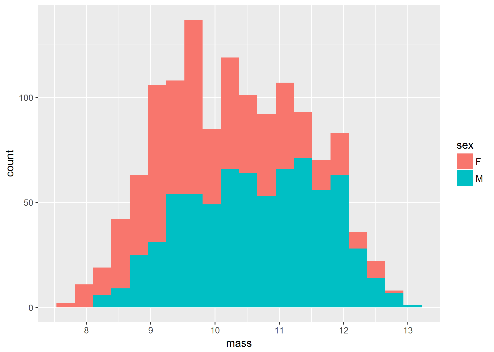
	      
##
<h2>Geometries: Adding aesthetics</h2>
<hr>
```{r geometry aes color, eval = FALSE}
birdMeasures %>%
  filter(spp %in% c('BCCH', 'CACH')) %>%
  ggplot(aes(x = mass)) +
  geom_histogram(
    aes(fill = sex),
    bins = 20,
    color = 'black')
```

##
<h2>Geometries: Adding aesthetics</h2>
<hr>
<br>
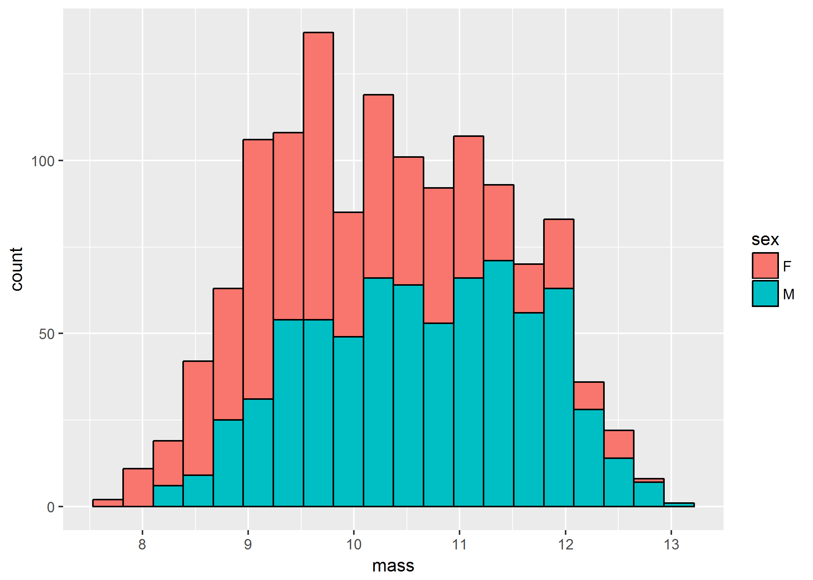
	      
##<!--- Exercise 3 --->
<h2><i class= "fa fa-user-circle-o" style = "font-size: 150%;"></i> Exercise Three:</h2>
<hr>
<p>Modify your density plot from Exercise Two. Use the `fill` argument of the function `geom_density` to assign a different fill color to females and males.</p>

##
<h2><i class= "fa fa-user-circle-o" style = "font-size: 150%;"></i> Exercise Three:</h2>
<hr>

```{r exercise three, eval = FALSE}
# Subset birdCounts to BCCH and CACH and plot density:

birdMeasures %>%
  filter(spp %in% c('BCCH', 'CACH')) %>%
  ggplot(aes(x = mass)) +
  geom_density(
    aes(fill = sex),
    alpha = 0.7)
```

##
<h2><i class= "fa fa-user-circle-o" style = "font-size: 150%;"></i> Exercise Three:</h2>
<hr>

	      
##<!--- facets --->
<h2>Facets</h2>
<hr>
<p><b>Faceting</b> splits plots, by some variable, into multiple plots.</p>

##
<h2>Facets</h2>
<hr>
```{r facet 1, eval = FALSE}
birdMeasures %>%
  filter(spp %in% c('BCCH', 'CACH')) %>%
  ggplot(aes(x = mass)) +
  geom_histogram(
    aes(fill = sex), 
    bins = 20,
    color = 'black') +
  facet_wrap(~spp)
```

##
<h2>Facets</h2>
<hr>
<br>
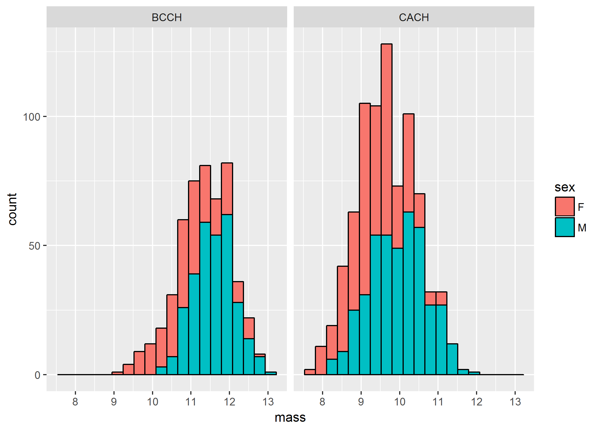

##
<h2>Facets</h2>
<hr>
```{r facet 2, eval = FALSE}
birdMeasures %>%
  filter(spp %in% c('BCCH', 'CACH')) %>%
  ggplot(aes(x = mass)) +
  geom_histogram(
    aes(fill = sex), 
    bins = 20,
    color = 'black') +
  facet_wrap(~spp, nrow = 2)
```

##
<h2>Facets</h2>
<hr>
<br>
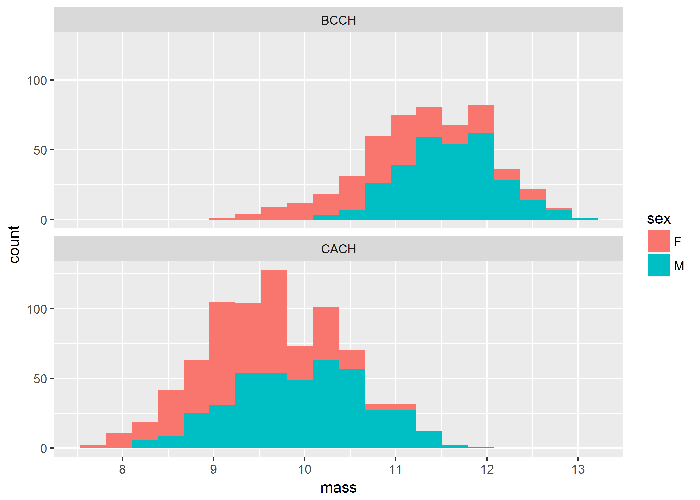

##<!--- Exercise 4 --->
<h2><i class= "fa fa-user-circle-o" style = "font-size: 150%;"></i> Exercise Four:</h2>
<hr>
<p>Modify your density plot from Exercise Three. Use the `facet_wrap` function with the argument `nrow = 2` to generate separate plots of Black-capped and Carolina chickadees.</p>

##
<h2><i class= "fa fa-user-circle-o" style = "font-size: 150%;"></i> Exercise Four:</h2>
<hr>

```{r exercise Four, eval = FALSE}
birdMeasures %>%
  filter(spp %in% c('BCCH', 'CACH')) %>%
  ggplot(aes(x = mass)) +
  geom_density(
    aes(fill = sex),
    alpha = 0.7) +
  facet_wrap(~spp, nrow = 2)
```

##
<h2><i class= "fa fa-user-circle-o" style = "font-size: 150%;"></i> Exercise Four:</h2>
<hr>

	      
##<!--- labels --->
<h2>Labels</h2>
<hr>
<p><b>Labels</b> describes the plot and axis titles.</p>
	      
##
<h2>Labels</h2>
<hr>
```{r labels1, eval = FALSE}
birdMeasures %>%
  filter(spp != 'NOCA') %>%
  ggplot(aes(x = spp)) +
  geom_bar(
    aes(fill = region),
    color = 'black',
    size = .7) +
  labs(
    title = 'Birds banded and recaptured 2000-2017',
    x = 'Species',
    y = 'Count')
```

##
<h2>Labels</h2>
<hr>


##
<h2>Labels</h2>
<hr>
<p>Piping can be used ...</p>
```{r labels2, eval = FALSE}
birdMeasures %>%
  filter(spp != 'NOCA') %>%
  mutate(
    spp = factor(
      spp,
      labels = c(
        'American robin',
        'Black-capped chickadee',
        'Carolina chickadee',
        'Gray catbird'
      )
    )) %>%
  ggplot(aes(x = spp)) +
  geom_bar(
    aes(fill = region),
    color = 'black',
    size = .7) +
  labs(
    title = 'Birds banded and recaptured 2000-2017',
    x = 'Species',
    y = 'Count')
```

##
<h2>Labels</h2>
<hr>

	      
##
<h2>Labels</h2>
<hr>
<p>It's a good time to assign names!</p>
```{r labels3, eval = FALSE}
birdCaptures_basicPlot <- 
  birdMeasures %>%
  filter(spp != 'NOCA') %>%
  mutate(spp = factor(
    spp,
    labels = c(
      'American robin',
      'Black-capped chickadee',
      'Carolina chickadee',
      'Gray catbird'
    )
  )) %>%
  ggplot(aes(x = spp)) +
  geom_bar(
    aes(fill = region),
    color = 'black',
    size = .7) +
  labs(
    title = 'Birds banded and recaptured 2000-2017',
    x = 'Species',
    y = 'Count')
```

##
<h2>Labels</h2>
<hr>


##<!--- Exercise 5 --->
<h2><i class= "fa fa-user-circle-o" style = "font-size: 150%;"></i> Exercise Five:</h2>
<hr>
<p>Modify the density plot you created in Exercise Four:</p>
<ul>
<li>Using the piping method, change the names "BCCH" and "CACH" to "Black-capped" and "Carolina"</li>
<li>Add the title "Mass of Carolina and Black-capped chickadees and capitalize the x and y axis titles</li>
<li>Assign the name "massDensity" to the plot</li>
</ul>

##
<h2><i class= "fa fa-user-circle-o" style = "font-size: 150%;"></i> Exercise Five:</h2>
<hr>

```{r exercise 5, eval = FALSE}
# Labels for massDensity:

massDensity <- 
  birdMeasures %>%
  filter(spp %in% c('BCCH', 'CACH')) %>%
  mutate(spp = factor(
    spp,
    labels = c(
      'Black-capped',
      'Carolina'
    )
  )) %>%
  ggplot(aes(x = mass)) +
  geom_density(
    aes(fill = sex),
    alpha = 0.7) +
  facet_wrap(~spp, nrow = 2) +
  labs(
    title = "Mass of Carolina and Black-capped chickadees",
    x = 'Mass', 
    y = 'Density')

massDensity
```

##
<h2><i class= "fa fa-user-circle-o" style = "font-size: 150%;"></i> Exercise Five:</h2>
<hr>
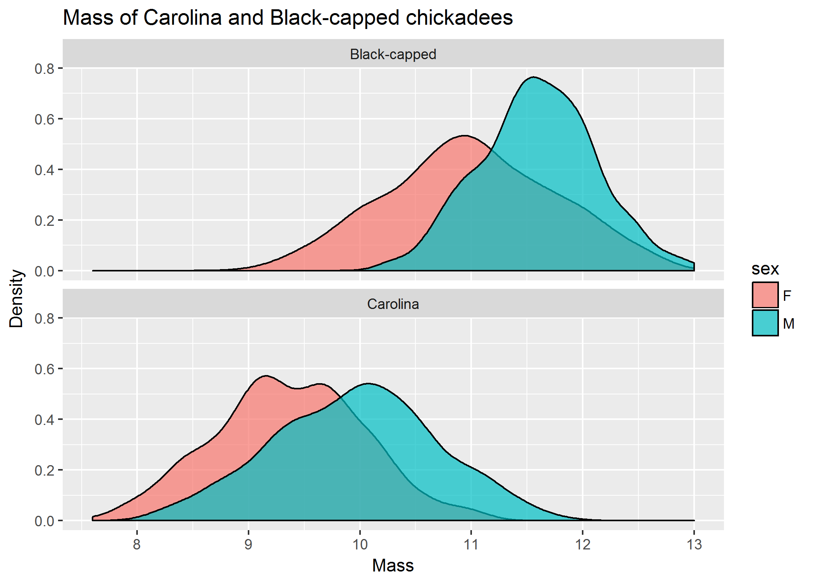
	      
##<!--- scaling --->
<h2>Scaling axes</h2>
<hr>
<p>Changing the <b>scale</b> of an axis changes the range of numbers and the names and locations of tick marks.</p>

##
<h2>Scaling axes</h2>
<hr>
```{r scaling1, eval = FALSE}
birdCaptures_basicPlot +
  scale_y_continuous(expand = c(0,0))
```

##
<h2>Scaling axes</h2>
<hr>
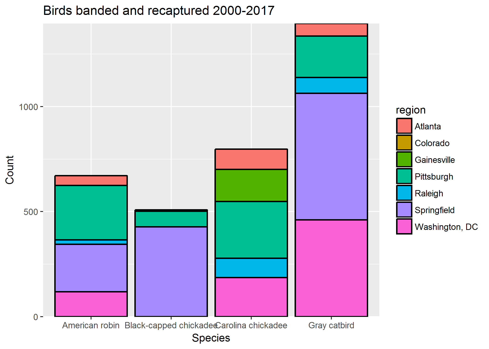
	      
##
<h2>Scaling axes</h2>
<hr>
```{r scaling2, eval = TRUE}
birdMeasures %>%
  filter(spp != 'NOCA') %>%
  group_by(spp) %>%
  summarize(n = n())
```

##
<h2>Scaling axes</h2>
<hr>
```{r scaling3, eval = FALSE}
birdCaptures_basicPlot +
  scale_y_continuous(
    expand = c(0, 0),
    limits = c(0, 1500))
```

##
<h2>Scaling axes</h2>
<hr>
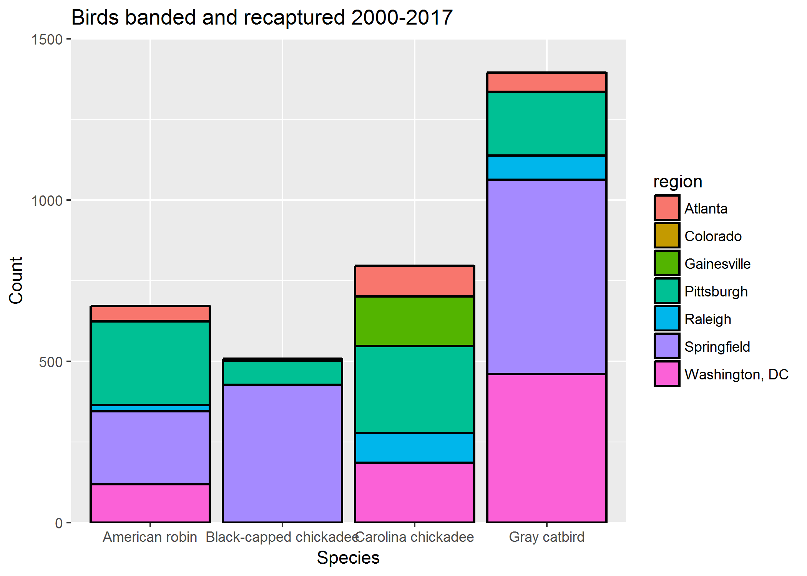

##
<h2>Scaling axes</h2>
<hr>
```{r scaling4, eval = FALSE}
birdCaptures_basicPlot +
  scale_y_continuous(
    expand = c(0, 0),
    limits = c(0, 1500),
    breaks = seq(0, 1500, by = 250))
```

##
<h2>Scaling axes</h2>
<hr>


##<!--- Exercise 6 --->
<h2><i class= "fa fa-user-circle-o" style = "font-size: 150%;"></i> Exercise Six:</h2>
<hr>
<p>Plot massDensity. Use the `expand`, `limits`, and `breaks` arguments of the function `scale_y_continuous` to scale the y-axis such that the scale ranges from 0 to 0.7 and breaks occur at intervals of 0.1.</p>

##
<h2><i class= "fa fa-user-circle-o" style = "font-size: 150%;"></i> Exercise Six:</h2>
<hr>

```{r exercise 6, eval = FALSE}
massDensity +
  scale_y_continuous(
    expand = c(0, 0),
    limits = c(0, 0.8),
    breaks = seq(0, 0.8, by = 0.1))
```

##
<h2><i class= "fa fa-user-circle-o" style = "font-size: 150%;"></i> Exercise Six:</h2>
<hr>
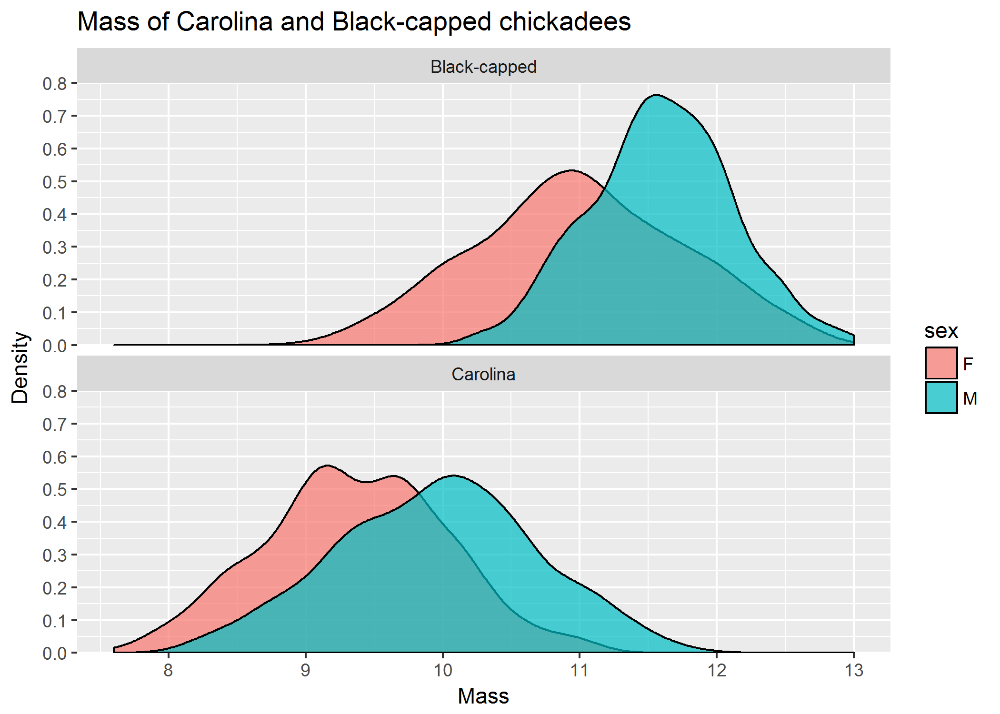
	      
##<!--- colors --->
<h2>Colors</h2>
<hr>
<p>The default <b>colors</b> of ggplot are pretty ugly. Luckily you can modify in an infinite number of ways!</p>

```{r colors1, eval = FALSE}
birdMeasures %>%
  filter(spp %in% c('BCCH', 'CACH')) %>%
  ggplot(aes(x = mass)) +
  geom_histogram(
    aes(fill = sex), 
    bins = 20,
    color = 'black') +
  facet_wrap(~spp, nrow = 2) +
  scale_fill_manual(values = c('blue', 'red'))
```

##
<h2>Colors</h2>
<hr>


##
<h2>Colors</h2>
<hr>
<p>Color-picker apps can be a great way to find colors that you like on the internet.</p>


##	      
<h2>Colors</h2>
<hr>
<p>Using Team Zissou's hat and shirt color:</p>
```{r colors2, eval = FALSE}
birdMeasures %>%
  filter(spp %in% c('BCCH', 'CACH')) %>%
  ggplot(aes(x = mass)) +
  geom_histogram(
    aes(fill = sex), 
    bins = 20,
    color = 'black') +
  facet_wrap(~spp, nrow = 2) +
  scale_fill_manual(values = c('#9EB8C5', '#F32017'))
```

##
<h2>Colors</h2>
<hr>
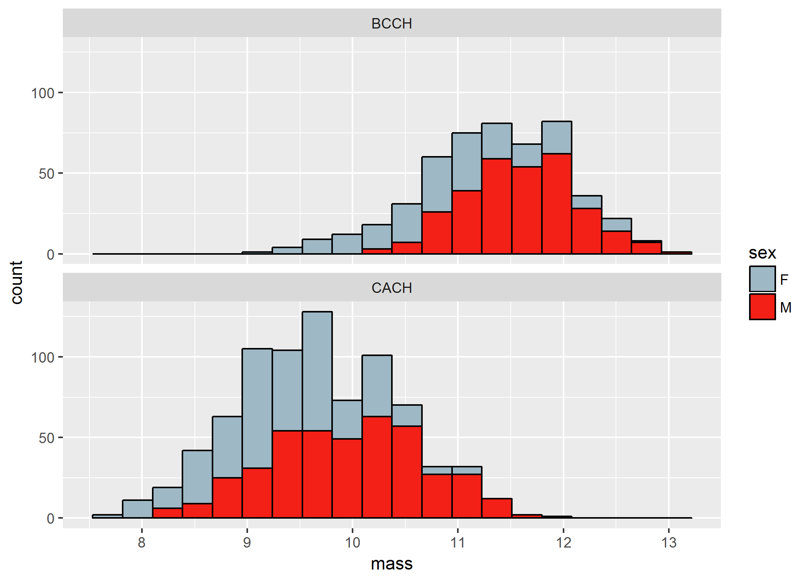

##
<h2>Colors</h2>
<hr>
<p>You can hunt around to find colors that you like and then save your palette for use later:</p>

```{r colors3, eval = FALSE}
zPalette <- c('#9EB8C5', '#F32017')

birdMeasures %>%
  filter(spp %in% c('BCCH', 'CACH')) %>%
  ggplot(aes(x = mass)) +
  geom_histogram(
    aes(fill = sex), 
    bins = 20,
    color = 'black') +
  facet_wrap(~spp, nrow = 2) +
  scale_fill_manual(values = zPalette)
```

##
<h2>Colors</h2>
<hr>

	      
##<!--- Exercise 7 --->
<h2><i class= "fa fa-user-circle-o" style = "font-size: 150%;"></i> Exercise Seven:</h2>
<hr>
<p>Modify the density plot you created in Exercise Six. Use `scale_fill_manual` to set custom fill colors.</p>

##
<h2><i class= "fa fa-user-circle-o" style = "font-size: 150%;"></i> Exercise Seven:</h2>
<hr>

```{r exercise 7, eval = FALSE}
# Colors for massDensity:

massDensity +
  scale_y_continuous(
    expand = c(0, 0),
    limits = c(0, 0.8),
    breaks = seq(0, 0.8, by = 0.1)) +
  scale_fill_manual(values =  c('#9EB8C5', '#F32017'))
```

##
<h2><i class= "fa fa-user-circle-o" style = "font-size: 150%;"></i> Exercise Seven:</h2>
<hr>
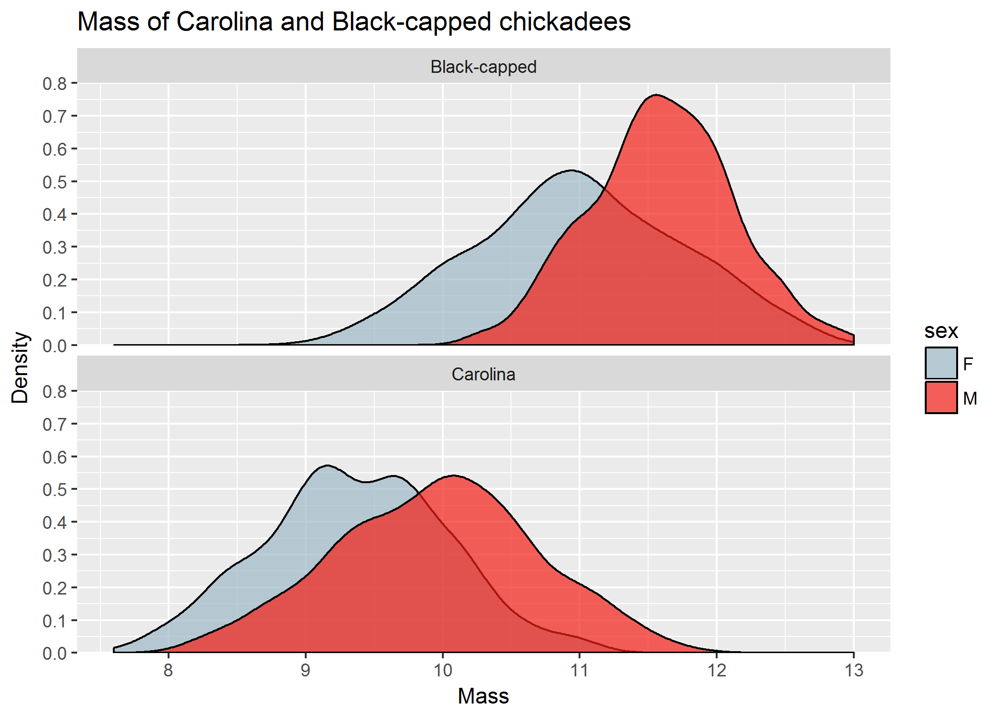

##<!--- legends --->
<h2>Legends</h2>
<hr>
<p>Legends can be modified in a number of ways. One method to do so is to modify the data frame coming into the plotting functions:</p>

```{r legend1, eval = FALSE}
birdMeasures %>%
  filter(spp %in% c('BCCH', 'CACH')) %>%
  mutate(
    sex = factor(
      sex,
      labels = c('Female','Male'))) %>%
  ggplot(aes(x = mass)) +
  geom_histogram(
    aes(fill = sex), 
    bins = 20,
    color = 'black') +
  facet_wrap(~spp, nrow = 2) +
  scale_fill_manual(values = c('#9EB8C5', '#F32017'))
```

##
<h2>Legends</h2>
<hr>
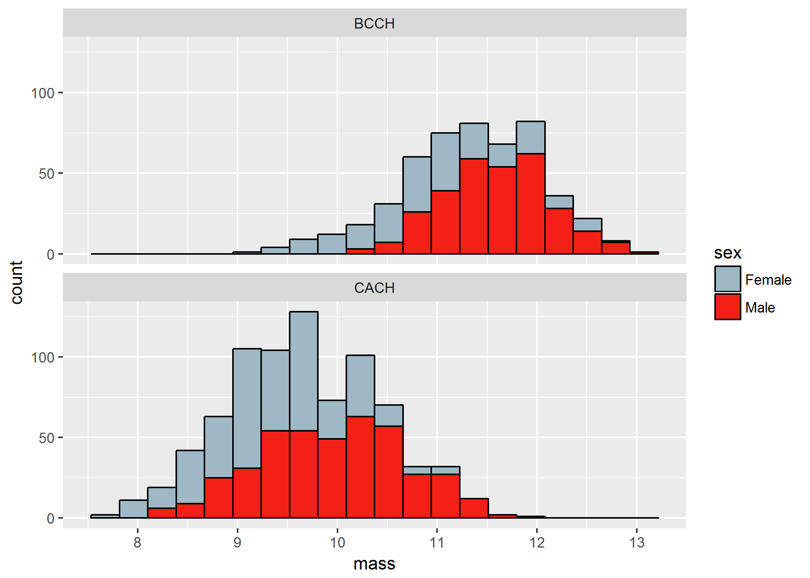

##
<h2>Legends</h2>
<hr>
<p>We can also use the `scale_fill_manual` function from above to modify the legend by specifying the `name` and `label` attributes:</p>

```{r legend2, eval = FALSE}
birdMeasures %>%
  filter(spp %in% c('BCCH', 'CACH')) %>%
  ggplot(aes(x = mass)) +
  geom_histogram(
    aes(fill = sex), 
    bins = 20,
    color = 'black') +
  facet_wrap(~spp, nrow = 2) +
  scale_fill_manual(
    values = c('#9EB8C5', '#F32017'), 
    name = 'Sex', 
    labels = c('Female', 'Male'))
```

##
<h2>Legends</h2>
<hr>

	      

##<!--- Exercise 8 --->
<h2><i class= "fa fa-user-circle-o" style = "font-size: 150%;"></i> Exercise Eight:</h2>
<hr>
<p>Modify the density plot you created in Exercise Seven. Use scale_fill_manual to set the legend title and labels.</p>

##
<h2><i class= "fa fa-user-circle-o" style = "font-size: 150%;"></i> Exercise Eight:</h2>
<hr>

```{r exercise 8, eval = FALSE}
# Colors for massDensity:
massDensity +
  scale_y_continuous(
    expand = c(0, 0),
    limits = c(0, 0.8),
    breaks = seq(0, 0.8, by = 0.1)) +
  scale_fill_manual(
    values = zPalette,
    name = 'Sex', 
    labels = c('Female', 'Male')) 
```

##
<h2><i class= "fa fa-user-circle-o" style = "font-size: 150%;"></i> Exercise Eight:</h2>
<hr>
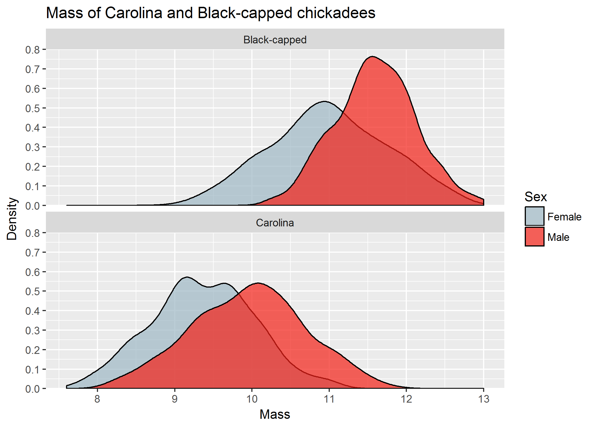
	      
##<!--- Themes --->
<h2>Themes</h2>
<hr>

<p>A <b>theme</b> describes many of the visual elements of a plot.</p>
<p>Themes are controlled by elements, including:</p>
<ul>
<li>`element_blank`: A blank element</li>
<li>`element_rect`: A rectangle element</li>
<li>`element_text`: A text element</li>
<li>`element_line`: A line element</li>
</ul>

##
<h2>Themes</h2>
<hr>
<p>Before exploring themes, let's take a moment to assign names to the current versions of our plots:</p>
```{r histogram2Theme, eval = FALSE}
histogram2Theme <- 
  birdMeasures %>%
  filter(spp %in% c('BCCH', 'CACH')) %>%
  mutate(spp = factor(
    spp,
    labels = c(
      'Black-capped',
      'Carolina'
    )
  )) %>%
  ggplot(aes(x = mass)) +
  geom_histogram(
    aes(fill = sex), 
    bins = 20,
    color = 'black') +
  scale_y_continuous(
    expand = c(0, 0),
    limits = c(0, 150),
    breaks = seq(0, 150, by = 25)) +
  facet_wrap(~spp, nrow = 2) +
  scale_fill_manual(
    values = c('#9EB8C5', '#F32017'), 
    name = 'Sex', 
    labels = c('Female', 'Male'))
```

##
<h2>Themes</h2>
<hr>
<p>Before exploring themes, let's take a moment to assign names to the current versions of our plots:</p>
```{r density2Theme, eval = FALSE}
density2Theme <- massDensity +
  scale_y_continuous(
    expand = c(0, 0),
    limits = c(0, 0.8),
    breaks = seq(0, 0.8, by = 0.1)) +
  scale_fill_manual(
    values = zPalette,
    name = 'Sex', 
    labels = c('Female', 'Male')) 
```

##
<h2>Themes</h2>
<hr>
<p>Remove gray panel background using element_rect:</p>

```{r theme 1, eval = FALSE}
histogram2Theme +
  labs(
    title = 'Mass of Carolina and Black-capped chickadees',
    x = 'Mass',
    y = 'Density',
    fill = 'Sex') +
  theme(
    panel.background = element_rect(fill = 'white')
  )
```

##
<h2>Themes</h2>
<hr>
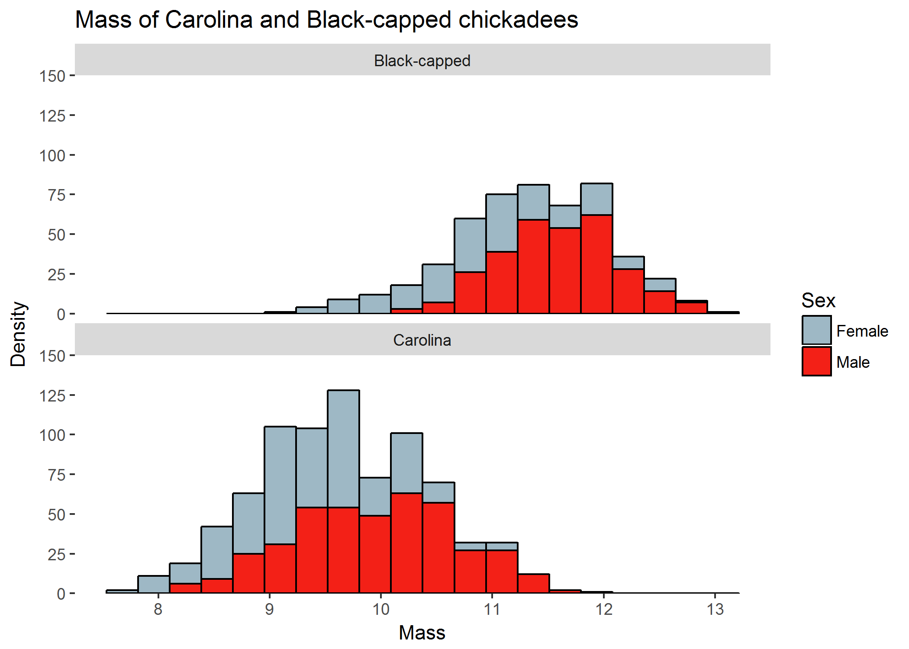
	      
##
<h2>Themes</h2>
<hr>
<p>Change panel lines using element_line:</p>

```{r theme 2, eval = FALSE}
histogram2Theme +
  labs(
    title = 'Mass of Carolina and Black-capped chickadees',
    x = 'Mass',
    y = 'Density',
    fill = 'Sex') +
  theme(
    panel.background = element_rect(fill = 'white'),
    panel.grid.major = element_line(color = 'gray80', size = .2),
  )
```

##
<h2>Themes</h2>
<hr>

	      
##
<h2>Themes</h2>
<hr>
<p>Modify the strip background using element_rect:</p>

```{r theme 3, eval = FALSE}
histogram2Theme +
  labs(
    title = 'Mass of Carolina and Black-capped chickadees',
    x = 'Mass',
    y = 'Density',
    fill = 'Sex') +
  theme(
    panel.background = element_rect(fill = 'white'),
    panel.grid.major = element_line(color = 'gray80', size = .2),
    strip.background = element_rect(fill = 'white')
  )
```

##
<h2>Themes</h2>
<hr>
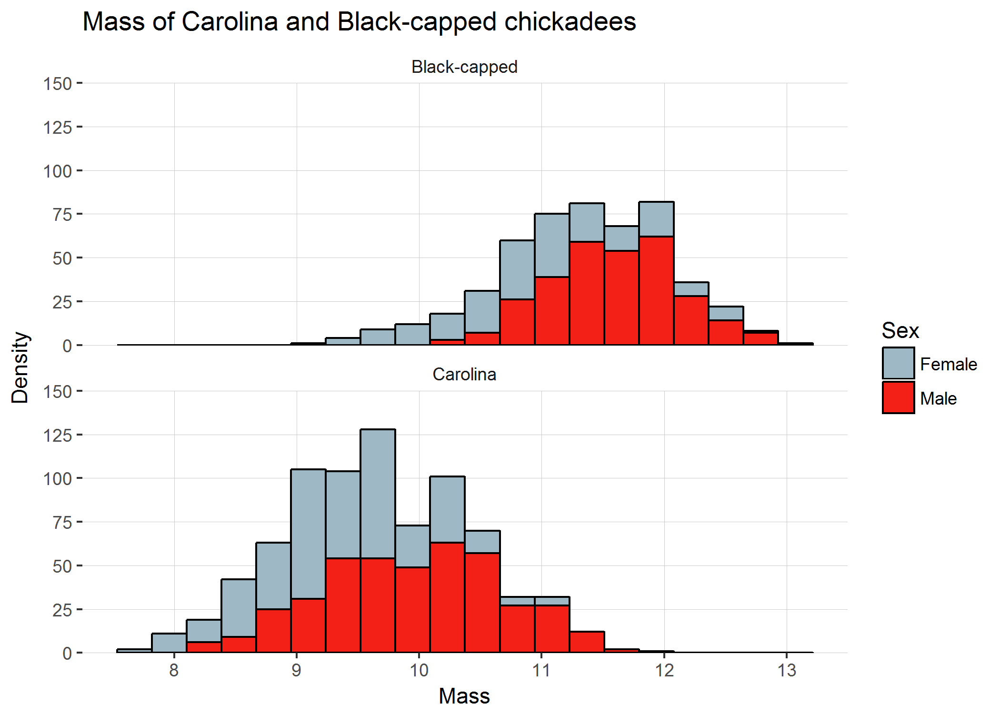
	      
##
<h2>Themes</h2>
<hr>
<p>Modify the y axis lines using element_line:</p>

```{r theme 4, eval = FALSE}
histogram2Theme +
  labs(
    title = 'Mass of Carolina and Black-capped chickadees',
    x = 'Mass',
    y = 'Density',
    fill = 'Sex') +
  theme(
    panel.background = element_rect(fill = 'white'),
    panel.grid.major = element_line(color = 'gray80', size = .2),
    axis.line = element_line(color = 'black', size = .5),
    strip.background = element_rect(fill = 'white')
  )
```

##
<h2>Themes</h2>
<hr>

	      

##
<h2>Themes</h2>
<hr>
<p>Remove the legend title using element_blank:</p>

```{r theme 5, eval = FALSE}
histogram2Theme +
  labs(
    title = 'Mass of Carolina and Black-capped chickadees',
    x = 'Mass',
    y = 'Density',
    fill = 'Sex') +
  theme(
    panel.background = element_rect(fill = 'white'),
    panel.grid.major = element_line(color = 'gray80', size = .2),
    axis.line = element_line(color = 'black', size = .5),
    strip.background = element_rect(fill = 'white'),
    legend.title = element_blank()
  )
```

##
<h2>Themes</h2>
<hr>
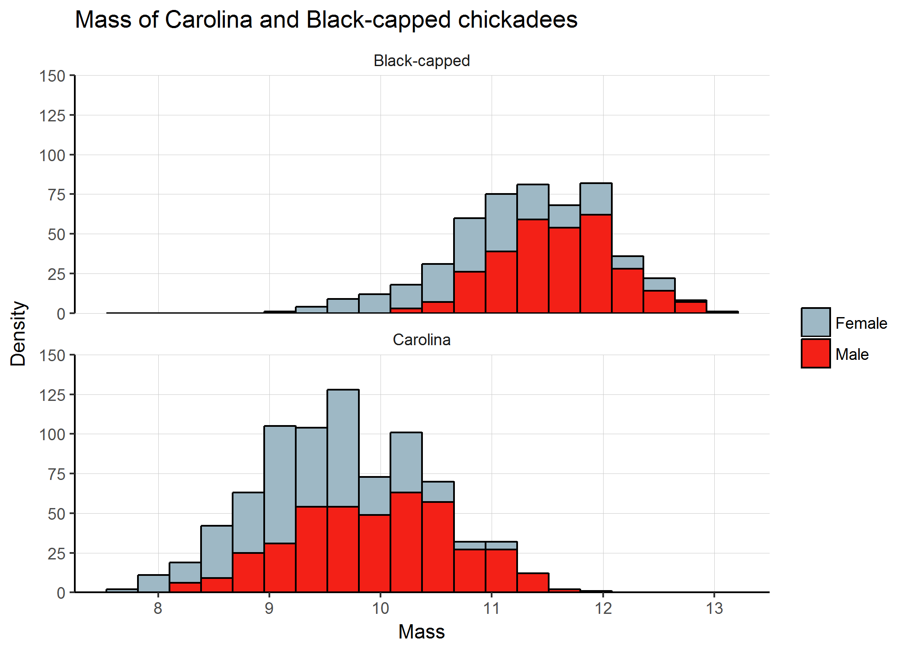
	      

##
<h2>Themes</h2>
<hr>
<p>Change the size of tick mark text using axis.text and element_text:</p>

```{r theme 6, eval = FALSE}
histogram2Theme +
  labs(
    title = 'Mass of Carolina and Black-capped chickadees',
    x = 'Mass',
    y = 'Density',
    fill = 'Sex') +
  theme(
    panel.background = element_rect(fill = 'white'),
    panel.grid.major = element_line(color = 'gray80', size = .2),
    axis.line = element_line(color = 'black', size = .5),
    strip.background = element_rect(fill = 'white'),
    legend.title = element_blank(),
    axis.text = element_text(size = 12)
  )
```

##
<h2>Themes</h2>
<hr>
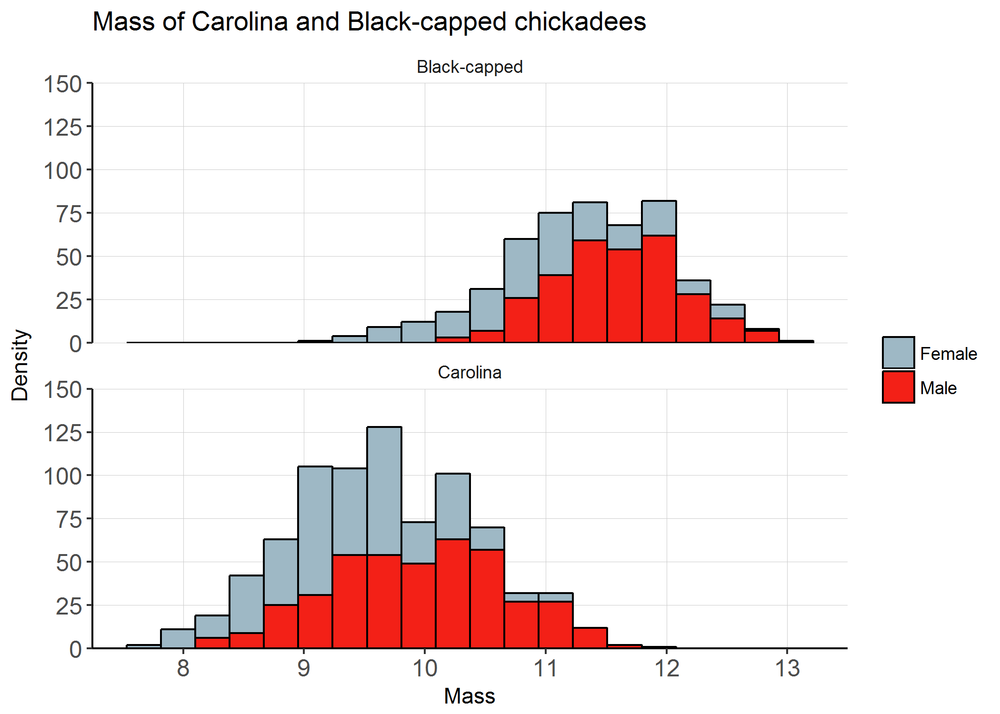
	      

##
<h2>Themes</h2>
<hr>
<p>Make the axis titles bigger we use axis.title and element_text:</p>

```{r theme 7, eval = FALSE}
histogram2Theme +
  labs(
    title = 'Mass of Carolina and Black-capped chickadees',
    x = 'Mass',
    y = 'Density',
    fill = 'Sex') +
  theme(
    panel.background = element_rect(fill = 'white'),
    panel.grid.major = element_line(color = 'gray80', size = .2),
    axis.line = element_line(color = 'black', size = .5),
    strip.background = element_rect(fill = 'white'),
    legend.title = element_blank(),
    axis.text = element_text(size = 12),
    axis.title = element_text(size = 18)
  )
```

##
<h2>Themes</h2>
<hr>
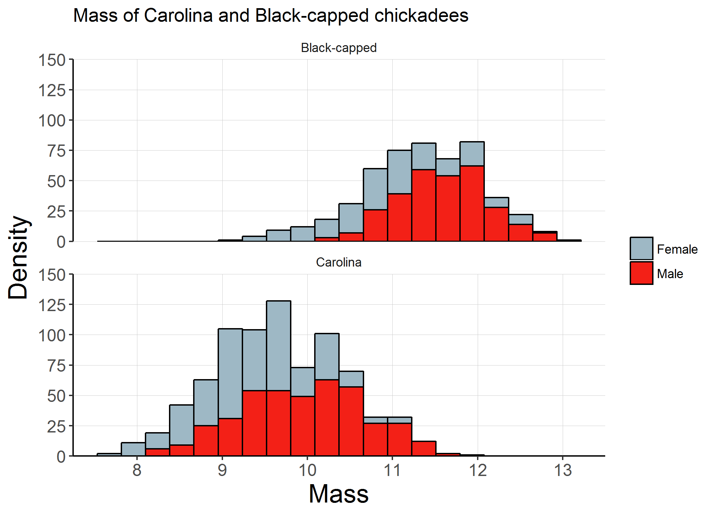
	      
##
<h2>Themes</h2>
<hr>
<p>Make the facet labels bigger we use axis.title and element_text:</p>

```{r theme 8, eval = FALSE}
histogram2Theme +
  labs(
    title = 'Mass of Carolina and Black-capped chickadees',
    x = 'Mass',
    y = 'Density',
    fill = 'Sex') +
  theme(
    panel.background = element_rect(fill = 'white'),
    panel.grid.major = element_line(color = 'gray80', size = .2),
    axis.line = element_line(color = 'black', size = .5),
    strip.background = element_rect(fill = 'white'),
    legend.title = element_blank(),
    axis.text = element_text(size = 12),
    axis.title = element_text(size = 18),
    strip.text = element_text(size = 18)
  )
```

##
<h2>Themes</h2>
<hr>

	      

##
<h2>Themes</h2>
<hr>
<p>Make the plot title larger using plot.title and element_text:</p>

```{r theme 9, eval = FALSE}
histogram2Theme +
  labs(
    title = 'Mass of Carolina and Black-capped chickadees',
    x = 'Mass',
    y = 'Density',
    fill = 'Sex') +
  theme(
    panel.background = element_rect(fill = 'white'),
    panel.grid.major = element_line(color = 'gray80', size = .2),
    axis.line = element_line(color = 'black', size = .5),
    strip.background = element_rect(fill = 'white'),
    legend.title = element_blank(),
    axis.text = element_text(size = 12),
    axis.title = element_text(size = 18),
    strip.text = element_text(size = 18),
    plot.title = element_text(size = 22)
  )
```

##
<h2>Themes</h2>
<hr>

	      

##
<h2>Themes</h2>
<hr>
<p>Add a margin between the plot and title (see ?margin):</p>

```{r theme 10, eval = FALSE}
massPlot +
  labs(
    title = 'Mass of Carolina and\nBlack-capped chickadees',
    x = 'Mass',
    y = 'Density',
    fill = 'Sex') +
  theme(
    panel.background = element_rect(fill = 'white'),
    panel.grid.major = element_line(color = 'gray80', size = .2),
    axis.line = element_line(color = 'black', size = .5),
    strip.background = element_rect(fill = 'white'),
    legend.title = element_blank(),
    axis.text = element_text(size = 12),
    axis.title = element_text(size = 18),
    strip.text = element_text(size = 18),
    plot.title = element_text(size = 22, margin = margin(b = 40))
  )
```

##
<h2>Themes</h2>
<hr>

	      
##
<h2><i class= "fa fa-user-circle-o" style = "font-size: 150%;"></i> Exercise Nine:</h2>
<hr>
<p>Make your density plot as pretty as possible using themes!</p>
