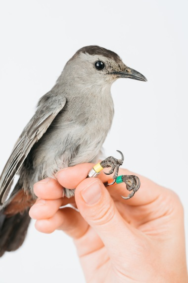

---
output:
  revealjs::revealjs_presentation:
    theme: simple
    highlight: pygments
    center: false
    transition: none
    progress: true
    font-family: Verdana
---

<head>
<link rel="stylesheet" href="https://cdnjs.cloudflare.com/ajax/libs/font-awesome/4.7.0/css/font-awesome.min.css">
</head>

<style>

code{
  background-color:#f2f2f2;
  border-radius: 25px;
}
 
span.co{
  color:#000080;
  font-weight: bold;
}
 
img{
  display: block;
  padding-left: 15px;
  padding-right: 15px;
  padding-top: 10px;
  padding-bottom: 10px;
}

p{
  text-align: left;
  font-size: 18px;
}

ul, ol{
  line-height: 27px;
  text-align: left;
  font-size: 18px;
  margin-left: 0px;
}
 
blockquote{
  font-size: 18px;
  border-left: 8px solid #292093;
  background-color: #e6ffff;
  padding-left: 16px;
  padding-right: 16px;
}
 
.row{
  margin: auto;
}
 
table {
  border-collapse: collapse;
}

table, td, th {
  border: 1px solid black;
  padding: 5px;
  text-align: center;
  vertical-align: middle;
}
 
 /* Create two equal columns that floats next to each other */
.column {
  float: left;
  width: 50%;
  padding: 10px;
}

/* Clear floats after the columns */
.row:after {
  content: "";
  display: table;
  clear: both;
}

.roundBorder {
  border-radius: 25px;
  border: 5px solid #30288C;
  background: #D6EAF8;
  padding-left: 20px;
  padding-right: 20px;
  padding-top: 10px;
  padding-bottom: 10px;
}

.roundBorderBlack {
  border-radius: 25px;
  border: 10px solid #D3D3D3;
  padding-left: 20px;
  padding-right: 20px;
  padding-top: 10px;
  padding-bottom: 10px;
}

.roundBorderBlackEx {
  border-radius: 5px;
  border: 5px solid #D3D3D3;
  padding-left: 5px;
  padding-right: 5px;
  padding-top: 2px;
}

.roundBorderEx {
  border-radius: 3px;
  border: 5px solid #30288C;
  background: #D6EAF8;
  padding-left: 5px;
  padding-right: 5px;
  padding-top: 2px;
}

.tt {
    position: relative;
    display: inline-block;
    class: inline; 
    font-weight: bold;
    font-family: "Avenir";
    font-size: 18px;
    border-bottom: 1px black;
}

/* Tooltip text */
.tt .ttText {
    visibility: hidden;
    font-weight: normal;
    font-size: 18px;
    width: 200px;
    background-color: black;
    border: 1px solid black;
    color: white;
    text-align: left;
    padding: 5px;
    border-radius: 6px;
    position: absolute;
    z-index: 1;
}

/* Show the tooltip text when you mouse over the tooltip container */
.tt:hover .ttText {
    visibility: visible;
}

</style>

<h2 style="text-align: center;">Introduction to data science in R</br> <b>Lesson 3:<br/>Functions and <i>for loops</i></b></h2>
<br>
<p style = "text-align: center; font-size: 24px;">Brian S. Evans, Ph.D.<br />
Migratory Bird Center<br />
Smithsonian Conservation Biology Institute</p>
<br>


## Objectives
<hr>
<br>
<ol style = "position: absolute; left: 10px; width: 45%">
<li>Writing custom <b>functions</b></li>
<li><i><b>For loops</b></i></li>
</ol>
<br>


	      
##
<h2>Setup for the lesson</h2>
<br>
```{r eval = FALSE}
# Load libraries:

library(tidyverse)
```

##
<h2>Setup for the lesson</h2>
<hr>
<p>The function `paste0` is used to paste two string values together. For example, we can paste the values `'hello'` and `'World'` together as follows. The resultant object is a nice looking camel case value.</p>

```{r}
# The paste0 function:

paste0('hello', 'World')
```
##
<h2>Setup for the lesson</h2>
<hr>
<p>We will use the function `paste0` to create an easy-to-read url</p>

```{r}

gitUrl <-
  'https://raw.githubusercontent.com/bsevansunc/'

courseData <-
  'smsc_data_science/master/data/'

paste0(
  gitUrl,
  courseData,
  'birdHabits.csv')
```

##
<h2>Setup for the lesson</h2>
<br>

```{r eval = FALSE}
# Read in the data:

birdCounts <- 
  read_csv(
    paste0(
      gitUrl,
      courseData,
      'bird_rawCounts.csv'))
```

##
<h2>Setup for the lesson</h2>
<br>

```{r eval = FALSE}
# Read in the data:

birdHabits <- 
  read_csv(
    paste0(
      gitUrl,
      courseData,
      'birdHabits.csv'))
```

##
<h2>Setup for the lesson</h2>
<hr>
<br>
<p>For the iris dataset, I think it's best to do some familiar cleaning steps:</p>

```{r, eval=FALSE}

# Clean up iris for analysis:

irisTbl <- tbl_df(iris)

names(irisTbl) <-
  c('sepalLength',
    'sepalWidth',
    'petalLength',
    'petalWidth',
    'species')
```

##
<h2>Functions</h2>
<hr>
<br>
<p><b>Functions</b> are a type of R object that consists of commands that can be used to execute complex or repetitive tasks.</p>

<p>Functions take the form:</p>

```{r, eval=FALSE}
functionName <-
  function(functionTarget) {
  functionBody
  }
```

##
<h2>Functions, simple example</h2>
<hr>
<br>

```{r first function, eval=FALSE}
# First function:

addOneFun <- 
  function(x) {
    x + 1
  }
```

```{r first function test1, eval=FALSE}
# Testing the function on a numeric value:

42+1

addOneFun(42)
```

##
<h2>Functions, simple example</h2>
<hr>
<br>
```{r first function repeat, eval=FALSE}
# First function:

addOneFun <-
  function(x) {
  x + 1
  }
```

```{r first function test2, eval=FALSE}
# Testing the function on a vector of numeric values:

v <-
  c(1, 1, 2, 3, 5)

v + 1
```

##
<h2>Function for queries</h2>
<hr>
<br>

	      
<p><b>Functions</b> can simplify writing queries!</p>

```{r explore bird counts, eval = FALSE}
# Explore birdCounts data:

str(birdCounts)

head(birdCounts)

# Matrix notation query:

birdCounts[birdCounts$species == 'grca', ]
```

## 
<h2>Function for queries</h2>
<hr>
<br>

	      
<p><b>Functions</b> can simplify writing queries!</p>

```{r first query function, eval = FALSE}
# Query by species function:

speciesSubset <- 
  function(spp) {
    birdCounts[birdCounts$species == spp,]
  }
```

```{r first query function test, eval = FALSE}
# Test function:

birdCounts[birdCounts$species == 'grca', ]

speciesSubset('grca')
```

## 
<h2>Functions: General is better!</h2>
<hr>
<br>
```{r query generalize fun, eval = FALSE}

# Query by species function, generalized:

speciesSubset <-
  function(dfIn, spp) {
  dfIn[dfIn$species == spp,]
  }
```

```{r query generalize fun test, eval = FALSE}
# Test function, birdCounts:

birdCounts[birdCounts$species == 'grca', ]

speciesSubset(birdCounts, 'grca')

# Test function, birdHabits:

birdHabits[birdHabits$species == 'grca', ]

speciesSubset(birdHabits, 'grca')
```

## 
<h2>Functions: Most general is best!</h2>
<hr>
<p><i>In many, but not all situations.</i></p>
```{r query generalize fun 2, eval = FALSE}
# Subset to catbirds using $ and matrix notation:

birdHabits[birdHabits$species == 'grca', ]

birdHabits[birdHabits[,'species'] == 'grca',]
```

```{r query generalize fun 3, eval = FALSE}
# Very generalized query:

query <-
  function(dfIn, variable, condition) {
  dfIn[dfIn[, variable] == condition, ]
  }

# Test query:

birdHabits[birdHabits$species == 'grca', ]

birdHabits[birdHabits[,'species'] == 'grca',]

query(birdHabits, 'species', 'grca')
```

##
<div style = "width: 90%; height: 90%;">
<h2><i class= "fa fa-user-circle-o" style = "font-size: 150%;"></i> Exercise One:</h2>
<hr>
<ol>
<li>Write a function to subset the `birdHabits` data frame to just ground foraging birds.</li><br>
<li>Write a function that will calculate the total number of individuals observed of a given species in the `birdCounts` data frame(i.e., the sum of count for a data frame subset by species)</li>
</ol>
<br>
</div>
<br>

##
<h2><i class= "fa fa-user-circle-o" style = "font-size: 150%;"></i> Exercise One:</h2>
<hr>
<ol>
<li>Write a function to subset the `birdHabits` data frame to just ground foraging birds.</li>
</ol>
```{r exercise 1.1, eval = FALSE}
head(birdHabits)

birdHabits[birdHabits$foraging == 'ground',]

foragingSubset <-
  function(foragingValue) {
  birdHabits[birdHabits$foraging == foragingValue, ]
  }

foragingSubsetGeneral <-
  function(dfIn, foragingValue) {
  dfIn[dfIn$foraging == foragingValue, ]
  }

foragingSubset('ground')

foragingSubsetGeneral(birdHabits, 'ground')

```

##
<h2><i class= "fa fa-user-circle-o" style = "font-size: 150%;"></i> Exercise One:</h2>
<hr>
<ol start = "2">
<li>Write a function that will calculate the total number of individuals observed of a given species in the `birdCounts` data frame(i.e., the sum of count for a data frame subset by species)</li>
</ol>
```{r exercise 1.2, eval = FALSE}
head(birdCounts)

birdCounts[birdCounts$species == 'grca',]

birdCounts[birdCounts$species == 'grca',]$count

sum(birdCounts[birdCounts$species == 'grca',]$count)

speciesN <-
  function(dfIn, spp) {
  sum(dfIn[dfIn$species == spp,]$count)
  }

speciesN(birdCounts, 'grca')

```

##
<h2>Functions: Some get long, use return</h2>
<hr>
```{r query mean fun, eval = FALSE}

# Query function, mean count:

meanSpeciesCounts <-
  function(spp) {
  # Number of unique site values:
  nSites <- length(unique(birdCounts$site))
  # Subset birdCounts to the species of interest:
  birdCounts_sppSubset <- birdCounts[birdCounts$species == spp,]
  # Calculate the total number of birds observed:
  nBirds <- sum(birdCounts_sppSubset$count)
  # Return mean number of birds per site:
  return(nBirds / nSites)
  }

# What is the average number of observed catbirds?

meanSpeciesCounts('grca')
```

##
<h2>Functions: They can be nested</h2>
<hr>
```{r query mean fun2, eval = FALSE}

# Query by species function, generalized:

meanSpeciesCounts <-
  function(dfIn, spp) {
  # Number of unique site values:
  nSites <- length(unique(dfIn$site))
  # Calculate the total number of birds observed:
  nBirds <- sum(speciesSubset(dfIn, spp)$count)
  # Return mean number of birds per site:
  return(nBirds / nSites)
  }

# What is the average number of observed catbirds?

meanSpeciesCounts(birdCounts, 'grca')
```

##
<h2><i class= "fa fa-user-circle-o" style = "font-size: 150%;"></i> Exercise Two:</h2>
<hr>
<ol>
<li>Using the `birdHabits` data frame, write a function to count the number of species in a given diet and foraging guild.</li>
<br>
<li>The mathematical formula for standard error is provided below. Convert this to an R function (<b>Note</b>: the function for standard deviation is `sd` and the function for square root is `sqrt`):</li>
$$StdErr (x) = \frac{StDev(x)}{\sqrt{n}}$$
</ol>

##
<h2><i class= "fa fa-user-circle-o" style = "font-size: 150%;"></i> Exercise Two:</h2>
<hr>
<ol>
<li>Using the `birdHabits` data frame, write a function to count the number of species in a given diet and foraging guild.</li>
</ol>

```{r exercise 2.1, eval = FALSE}
dietForagingSppCount <-
  function(dietValue, foragingValue) {
    dataSubset <-
      birdHabits[birdHabits$diet == dietValue &
                   birdHabits$foraging == foragingValue, ]
    length(
      unique(foragingSubset$species)))
  }

dietForagingSppCount('omnivore', 'ground')
```

##
<h2><i class= "fa fa-user-circle-o" style = "font-size: 150%;"></i> Exercise Two:</h2>
<hr>
<ol start = "2">
<br>
<li>The mathematical formula for standard error is provided below. Convert this to an R function (<b>Note</b>: the function for standard deviation is `sd` and the function for square root is `sqrt`):</li>
$$StdErr (x) = \frac{StDev(x)}{\sqrt{n}}$$
</ol>
<br>
```{r exercise 2.2, eval = FALSE}
se <-
  function(x) {
  sd(x) / sqrt(length(x))
  }
```

##
<h2><i><b>For loops</b></i></h2>
<hr>
<p><b>Why would you use <i>for loops</i>?</b></p>
```{r, eval=FALSE}
# Filter irisTbl to setosa:

irisTbl[irisTbl$species == 'setosa', ]

# Extract the petalLength field (column):

irisTbl[irisTbl$species == 'setosa', ]$petalLength

# Calculate the mean of petal lengths:

mean(irisTbl[irisTbl$species == 'setosa', ]$petalLength)

```

##
<h2><i class= "fa fa-user-circle-o" style = "font-size: 150%;"></i> Exercise Three:</h2>
<hr>
<p>Calculate the mean petal length of each of the Iris species using matrix notation and a custom function.</p>
<br>

##
<h2><i class= "fa fa-user-circle-o" style = "font-size: 150%;"></i> Exercise Three:</h2>
<hr>
<p>Calculate the mean petal length of each of the Iris species using matrix notation (as above) and a custom function.</p>

```{r exercise 3, eval=FALSE}
# Mean petal lengths, matrix notation:

mean(
  irisTbl[irisTbl$species == 'setosa', ]$petalLength)

mean(
  irisTbl[irisTbl$species == 'versicolor', ]$petalLength)

mean(
  irisTbl[irisTbl$species == 'virginica', ]$petalLength)

# Mean petal lengths, function method:

meanPetalFun <-
  function(spp) {
  mean(
    irisTbl[irisTbl$species == spp,]$petalLength)
  }

meanPetalFun('setosa')
meanPetalFun('versicolor')
meanPetalFun('virginica')
```

##
<h2><i>For loops</i>, simple</h2>
<hr>
<p>Construct a vector, `v`  using a set of five numbers.</p>

```{r, eval=FALSE}
# Generate vector v:

v <- 
  c(1, 1, 2, 3, 5)

v
```

<p>Modify the values in vector `v` by adding one to each value. This might be written mathematically as:<br>

$$V_{new, i} = V_{i} + 1$$
</p>

##
<h2><i>For loops</i>, simple</h2>
<hr>
<p>Writing proper <i>for loops</i> requires following these three steps:</p>

<ol>
<li><b>Output</b>: Always define an object for storing output (e.g., an empty vector, matrix, or list)</li>
<li><b>Sequence</b>: The locations for which the loop will run</li>
<li><b>Body</b>: This is the instructions for what will occur during each iteration of the loop</li>
</ol>

##
<h2><i>For loops</i>, indexing review</h2>
<hr>
<p>Recall that value `v[i]` is equal to the value at position <i>i</i> in vector `v`. Let's take a look at the value of `v` at position 3:</p>

```{r, eval=FALSE}

# Explore vector v using indexing:

i <- 3

v[i]

v[3]

v[3] == v[i]
```

##
<h2><i>For loops</i>, indexing review</h2>
<hr>
<p>Recall that value `v[i]` is equal to the value at position <i>i</i> in vector `v`. Let's take a look at the value of `v` at position 3:</p>

```{r, eval=FALSE}
# Add 1 to the value of v at position three:

v[3] + 1

v[i] + 1

```

##
<h2><i>For loop</i>, output:</h2>
<hr>
<p><b>ALWAYS</b> specify an object to store your output!</p>
<p>Vector objects are defined as:</p>

```{r, eval=FALSE}
# Define a vector for output:

vNew <- 
  vector('numeric', length = length(v))

str(vNew)
```

##
<h2><i>For loop</i>, output</h2>
<hr>
<p><b>ALWAYS</b> specify an object to store your output!</p>
```{r, eval=FALSE}
# Explore filling values of vNew by index:

i <- 3

v[i]

vNew[i] <- v[i] + 1

vNew[i]

v[i] + 1 == vNew[i]
```

##
<h2><i>For loop</i>, sequence</h2>
<hr>
<p>The <b>sequence</b> can be defined as:</p>
```{r seq_along, eval=FALSE}
v

1:5

1:length(v)

seq_along(v)

# Example for loop sequence statements:

# for(i in 1:length(v))
  
# for(i in seq_along(v))
```


##
<h2><i>For loop</i>, body</h2>
<hr>
<p>The <i>for loop</i> <b>body</b> describes what will happen at each iteration of the loop. For example:</p>

```{r, eval = FALSE}
i <- 3

vNew[i] <- v[i] + 1
```

##
<h2><i>For loop</i>, putting it together</h2>
<hr>
<ol>
<li>Output</li>
<li>Sequence</li>
<li>Body</li>
</ol>

```{r full example for loop, eval=FALSE}
# First for loop:

vNew <- 
  numeric(length = length(v))

for(i in seq_along(v)) {
  vNew[i] <- v[i] + 1
}

# Explore first for loop output:

vNew

v

vNew == v
```

##
<h2>Subsetting with <i>for loops</i></h2>
<hr>
<p style = "text-align: center;">Split-Apply-Combine</p>
```{r summarizing review, eval=FALSE}
# Mean petal lengths of Iris species without a for loop:

mean(irisTbl[irisTbl$species == 'setosa', ]$petalLength)

mean(irisTbl[irisTbl$species == 'versicolor', ]$petalLength)

mean(irisTbl[irisTbl$species == 'virginica', ]$petalLength)
```

##
<h2>Subsetting with <i>for loops</i></h2>
<hr>
<p style = "text-align: center;">Split-Apply-Combine</p>
<br>
<p>Start by creating a vector of species:</p>

```{r, eval=FALSE}
# Make a vector of species to loop across:

irisSpecies <- levels(irisTbl$species)

irisSpecies
```

##
<h2>Subsetting with <i>for loops</i></h2>
<hr>
<p style = "text-align: center;">Split-Apply-Combine</p>
<br>
<p>Create an empty vector to store our <b>output</b>:</p>

```{r, eval=FALSE}
# For loop output statement:

petalLengths <- 
  vector('numeric',length = length(irisSpecies))

petalLengths
```

##
<h2>Subsetting with <i>for loops</i></h2>
<hr>
<p style = "text-align: center;">Split-Apply-Combine</p>
<br>
<p><b>Split:</b> The <i>for loop</i> body, starts with splitting the data</p>

```{r, eval=FALSE}

# Exploring the iris data, subsetting by species:

i <- 3

irisSpecies[i]

irisTbl[irisTbl$species == irisSpecies[i], ]

# Split:

iris_sppSubset <- 
  irisTbl[irisTbl$species == irisSpecies[i], ]
```

##
<h2>Subsetting with <i>for loops</i></h2>
<hr>
<p style = "text-align: center;">Split-Apply-Combine</p>
<br>
<p><b>Apply:</b> Modification of the data:</p>

```{r, eval=FALSE}
# Calculate mean petal length of each subset:

mean(iris_sppSubset$petalLength)
```

##
<h2>Subsetting with <i>for loops</i></h2>
<hr>
<p style = "text-align: center;">Split-Apply-Combine</p>
```{r, eval=FALSE}
# Make a vector of species to loop across:

irisSpecies <- 
  levels(irisTbl$species)

# For loop output statement:

petalLengths <- 
  vector('numeric',length = length(irisSpecies))

# For loop:

for(i in seq_along(irisSpecies)) {
  # Split:
  iris_sppSubset <- irisTbl[irisTbl$species == irisSpecies[i],]
  # Apply:
  petalLengths[i] <- mean(iris_sppSubset$petalLength)
}
```

##
<h2>Subsetting with <i>for loops</i></h2>
<hr>
<p style = "text-align: center;">Split-Apply-Combine</p>
<br>
<p><b>Combine:</b> Combining the <i>for loop</i> output</p>
```{r, eval=FALSE}
# Make a tibble data frame of the for loop output:

petalLengthFrame <- 
  tibble(species = irisSpecies, count = petalLengths)

petalLengthFrame
```

##
<h2><i class= "fa fa-user-circle-o" style = "font-size: 150%;"></i> Exercise Four:</h2>
<hr>
<p>Use a <i>for loop</i> and the `birdHabits` data frame to calculate the number species in each diet guild.</p>
<br>

##
<h2><i class= "fa fa-user-circle-o" style = "font-size: 150%;"></i> Exercise Four:</h2>
<hr>
<p>Use a <i>for loop</i> and the `birdHabits` data frame to calculate the number species in each diet guild.</p>

```{r exercise 4, eval=FALSE}
diets <- 
  unique(birdHabits$diet)

outVector <- 
  vector('numeric', length = length(diets))

for(i in seq_along(outVector)) {
  # Split:
  dietSubset <- 
    birdHabits[birdHabits$diet == diets[i], ]
  # Apply:
  outVector[i] <- nrow(dietSubset)
}

# Combine: 
tibble(
  diet = diets, 
  nSpecies = outVector)
```

##
<h2><i>For loops</i> across data objects</h2>
<hr>
<p><i>For loops</i> can be used to explore data objects with common features.</p>

<p>How many omnivorous birds were observed at each site?</p>

```{r birdCounts0, eval = FALSE}
# Explore the bird count data:

head(birdCounts)

str(birdCounts)

# Explore the bird trait data:

head(birdHabits)

str(birdHabits)

```

##
<h2><i>For loops</i> across data objects</h2>
<hr>
<p>How many omnivorous birds were observed at each site?</p>

<p>Get a vector of birds that are ground foragers from the `birdHabits` data frame:</p>
```{r birdCounts1, eval = FALSE}
# Extract vector of omnivorous species:

omnivores <- 
  birdHabits[birdHabits$diet == 'omnivore',]$species

```

##
<h2><i>For loops</i> across data objects</h2>
<hr>
<p>How many omnivorous birds were observed at each site?</p>

<p><b>Split</b> the data into individual sites.</p>

```{r birdCounts split, eval = FALSE}
# Generate a vector of unique sites:

sites <- 
  unique(birdCounts$site)

# Site at position i:

i <- 3

sites[i]

# Subset data:

birdCounts_siteSubset <- 
  birdCounts[birdCounts$site == sites[i],]

birdCounts_siteSubset

```

##
<h2><i>For loops</i> across data objects</h2>
<hr>
<p>How many omnivorous birds were observed at each site?</p>
<p><b>Split</b>: Use `%in%` to extract only records associated with omnivores and sum the `count` field.</p>
<br>

```{r birdCounts split1, eval = FALSE}
# Just a vector of omnivore counts:

countVector <-
  birdCounts_siteSubset[birdCounts_siteSubset$species %in%
  omnivores,]$count
```

##
<h2><i>For loops</i> across data objects</h2>
<hr>
<p>How many omnivorous birds were observed at each site?</p>
<p><b>Apply</b>: Sum the count vector.</p>
<br>

```{r birdCounts apply, eval = FALSE}

# Get total number of omnivores at the site:

nOmnivores <- sum(countVector)

```

##
<h2><i>For loops</i> across data objects</h2>
<hr>
<p>How many omnivorous birds were observed at each site?</p>
<p><b>Combine</b>: Values combined using the vector method</p>

```{r birdCounts combine1, eval = FALSE}
sites <- unique(birdCounts$site)

outVector <- 
  vector('numeric', length = length(unique(sites)))

for(i in seq_along(sites)) {
  birdCounts_siteSubset <-
    birdCounts[birdCounts$site == sites[i], ]
  countVector <-
    birdCounts_siteSubset[birdCounts_siteSubset$species %in%
                            omnivores,]$count
  outVector[i] <- sum(countVector)
}

# Combine:

tibble(
  site = sites,
  nOmnivores = outVector)
```

##
<h2><i>For loops</i> across data objects</h2>
<hr>
<p>How many omnivorous birds were observed at each site?</p>
<p><b>Combine</b>: Values combined using the list method</p>

```{r birdCounts combine2, eval = FALSE}
sites <- 
  unique(birdCounts$site)

outList <- 
  vector('list', length = length(unique(sites)))

for(i in seq_along(sites)) {
  birdCounts_siteSubset <-
    birdCounts[birdCounts$site == sites[i], ]
  countVector <-
    birdCounts_siteSubset[birdCounts_siteSubset$species %in%
                            omnivores, ]$count
  outList[[i]] <-
    data_frame(site = sites[i],
               nOmnivores = sum(countVector))
}

# Combine:

bind_rows(outList)
```

##
<h2>Simulation with <i>for loops</i></h2>
<hr>
<p><i>For loop</i> to generate a vector of numbers based on some mathematical function. For example:</p>
<br>
$$n_t = 2(n_{t-1})$$
<br>

##
<h2>Simulation with <i>for loops</i></h2>
<hr>
<p><i>For loop</i> to generate a vector of numbers based on some mathematical function. For example:</p>
<br>
$$n_t = 2(n_{t-1})$$

```{r number series 1, eval=FALSE}

# For loop output:


n <- vector('numeric', length = 5)

n

# Set the seed value:

n[1] <- 10

n
```

##
<h2>Simulation with <i>for loops</i></h2>
<hr>
<p><i>For loop</i> to generate a vector of numbers based on some mathematical function. For example:</p>
<br>
$$n_t = 2(n_{t-1})$$

```{r number series 3, eval=FALSE}

# For loop sequence:

# for(i in 2:length(n))
```

##
<h2>Simulation with <i>for loops</i></h2>
<hr>
<p><i>For loop</i> to generate a vector of numbers based on some mathematical function. For example:</p>
<br>
$$n_t = 2(n_{t-1})$$

<p><b>Body:</b> For each iteration (example, position 2):</p>

```{r number series 4, eval=FALSE}
# Exploring the construction of the for loop body:

i <- 2

n[i]

n[i-1]

n[i] <- 2*n[i-1]

n
```

##
<h2>Simulation with <i>for loops</i></h2>
<hr>
<p><i>For loop</i> to generate a vector of numbers based on some mathematical function. For example:</p>
<br>
$$n_t = 2(n_{t-1})$$

```{r number series 5, eval=FALSE}
# Output:

n <- vector('numeric', length = 5)

# Seed:

n[1] <- 10

# For loop:

for(i in 2:5){
 n[i] = n*v[i-1]
}
```

##
<h2><i class= "fa fa-user-circle-o" style = "font-size: 150%;"></i> Exercise Five:</h2>
<hr>


	      
<p style = "font-size: 30px;">One of my favorite <i>for loops</i> was created by Leonardo Bonacci (Fibonacci). He created the first known population model, from which the famous Fibonacci number series was created. He described a population (N) of rabbits at time t as the sum of the population at the previous time step plus the time step before that:</p>

$$N_t = N_{t-1} + N_{t-2}$$
<br>
<ol style = "font-size: 30px;">
<li style = "font-size: 30px;">Create an output vector of 20 numeric values.</li>
<li style = "font-size: 30px;">Seed the vector with the first two values, 0 and 1.</li>
<li style = "font-size: 30px;">Use the formula above and your seed vector to generate the first 20 numbers of the Fibonacci number sequence.</li>
</ol>